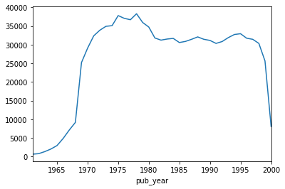
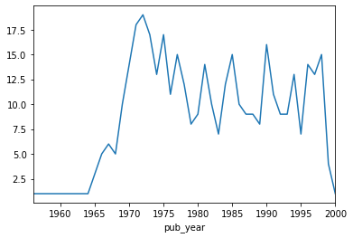

In my dissertation, I'm interested in how the academic study of education affected the kinds of policy ideas that would emerge in the early 1980s. One of the ways I assess this is to use a large body of academic (and non-academic) articles indexed by a widely used database, the Education Resources Information Center. Many universities have access to this database, but not in a way that can be analyzed easily. Fortunately, the federal government, which has been running the database since the 1960s, makes all of the data available in XML format.

The code below takes a bunch of large XML files, which you can access as zip files [here](https://eric.ed.gov/?download), and compiles them all into a .csv file. Each row is a separate article, and the columns are different pieces of information about the article (e.g., author, publication date, subjects, keywords, sponsors, etc.). XML files are difficult to work with (because they're all created a little differently), so the code below may not work well on other XMLs.


```python
# import modules
import xml.etree.ElementTree as ET
import csv
import pandas as pd
from collections import Counter
import itertools
from lxml import etree

%matplotlib inline
```


```python
# read in one XML file and turn each line into a list item
with open('eric1965-1979/eric1968.xml') as f:  
    file_lines = f.readlines() 
```


```python
# print out number of lines in file
len(file_lines)
```


    433962


```python
# print out first five lines of file
# file_lines[:5]
```

Before you parse the XML file, you need to look at the structure of the file. Below is representative of the kind of information that's available for **one** article. The challenge here is that, for each article, there are often multiple authors, subjects, keywords, etc., all of which need to be included in the final .csv file.


```python
# print out parts of the XML file to see how it's structured
file_lines[4605:4628]
```


    ['<header>\n',
     '<action>New</action>\n',
     '</header>\n',
     '<metadata>\n',
     '<dcterms:accessRights>Yes</dcterms:accessRights>\n',
     '<dc:subject>Behavioral Science Research</dc:subject>\n',
     '<dc:subject>Contrastive Linguistics</dc:subject>\n',
     '<dc:subject>English (Second Language)</dc:subject>\n',
     '<dc:subject>Phonemics</dc:subject>\n',
     '<dc:subject>Phonetics</dc:subject>\n',
     '<dc:subject>Second Language Learning</dc:subject>\n',
     '<dc:subject>Syllables</dc:subject>\n',
     "<dc:creator scheme='personal author'>BRIERE, EUGENE J.</dc:creator>\n",
     "<dc:creator scheme='personal author'>AND OTHERS</dc:creator>\n",
     '<dc:type></dc:type>\n',
     '<eric:keywords>California (Los Angeles)</eric:keywords>\n',
     '<eric:keywords>UNIVERSITY OF CALIFORNIA</eric:keywords>\n',
     '<eric:keywords_geo>California (Los Angeles)</eric:keywords_geo>\n',
     '<eric:issn></eric:issn>\n',
     "<dc:creator scheme='institution'></dc:creator>\n",
     '<dc:language></dc:language>\n',
     '<dcterms:educationLevel></dcterms:educationLevel>\n',
     '<dc:description>ONE OF THE MOST IMPORTANT CONSIDERATIONS WHEN LEARNING OR TEACHING A FOREIGN LANGUAGE IS DETERMINING THE POSSIBILITIES OF PHONEME OVERLAP AND/OR INTERFERENCE BETWEEN THE NATIVE LANGUAGE AND THE TARGET LANGUAGE. ALTHOUGH TRADITIONAL METHODS OF CONTRASTIVE ANALYSIS HAVE RELIED ON MINIMAL PAIRS OF WORDS AND ISOLATING THE PHONEMES OF INITIAL OR FINAL POSITION, THE AUTHOR FEELS THAT A CONTRASTIVE ANALYSIS OF SYLLABLES MIGHT BE MORE INDICATIVE OF THE TYPES OF PROBLEMS THAT LANGUAGE STUDENTS WILL HAVE. TO TEST THIS HYPOTHESIS, AN EXPERIMENT WAS CONDUCTED WITH 25 MONOLINGUAL UNDERGRADUATE STUDENTS. A SERIES OF CHI-SQUARE TESTS WAS MADE TO INVESTIGATE ANY CORRELATION BETWEEN SYLLABLE ASSIGNMENTS MADE BY THE SUBJECTS AND THE VARIABLES OF STRESS, GEMINATION, AND VOICING. RESULTS OF THE  EXPERIMENT INDICATED THAT, IN ENGLISH, THE WORD IS USEFUL TO DEFINE THE DISTRIBUTION OF ALLOPHONES, BUT THAT THE SYLLABLE IS A BETTER IDENTIFIER OF PHONEME DISTRIBUTION. (FB)</dc:description>\n']


A lot of XMLs include something called a namespace. To parse out text that use a namespace, see this Python [documentation](https://docs.python.org/3/library/xml.etree.elementtree.html#parsing-xml-with-namespaces).


```python
# account for namespaces that are used in the ERIC XMLs
ns = {'eric_code': 'http://www.eric.ed.gov',
      'dc_code': 'http://purl.org/dc/elements/1.1/',
      'terms_code': 'http://purl.org/dc/terms/'}
```


```python
# create empty lists
allyears_dfs = []
allyears_df_lengths = []
```

This is the main function that will read, in this case, dozens of XML files, and parse out information about each individual article. If the variable I wanted had more than one piece of information (e.g., multiple subjects or multiple authors), I accounted for that. See the comment below right after the 'authors' line.


```python
# pick the range of years you want.
for year in range(1965, 2001):
    tree = etree.parse('eric{}.xml'.format(year))
    root = tree.getroot()
    # create an empty list for each XML file
    full_list = []
    counter = 1
    for all in root.iter('metadata'):
        var_dict = {}
        # create a unique id for each article
        var_dict['my_id'] = counter
        counter +=1
        titles = all.findall('dc_code:title', ns)
        for title in titles:
            var_dict['title'] = title.text
        # description is basically the abstract of the article
        descriptions = all.findall('dc_code:description', ns)
        for descr in descriptions:
            var_dict['description'] = descr.text
        date_published = all.findall('dc_code:date', ns)
        for date in date_published:
            var_dict['date_published'] = date.text
        date_added = all.findall('eric_code:dateAdded', ns)
        for date_add in date_added:
            var_dict['date_added'] = date_add.text
        identifiers = all.findall('dc_code:identifier', ns)
        for identifier in identifiers:
            if identifier.attrib['scheme'] == 'eric_accno':
                var_dict['accno'] = identifier.text
        # For any variable that could have multiple pieces of data, I first created a list and then
        # separated out the list with ";;;" This allows me, later, to separate those out, if need be.
        authors = all.findall('dc_code:creator[@scheme="personal author"]', namespaces=ns)
        for author in authors:
            a = [author.text for author in authors]
            a_str = ';;;'.join(author for author in a if author)
            var_dict['authors'] = a_str
        institutions = all.findall('dc_code:creator[@scheme="institution"]', namespaces=ns)
        for institution in institutions:
            i = [institution.text for institution in institutions]
            i_str = ';;;'.join(institution for institution in i if institution)
            var_dict['institutions'] = i_str
        subjects = all.findall('dc_code:subject', namespaces=ns)
        for subject in subjects:
            s = [subject.text for subject in subjects]
            s_str = ';;;'.join(subject for subject in s if subject)
            var_dict['subjects'] = s_str
        major_subjects = all.findall('dc_code:subject[@weight="MAJOR"]', namespaces=ns)
        for major_subject in major_subjects:
            ms = [major_subject.text for major_subject in major_subjects]
            ms_str = ';;;'.join(major_subject for major_subject in ms if major_subject)
            var_dict['major_subjects'] = ms_str
        publishers = all.findall('dc_code:publisher', namespaces=ns)
        for publisher in publishers:
            p = [publisher.text for publisher in publishers]
            p_str = ';;;'.join(publisher for publisher in p if publisher)
            var_dict['publishers'] = p_str
        sponsors = all.findall('eric_code:sponsor', namespaces=ns)
        for sponsor in sponsors:
            sp = [sponsor.text for sponsor in sponsors]
            sp_str = ';;;'.join(sponsor for sponsor in sp if sponsor)
            var_dict['sponsors'] = sp_str
        keywords = all.findall('eric_code:keywords', namespaces=ns)
        for keyword in keywords:
            k = [keyword.text for keyword in keywords]
            k_str = ';;;'.join(keyword for keyword in k if keyword)
            var_dict['keywords'] = k_str
        keywords_geo = all.findall('eric_code:keywords_geo', ns)
        for keyword_geo in keywords_geo:
            k_g = [keyword_geo.text for keyword_geo in keywords_geo]
            k_g_str = ';;;'.join(keyword_geo for keyword_geo in k_g if keyword_geo)
            var_dict['keywords_geo'] = k_g_str
        types = all.findall('dc_code:type', ns)
        for type in types:
            t = [type.text for type in types]
            t_str = ';;;'.join(type for type in t if type)
            var_dict['types'] = t_str
        sources = all.findall('dc_code:source', ns)
        for source in sources:
            sou = [source.text for source in sources]
            sou_str = ';;;'.join(source for source in sou if source)
            var_dict['sources'] = sou_str
        issues = all.findall('eric_code:issue', ns)
        for issue in issues:
            iss = [issue.text for issue in issues]
            iss_str = ';;;'.join(issue for issue in iss if issue)
            var_dict['issues'] = iss_str
        # add everything to the empty list
        full_list.append(var_dict)
    # print out the length of articles for each XML file (each year)
    print ('List length of {} xml is {}'.format(year, len(full_list)))
    # create a temporary dataframe from the list
    tmp_df = pd.DataFrame(full_list)
    # add the year of the XML file to the dataframe
    tmp_df['year'] = year
    # print out the dataframe's shape
    print ('Dataframe shape of {} xml is {}'.format(year, tmp_df.shape))
    # add all dataframes to the allyears_dfs list
    allyears_dfs.append(tmp_df)
    # add the length of each dataframe to the allyears_df_lengths list
    allyears_df_lengths.append(len(tmp_df))
```


```python
# This sums up the length of each XML file. This is more of a check to make sure all articles were included.
print ('Total length of all xmls is {}'.format(sum(allyears_df_lengths)))
```


```python
# Create a full dataset of all dataframes
eric_65_00 = pd.concat(allyears_dfs, ignore_index = True)
```


```python
# Print out the shape of the full dataset, the number of unique article IDs (to make sure there aren't 
# duplicates), and the number of articles by year.
print ('Shape of full dataset is {}'.format(eric_65_00.shape))
print ('Number of unique ACC numbers is {}'.format(eric_65_00['accno'].nunique()))
print ('Number of rows by year is {}'.format(eric_65_00['year'].value_counts()))
```


```python
# Create the final .csv
eric_65_00.to_csv('eric_65_00.csv', index = False)
```

#### The above code takes a long time, so I'm going to show the output of the final dataset below.


```python
# import dataset
eric = pd.read_csv('eric_65_00.csv', low_memory = False)
```


```python
# print the shape of the dataset and the number of unique IDs. The number of rows and number of unique IDs
# is the same, so that's a good sign that there aren't duplicates.
print (eric.shape)
print (eric['accno'].nunique())
```

    (1044919, 21)
    1044919
    

That's a little over a million articles from 1965 to 2000.


```python
# change display options
pd.set_option('display.max_columns', 8)
pd.set_option('display.max_colwidth', 40)
```

Just looking at the first 2 rows of the dataset, you can see that some articles will have multiple authors and/or multiple subjects (in each case, separated by ";;;").


```python
eric.loc[:, :'year'].head(2)
```


<div>
<style scoped>
    .dataframe tbody tr th:only-of-type {
        vertical-align: middle;
    }

    .dataframe tbody tr th {
        vertical-align: top;
    }

    .dataframe thead th {
        text-align: right;
    }
</style>
<table border="1" class="dataframe">
  <thead>
    <tr style="text-align: right;">
      <th></th>
      <th>accno</th>
      <th>authors</th>
      <th>date_added</th>
      <th>date_published</th>
      <th>...</th>
      <th>subjects</th>
      <th>title</th>
      <th>types</th>
      <th>year</th>
    </tr>
  </thead>
  <tbody>
    <tr>
      <th>0</th>
      <td>ED001001</td>
      <td>HAVIGHURST, ROBERT J.</td>
      <td>1965</td>
      <td>1960-08-00</td>
      <td>...</td>
      <td>Acculturation;;;Community Programs;;...</td>
      <td>SOCIAL CLASS INFLUENCE ON LEARNING.</td>
      <td>NaN</td>
      <td>1965</td>
    </tr>
    <tr>
      <th>1</th>
      <td>ED001002</td>
      <td>MARBURGER, CARL L.;;;RASSCHAERT, WIL...</td>
      <td>1965</td>
      <td>1962-07-00</td>
      <td>...</td>
      <td>Achievement;;;Attitudes;;;Costs;;;Di...</td>
      <td>A PLAN FOR EVALUATING MAJOR ACTIVITI...</td>
      <td>NaN</td>
      <td>1965</td>
    </tr>
  </tbody>
</table>
<p>2 rows × 18 columns</p>
</div>


```python
# This code creates a column, pub_year, that gets the publication year of the article based on the
# date_published column above.
eric['date_published'] = eric['date_published'].astype('str')
eric['date_pub_list'] = eric['date_published'].apply(lambda x: x.split('-'))
eric['date_pub_len'] = eric['date_pub_list'].apply(lambda x: len(x))
eric['pub_year'] = eric['date_pub_list'].apply(lambda x: x[0])
```

#### Number of articles by year


```python
# quick plot of number of articles, after 1960, in the dataset
eric[eric['pub_year'] > 1960].groupby('pub_year').size().plot()
```


    <matplotlib.axes._subplots.AxesSubplot at 0x11e20198>





#### Number of articles, by subject, by year

To analyze something like the number of articles on a particular subject, and because each article has multiple subjects, you have to first put each article-subject combination on a different row. 

##### Getting article-subject for the full dataset takes a while, so I'm going to do this on a sample of 10,000 articles.


```python
# sample of 10,000 articles, weighted by pub year
eric_sample = eric.sample(10000, weights='pub_year')
```


```python
# This creates a column that has a list of all the subjects of an article. It's being split on ";;;" the separator I used in the initial XML parser.
eric_sample['subject_list'] = eric_sample['subjects'].astype(str).apply(lambda x: x.split(';;;'))
```


```python
# This is the function that creates a dataframe that includes each article's subject on a separate row
subjects_sample = eric_sample.set_index(['pub_year', 'accno'])['subject_list'].apply(pd.Series).stack().reset_index().drop('level_2', axis=1).rename(columns = {0 : 'subject'})
```


```python
# dataframe went from 10,000 rows to 98,668
subjects_sample.shape
```


    (98668, 3)


```python
subjects_sample.head()
```


<div>
<style scoped>
    .dataframe tbody tr th:only-of-type {
        vertical-align: middle;
    }

    .dataframe tbody tr th {
        vertical-align: top;
    }

    .dataframe thead th {
        text-align: right;
    }
</style>
<table border="1" class="dataframe">
  <thead>
    <tr style="text-align: right;">
      <th></th>
      <th>pub_year</th>
      <th>accno</th>
      <th>subject</th>
    </tr>
  </thead>
  <tbody>
    <tr>
      <th>0</th>
      <td>1979.0</td>
      <td>EJ209713</td>
      <td>College Faculty</td>
    </tr>
    <tr>
      <th>1</th>
      <td>1979.0</td>
      <td>EJ209713</td>
      <td>Curriculum Development</td>
    </tr>
    <tr>
      <th>2</th>
      <td>1979.0</td>
      <td>EJ209713</td>
      <td>Expectation</td>
    </tr>
    <tr>
      <th>3</th>
      <td>1979.0</td>
      <td>EJ209713</td>
      <td>Faculty Development</td>
    </tr>
    <tr>
      <th>4</th>
      <td>1979.0</td>
      <td>EJ209713</td>
      <td>Higher Education</td>
    </tr>
  </tbody>
</table>
</div>


Check out this particular article here: https://eric.ed.gov/?q=EJ209713. You can see the subjects and publication year match.

##### Top subjects in our sample of 10,000 articles.


```python
subjects_sample['subject'].value_counts().head(10)
```


    Higher Education                  2033
    Elementary Secondary Education    1425
    Foreign Countries                  830
    Secondary Education                785
    Teaching Methods                   753
    Elementary Education               657
    Science Education                  420
    Curriculum Development             390
    Program Evaluation                 388
    Models                             373
    Name: subject, dtype: int64


##### Get just articles on curriculum development


```python
curr_dev = subjects_sample[subjects_sample['subject'] == 'Curriculum Development'].copy()
```


```python
# Mean number of articles in sample, by publication year, on curriculum development
curr_dev.groupby('pub_year').size().mean()
```


    9.75


#### Quick plot of Curriculum Development articles in the sample of 10,000


```python
curr_dev.groupby('pub_year').size().plot()
```


    <matplotlib.axes._subplots.AxesSubplot at 0x16178be0>




