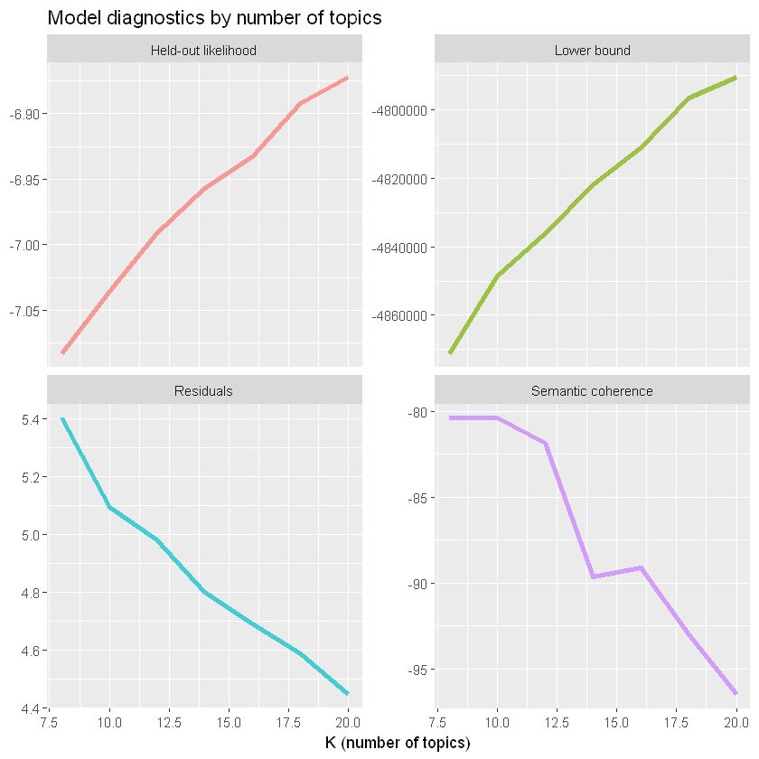
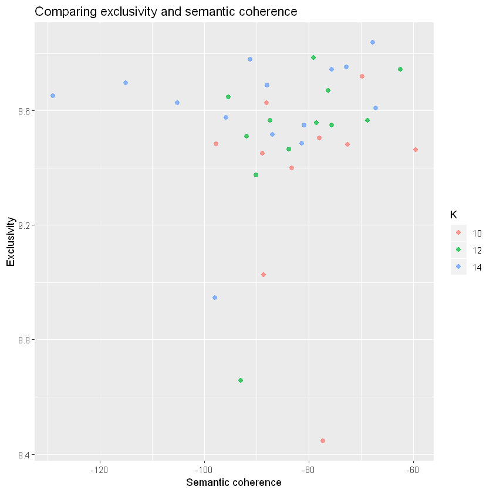
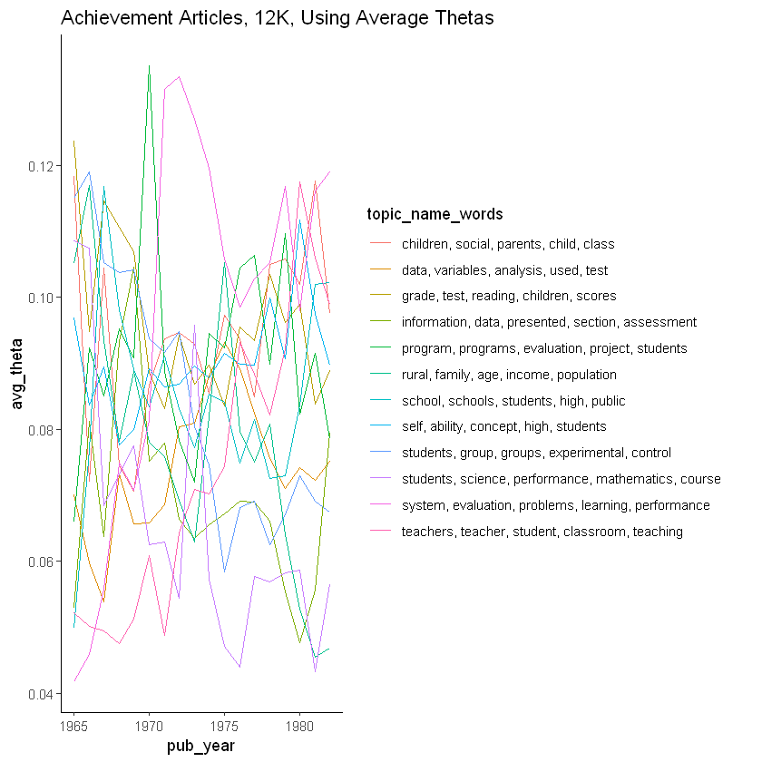
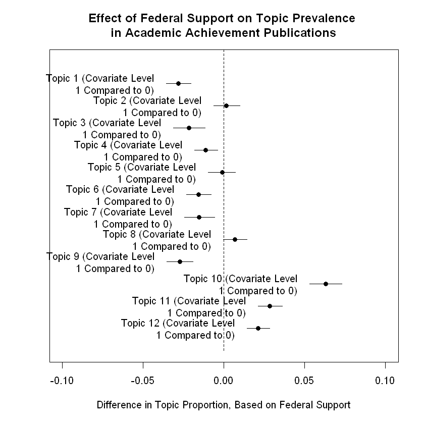

```
library(stm)
library(tidyverse)
library(furrr)
library(plotly)
library(htmlwidgets)
```


```
achieve_orig <- read_csv('achieve_articles_60_94.csv', col_types = cols())

ach_inst_dummies <- read_csv('achieve_60_94_inst_dummies.csv', col_types = cols())

achieve_pre_83_dummies = read_csv('ach_pre_83_dummies.csv', col_types = cols())

achieve_orig_inst <- merge(achieve_orig, ach_inst_dummies, by = 'accno')

# just select last columns, since they're already in achieve_orig
achieve_pre_83_dummies <- achieve_pre_83_dummies %>% 
  select(16:24)

achieve = merge(achieve_orig_inst, achieve_pre_83_dummies, by = 'accno')
```


```
# head(achieve)
```


```
num_k <- c(8, 10, 12, 14, 16, 18, 20)

stop_words <- c('education', 'educational', 'achievement', 'achieve', 
'quot', 'author', 'authors', 'review', 'study', 'academic', 'studies', 
'research', 'paper', 'document', 'report', 'use', 'can', 'may', 'documents', 'will', 'must')
```


```
load('achieve_multiple_k_diagnostics.RData')
```


```
achieve_process <- textProcessor(achieve$description, metadata = achieve, onlycharacter = TRUE, 
stem = FALSE, customstopwords = stop_words)

# drop words that appear in fewer than 5 documents and more than 70 percent of documents
achieve_out <- prepDocuments(achieve_process$documents, achieve_process$vocab, 
achieve_process$meta, lower.thresh = 4, upper.thresh = floor(nrow(achieve)*.7))
```

A common critique of topic modeling is that researchers have to choose the number of latent topics for the body of texts, an often subjective and difficult to replicate process. I address these concerns in the appendix, but in short, I run models that include different numbers of topics. For each model, I run a regression that estimates the effect of sponsorship by education agencies on the proportion of each article that is about each of the topics in the model. For these models, I control, similarly to the logistic regression above, for publication year and whether an article was funded by a private foundation.


```
plan(multiprocess)

many_models <- tibble(K = c(8, 10, 12, 14, 16, 18, 20)) %>%
  mutate(topic_model = future_map(K, ~stm(documents = achieve_out$documents, 
  vocab = achieve_out$vocab, data = achieve_out$meta, K = ., 
  prevalence = ~ s(pub_year) + sponsor_dummy, max.em.its = 75, seed = 1234, verbose = FALSE)))
```


```
heldout <- make.heldout(documents = achieve_out$documents, vocab = achieve_out$vocab)

k_result <- many_models %>%
  mutate(exclusivity = map(topic_model, exclusivity),
         semantic_coherence = map(topic_model, semanticCoherence, achieve_out$documents),
         eval_heldout = map(topic_model, eval.heldout, heldout$missing),
         residual = map(topic_model, checkResiduals, achieve_out$documents),
         bound =  map_dbl(topic_model, function(x) max(x$convergence$bound)),
         lfact = map_dbl(topic_model, function(x) lfactorial(x$settings$dim$K)),
         lbound = bound + lfact,
         iterations = map_dbl(topic_model, function(x) length(x$convergence$bound)))

k_fig1 <- k_result %>%
  transmute(K,
            `Lower bound` = lbound,
            Residuals = map_dbl(residual, "dispersion"),
            `Semantic coherence` = map_dbl(semantic_coherence, mean),
            `Held-out likelihood` = map_dbl(eval_heldout, "expected.heldout")) %>%
  gather(Metric, Value, -K) %>%
  ggplot(aes(K, Value, color = Metric)) +
  geom_line(size = 1.5, alpha = 0.7, show.legend = FALSE) +
  facet_wrap(~Metric, scales = "free_y") +
  labs(x = "K (number of topics)",
       y = NULL,
       title = "Model diagnostics by number of topics")

ggsave("fig1.png", k_fig1, height = 10, width = 16, units = "in")
```


```
k_result %>%
  transmute(K,
            `Lower bound` = lbound,
            Residuals = map_dbl(residual, "dispersion"),
            `Semantic coherence` = map_dbl(semantic_coherence, mean),
            `Held-out likelihood` = map_dbl(eval_heldout, "expected.heldout")) %>%
  gather(Metric, Value, -K) %>%
  ggplot(aes(K, Value, color = Metric)) +
  geom_line(size = 1.5, alpha = 0.7, show.legend = FALSE) +
  facet_wrap(~Metric, scales = "free_y") +
  labs(x = "K (number of topics)",
       y = NULL,
       title = "Model diagnostics by number of topics")
```





```
k_result %>%
  select(K, exclusivity, semantic_coherence) %>%
  filter(K %in% c(10, 12, 14)) %>%
  unnest() %>%
  mutate(K = as.factor(K)) %>%
  ggplot(aes(semantic_coherence, exclusivity, color = K)) +
  geom_point(size = 2, alpha = 0.7) +
  labs(x = "Semantic coherence",
       y = "Exclusivity",
       title = "Comparing exclusivity and semantic coherence")
```





```
map(many_models$topic_model, labelTopics)[[3]]
```


    Topic 1 Top Words:
     	 Highest Prob: children, social, parents, child, class, school, home 
     	 FREX: article, child, childs, influences, emotional, role, home 
     	 Lift: conversation, dep, deviancy, jencks, jensen, malnutrition, nurture 
     	 Score: children, child, article, parents, parent, home, social 
    Topic 2 Top Words:
     	 Highest Prob: students, group, groups, experimental, control, classes, instruction 
     	 FREX: experimental, week, treatment, reinforcement, cai, assigned, programed 
     	 Lift: cai, guides, jigsaw, quizzes, shorthand, stad, tutees 
     	 Score: experimental, guides, group, instruction, treatment, control, cai 
    Topic 3 Top Words:
     	 Highest Prob: rural, family, age, income, population, years, data 
     	 FREX: women, labor, men, employment, rural, income, residence 
     	 Lift: coal, compositional, immigration, mexicans, migrating, owned, owners 
     	 Score: women, income, rural, family, indian, labor, employment 
    Topic 4 Top Words:
     	 Highest Prob: school, schools, students, high, public, district, student 
     	 FREX: desegregation, schools, inner, desegregated, city, busing, private 
     	 Lift: castle, desegregated, ghettos, hoffer, kilgore, bused, busing 
     	 Score: schools, desegregation, school, district, districts, racial, students 
    Topic 5 Top Words:
     	 Highest Prob: grade, test, reading, children, scores, year, tests 
     	 FREX: kindergarten, arithmetic, grade, start, reading, readiness, vocabulary 
     	 Lift: caldwell, delta, piat, ppvt, slosson, binet, mrt 
     	 Score: grade, children, reading, test, scores, kindergarten, arithmetic 
    Topic 6 Top Words:
     	 Highest Prob: students, science, performance, mathematics, course, student, college 
     	 FREX: science, courses, course, checks, naep, chemistry, music 
     	 Lift: booklets, bscs, oec, pssc, xerography, chem, commentsobservations 
     	 Score: science, course, checks, naep, iscs, students, college 
    Topic 7 Top Words:
     	 Highest Prob: system, evaluation, problems, learning, performance, programs, goals 
     	 FREX: accountability, issues, standards, policy, decision, contracting, conference 
     	 Lift: auditing, technologies, transaction, audiences, campbell, cbe, coherent 
     	 Score: accountability, policy, issues, evaluation, discusses, contracting, objectives 
    Topic 8 Top Words:
     	 Highest Prob: data, variables, analysis, used, test, measures, model 
     	 FREX: regression, analyses, variable, variables, multiple, variance, validity 
     	 Lift: squares, longstep, accessioned, equations, jacobson, reanalysis, slopes 
     	 Score: variables, tell, regression, variance, data, test, analysis 
    Topic 9 Top Words:
     	 Highest Prob: self, ability, concept, high, students, low, relationship 
     	 FREX: locus, esteem, boys, anxiety, ses, self, girls 
     	 Lift: internality, ach, locus, arousal, coopersmith, crandall, externality 
     	 Score: self, boys, concept, girls, locus, sex, hall 
    Topic 10 Top Words:
     	 Highest Prob: program, programs, evaluation, project, students, title, language 
     	 FREX: title, bilingual, projects, program, esea, services, career 
     	 Lift: amigos, bedford, bslc, clovis, connell, coordinator, creole 
     	 Score: program, title, staff, migrant, evaluation, services, bilingual 
    Topic 11 Top Words:
     	 Highest Prob: information, data, presented, section, assessment, results, procedures 
     	 FREX: hearing, section, bibliography, chapter, appendix, volume, summary 
     	 Lift: dissertations, entries, alphabetical, alphabetically, collections, debt, indexed 
     	 Score: section, chapter, assessment, information, hearing, contains, summary 
    Topic 12 Top Words:
     	 Highest Prob: teachers, teacher, student, classroom, teaching, behavior, learning 
     	 FREX: teacher, behaviors, classroom, teachers, classrooms, observation, teaching 
     	 Lift: engagement, authorsjd, brophy, btes, objections, pbte, personsinstructors 
     	 Score: teacher, teachers, classroom, teaching, student, behavior, behaviors 


```
achieve_out$meta$ID <- seq.int(nrow(achieve_out$meta))

# replace list number with best model
theta <- data.frame(many_models$topic_model[[3]]$theta)
theta$ID <- seq.int(nrow(theta))

achieve_all <- merge(achieve_out$meta, theta)

achieve_cond <- achieve_all %>% 
  select(ID, pub_year, starts_with('X'))

achieve_long <- gather(data = achieve_cond, key = topic, value = theta, starts_with('X'), factor_key=TRUE)
```


```
# head(achieve_long)
```


```
achieve_cols <- as.list(levels(achieve_long$topic))
```


```
achieve_yr_topic <- achieve_long %>%  
  group_by(pub_year, topic) %>% 
  summarize(total = n(),
            med_theta = median(theta),
            avg_theta = mean(theta))

# change first part of list to best model
achieve_words <- labelTopics(many_models$topic_model[[3]], n = 5)[[1]]

achieve_topics_words <- data.frame(achieve_words, row.names = achieve_cols)

# add column with words all together
achieve_topics_words <- achieve_topics_words %>%
  unite(topic_name_words, sep = ', ')

achieve_topics_words$topic <- rownames(achieve_topics_words)

achieve_merged <- merge(achieve_yr_topic, achieve_topics_words, by = 'topic')
```


```
head(achieve_merged)
```


<table>
<thead><tr><th scope=col>topic</th><th scope=col>pub_year</th><th scope=col>total</th><th scope=col>med_theta</th><th scope=col>avg_theta</th><th scope=col>topic_name_words</th></tr></thead>
<tbody>
	<tr><td>X1                                     </td><td>1960                                   </td><td> 18                                    </td><td>0.01862116                             </td><td>0.02716235                             </td><td>children, social, parents, child, class</td></tr>
	<tr><td>X1                                     </td><td>1970                                   </td><td>513                                    </td><td>0.03968031                             </td><td>0.08666919                             </td><td>children, social, parents, child, class</td></tr>
	<tr><td>X1                                     </td><td>1969                                   </td><td>394                                    </td><td>0.03533882                             </td><td>0.07062001                             </td><td>children, social, parents, child, class</td></tr>
	<tr><td>X1                                     </td><td>1968                                   </td><td>248                                    </td><td>0.03235878                             </td><td>0.07442264                             </td><td>children, social, parents, child, class</td></tr>
	<tr><td>X1                                     </td><td>1967                                   </td><td>242                                    </td><td>0.04968227                             </td><td>0.10435907                             </td><td>children, social, parents, child, class</td></tr>
	<tr><td>X1                                     </td><td>1977                                   </td><td>800                                    </td><td>0.03818207                             </td><td>0.08485530                             </td><td>children, social, parents, child, class</td></tr>
</tbody>
</table>


```
plot_12k <- achieve_merged %>% 
  filter(pub_year > 1964) %>%
  ggplot(aes(pub_year, avg_theta, color = topic_name_words)) +
  geom_line() +
  labs(title = 'Achievement Articles, 12K, Using Average Thetas') +
  theme_classic()
```


```
plot_12k
```





```
# p_12k <- ggplotly(plot_12k)
```


```
# p_12k
```


```
reg_prep12 <- estimateEffect(1:12 ~ fed_gov_v2 + foundations_v2 + s(pub_year), many_models$topic_model[[3]], 
meta = achieve_out$meta, uncertainty = "Global")
```


```
plot(reg_prep12, covariate = 'fed_gov_v2', topics = 1:12,
     model = many_models$topic_model[[3]], 
     method = 'difference', 
     cov.value1 = 1, 
     cov.value2 = 0, 
     xlim = c(-.1, .1), 
     xlab = 'Difference in Topic Proportion, Based on Federal Support',
     main = 'Effect of Federal Support on Topic Prevalence \nin Academic Achievement Publications')
```




