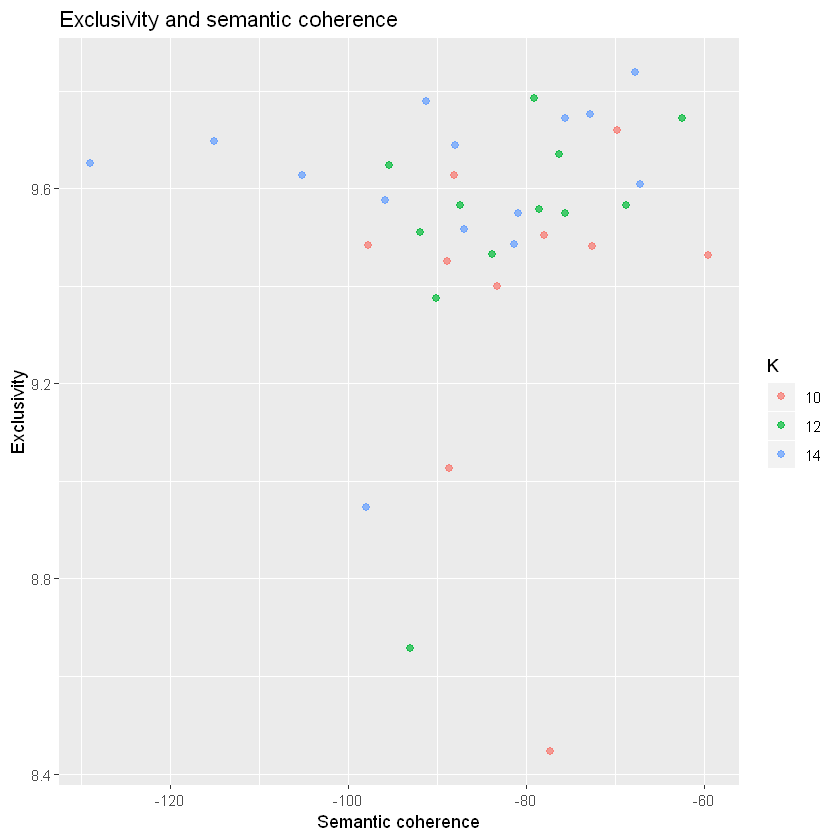
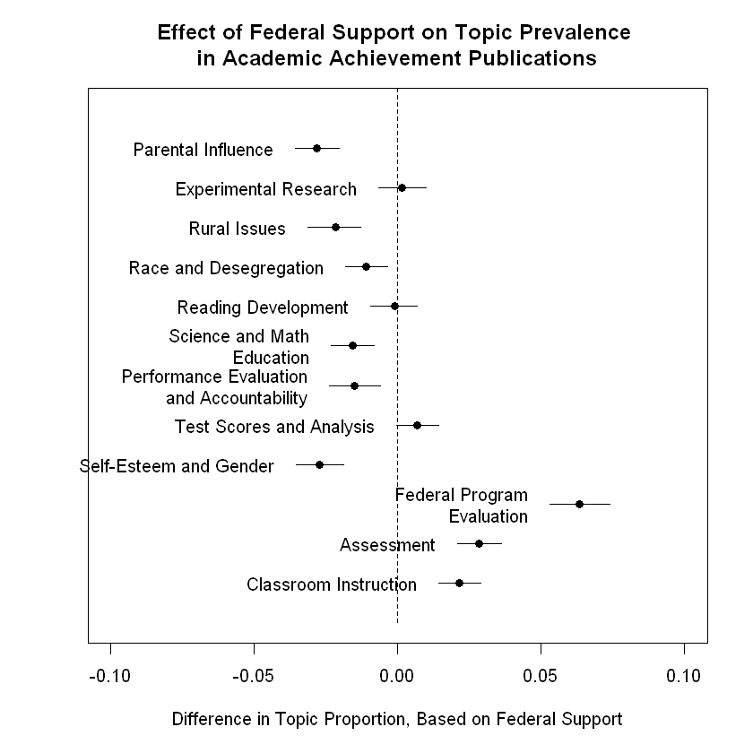

Topic modeling is an inductively driven text analytic method commonly used to show the underlying, latent topics of large bodies of text (Blei, Ng, and Jordan 2003; McFarland et al. 2013; Mohr and Bogdanov 2013). While researchers often use topic modeling for descriptive purposes, recent extensions allow a researcher to predict the likelihood that a document’s metadata (e.g., publication year, author, funder, etc.) is correlated with the proportion of that document dedicated to a particular topic (Roberts, Stewart, and Tingley n.d.). 

In the code below, I use the [STM package](https://www.structuraltopicmodel.com/) in R to run topic models using the abstracts of a subset of [ERIC articles](https://eric.ed.gov/). I then run a regression that estimates the effect of federal funding on the proportion of each article that is about each of the latent topics.


```
library(stm)
library(tidyverse)
library(furrr)
library(plotly)
library(htmlwidgets)
```

After [getting all ERIC articles](https://alturk.netlify.com/post/eric-parser/), I subset the data to get ones focused specifically on academic achievement in the U.S. before 1983. I then created a bunch of dummy variables (including, most importantly, whether the government funded the study) that are included in the files I import here.


```
# import subset of articles and different dummy datasets and merge together
options(warn=-1)

achieve_orig <- read_csv('achieve_articles_60_94.csv', col_types = cols())

ach_inst_dummies <- read_csv('achieve_60_94_inst_dummies.csv', col_types = cols())

achieve_pre_83_dummies = read_csv('ach_pre_83_dummies.csv', col_types = cols())

achieve_orig_inst <- merge(achieve_orig, ach_inst_dummies, by = 'accno')

# just select last columns, since they're already in achieve_orig
achieve_pre_83_dummies <- achieve_pre_83_dummies %>% 
  select(16:24)

achieve = merge(achieve_orig_inst, achieve_pre_83_dummies, by = 'accno')
```


```
# a few columns, sorted by federal government sponsorship
achieve %>%
    select(accno, pub_year, title, sponsors, fed_gov_v2, foundations_v2) %>%
    arrange(desc(fed_gov_v2)) %>%
    head
```


<table>
<thead><tr><th scope=col>accno</th><th scope=col>pub_year</th><th scope=col>title</th><th scope=col>sponsors</th><th scope=col>fed_gov_v2</th><th scope=col>foundations_v2</th></tr></thead>
<tbody>
	<tr><td>ED021313                                                                                                                                                </td><td>1967                                                                                                                                                    </td><td>A Student Report on Student and Teacher Reactions to Modular Scheduling and Independent Study at South Hills High School during the 1966-67 School Year.</td><td>Office of Education (DHEW), Washington, DC.                                                                                                             </td><td>1                                                                                                                                                       </td><td>0                                                                                                                                                       </td></tr>
	<tr><td>ED021675                                                                                                                                                </td><td>1968                                                                                                                                                    </td><td>Effects of an Enrichment Program on the School Achievement of Rural Welfare Recipient Children.                                                         </td><td>Office of Education (DHEW), Washington, DC. Bureau of Research.                                                                                         </td><td>1                                                                                                                                                       </td><td>0                                                                                                                                                       </td></tr>
	<tr><td>ED021702                                                                                                                                                </td><td>1968                                                                                                                                                    </td><td>Forecasting Academic Status.                                                                                                                            </td><td>Office of Education (DHEW), Washington, DC. Bureau of Research.                                                                                         </td><td>1                                                                                                                                                       </td><td>0                                                                                                                                                       </td></tr>
	<tr><td>ED021944                                                                                                                                                </td><td>1968                                                                                                                                                    </td><td>The Segregated Student in Desegregated Schools; Sources of Influence on Negro Secondary Students. Final Report.                                         </td><td>Office of Education (DHEW), Washington, DC.                                                                                                             </td><td>1                                                                                                                                                       </td><td>0                                                                                                                                                       </td></tr>
	<tr><td>ED021948                                                                                                                                                </td><td>1967                                                                                                                                                    </td><td>The Development and Evaluation of a Diagnostically Based Curriculum for Preschool Psychosocially Deprived Children. Final Report.                       </td><td>Office of Education (DHEW), Washington, DC. Bureau of Research.                                                                                         </td><td>1                                                                                                                                                       </td><td>0                                                                                                                                                       </td></tr>
	<tr><td>ED021972                                                                                                                                                </td><td>1967                                                                                                                                                    </td><td>Flexibility for Vocational Education through Computer Scheduling. Quarterly Report.                                                                     </td><td>Office of Education (DHEW), Washington, DC.                                                                                                             </td><td>1                                                                                                                                                       </td><td>0                                                                                                                                                       </td></tr>
</tbody>
</table>


```
mean(achieve$fed_gov_v2)
mean(achieve$foundations_v2)
```


0.172856578427499


0.0109640458316871


Seventeen percent were funded by an education agency and 1 percent by a foundation

#### Running Topic Models

A common critique of topic modeling is that researchers have to choose the number of latent topics for the body of texts, an often subjective and difficult to replicate process. To address this, I run models that include different numbers of topics (ranging from 8 to 20).


```
# list of the numbers of topics 
num_k <- c(8, 10, 12, 14, 16, 18, 20)

# words to exclude
stop_words <- c('education', 'educational', 'achievement', 'achieve', 
'quot', 'author', 'authors', 'review', 'study', 'academic', 'studies', 
'research', 'paper', 'document', 'report', 'use', 'can', 'may', 'documents', 'will', 'must')
```

The code below processes the abstracts of the abstracts, includes only characters, excludes the words in the stop_words list, and doesn't stem the words. See [Schofield et al.](http://www.cs.cornell.edu/~xanda/winlp2017.pdf) for more on stemming. Thanks to [Neal](https://nealcaren.org/) for the tip. It also excludes words that are in fewer than 5 documents (out of ~10,000) and more than 70 percent.


```
achieve_process <- textProcessor(achieve$description, metadata = achieve, onlycharacter = TRUE, 
stem = FALSE, customstopwords = stop_words)

# drop words that appear in fewer than 5 documents and more than 70 percent of documents
achieve_out <- prepDocuments(achieve_process$documents, achieve_process$vocab, 
achieve_process$meta, lower.thresh = 4, upper.thresh = floor(nrow(achieve)*.7))
```

The next four code snippets are adapted from a great blog [post](https://juliasilge.com/blog/evaluating-stm/) by Julia Silge about how to run multiple topic models and evaluate them based on a number of measures, including [semantic coherence](http://dirichlet.net/pdf/mimno11optimizing.pdf) (words in a topic that frequently co-occur together in documents) and exclusivity (how exclusive words are to a particular topic). See the STM [documentation](https://www.structuraltopicmodel.com/) for more.


```
# start parallel processing
plan(multiprocess)

# run 7 different topic models, using publication year and whether a publication was sponsored at all as covariates in estimating the topic prevalence
many_models <- tibble(K = num_k) %>%
  mutate(topic_model = future_map(K, ~stm(documents = achieve_out$documents, 
  vocab = achieve_out$vocab, data = achieve_out$meta, K = ., 
  prevalence = ~ s(pub_year) + sponsor_dummy, max.em.its = 75, seed = 1234, verbose = FALSE)))
```


```
# this creates a table that includes different measures (heldout likelihood, semantic coherence, exclusivity, and residuals) for each of the models

heldout <- make.heldout(documents = achieve_out$documents, vocab = achieve_out$vocab)

k_result <- many_models %>%
  mutate(exclusivity = map(topic_model, exclusivity),
         semantic_coherence = map(topic_model, semanticCoherence, achieve_out$documents),
         eval_heldout = map(topic_model, eval.heldout, heldout$missing),
         residual = map(topic_model, checkResiduals, achieve_out$documents),
         bound =  map_dbl(topic_model, function(x) max(x$convergence$bound)),
         lfact = map_dbl(topic_model, function(x) lfactorial(x$settings$dim$K)),
         lbound = bound + lfact,
         iterations = map_dbl(topic_model, function(x) length(x$convergence$bound)))
```


```
# plot the model diagnostics, by number of topics
k_result %>%
  transmute(K,
            `Lower bound` = lbound,
            Residuals = map_dbl(residual, "dispersion"),
            `Semantic coherence` = map_dbl(semantic_coherence, mean),
            `Held-out likelihood` = map_dbl(eval_heldout, "expected.heldout")) %>%
  gather(Metric, Value, -K) %>%
  ggplot(aes(K, Value, color = Metric)) +
  geom_line(size = 1.5, alpha = 0.7, show.legend = FALSE) +
  facet_wrap(~Metric, scales = "free_y") +
  labs(x = "K (number of topics)",
       y = NULL,
       title = "Diagnostics by number of topics")
```


From the above plots, it looks like 12 is a good number of topics, but let's compare semantic coherence and exclusivity of 10 and 14 topics too.


```
k_result %>%
  select(K, exclusivity, semantic_coherence) %>%
  filter(K %in% c(10, 12, 14)) %>%
  unnest() %>%
  mutate(K = as.factor(K)) %>%
  ggplot(aes(semantic_coherence, exclusivity, color = K)) +
  geom_point(size = 2, alpha = 0.7) +
  labs(x = "Semantic coherence",
       y = "Exclusivity",
       title = "Exclusivity and semantic coherence")
```





From this plot, it looks like k=12 does a good job of balancing semantic coherence and exclusivity.

#### Print out most common words and most frequent words for our BEST model (K=12).


```
# Use 3 in double brackets because K=12 is the third model in many_models
map(many_models$topic_model, labelTopics)[[3]]
```


    Topic 1 Top Words:
     	 Highest Prob: children, social, parents, child, class, school, home 
     	 FREX: article, child, childs, influences, emotional, role, home 
     	 Lift: conversation, dep, deviancy, jencks, jensen, malnutrition, nurture 
     	 Score: children, child, article, parents, parent, home, social 
    Topic 2 Top Words:
     	 Highest Prob: students, group, groups, experimental, control, classes, instruction 
     	 FREX: experimental, week, treatment, reinforcement, cai, assigned, programed 
     	 Lift: cai, guides, jigsaw, quizzes, shorthand, stad, tutees 
     	 Score: experimental, guides, group, instruction, treatment, control, cai 
    Topic 3 Top Words:
     	 Highest Prob: rural, family, age, income, population, years, data 
     	 FREX: women, labor, men, employment, rural, income, residence 
     	 Lift: coal, compositional, immigration, mexicans, migrating, owned, owners 
     	 Score: women, income, rural, family, indian, labor, employment 
    Topic 4 Top Words:
     	 Highest Prob: school, schools, students, high, public, district, student 
     	 FREX: desegregation, schools, inner, desegregated, city, busing, private 
     	 Lift: castle, desegregated, ghettos, hoffer, kilgore, bused, busing 
     	 Score: schools, desegregation, school, district, districts, racial, students 
    Topic 5 Top Words:
     	 Highest Prob: grade, test, reading, children, scores, year, tests 
     	 FREX: kindergarten, arithmetic, grade, start, reading, readiness, vocabulary 
     	 Lift: caldwell, delta, piat, ppvt, slosson, binet, mrt 
     	 Score: grade, children, reading, test, scores, kindergarten, arithmetic 
    Topic 6 Top Words:
     	 Highest Prob: students, science, performance, mathematics, course, student, college 
     	 FREX: science, courses, course, checks, naep, chemistry, music 
     	 Lift: booklets, bscs, oec, pssc, xerography, chem, commentsobservations 
     	 Score: science, course, checks, naep, iscs, students, college 
    Topic 7 Top Words:
     	 Highest Prob: system, evaluation, problems, learning, performance, programs, goals 
     	 FREX: accountability, issues, standards, policy, decision, contracting, conference 
     	 Lift: auditing, technologies, transaction, audiences, campbell, cbe, coherent 
     	 Score: accountability, policy, issues, evaluation, discusses, contracting, objectives 
    Topic 8 Top Words:
     	 Highest Prob: data, variables, analysis, used, test, measures, model 
     	 FREX: regression, analyses, variable, variables, multiple, variance, validity 
     	 Lift: squares, longstep, accessioned, equations, jacobson, reanalysis, slopes 
     	 Score: variables, tell, regression, variance, data, test, analysis 
    Topic 9 Top Words:
     	 Highest Prob: self, ability, concept, high, students, low, relationship 
     	 FREX: locus, esteem, boys, anxiety, ses, self, girls 
     	 Lift: internality, ach, locus, arousal, coopersmith, crandall, externality 
     	 Score: self, boys, concept, girls, locus, sex, hall 
    Topic 10 Top Words:
     	 Highest Prob: program, programs, evaluation, project, students, title, language 
     	 FREX: title, bilingual, projects, program, esea, services, career 
     	 Lift: amigos, bedford, bslc, clovis, connell, coordinator, creole 
     	 Score: program, title, staff, migrant, evaluation, services, bilingual 
    Topic 11 Top Words:
     	 Highest Prob: information, data, presented, section, assessment, results, procedures 
     	 FREX: hearing, section, bibliography, chapter, appendix, volume, summary 
     	 Lift: dissertations, entries, alphabetical, alphabetically, collections, debt, indexed 
     	 Score: section, chapter, assessment, information, hearing, contains, summary 
    Topic 12 Top Words:
     	 Highest Prob: teachers, teacher, student, classroom, teaching, behavior, learning 
     	 FREX: teacher, behaviors, classroom, teachers, classrooms, observation, teaching 
     	 Lift: engagement, authorsjd, brophy, btes, objections, pbte, personsinstructors 
     	 Score: teacher, teachers, classroom, teaching, student, behavior, behaviors 


Once we have our topics, one thing we may want to do is get the prevalence of each topic over time. You can do this in the STM package, but the code below creates a long dataframe, where each row gives the prevalence of each topic (X1-X12, in this case) for each document.


```
achieve_out$meta$ID <- seq.int(nrow(achieve_out$meta))

# replace list number with best model
theta <- data.frame(many_models$topic_model[[3]]$theta)
theta$ID <- seq.int(nrow(theta))

achieve_all <- merge(achieve_out$meta, theta)

achieve_cond <- achieve_all %>% 
  select(ID, accno, pub_year, starts_with('X'))

achieve_long <- gather(data = achieve_cond, key = topic, value = theta, starts_with('X'), factor_key=TRUE)
```

#### The table below gives the thetas (topic prevalence) of two articles from 1964. According to our topic models, the top 3 topics of the [first article](https://eric.ed.gov/?q=ED001044&id=ED001044) are topics 10, 3, and 4, and the top 3 topics of the [second article](https://eric.ed.gov/?q=ED001114&id=ED001114) are topics 10, 6, and 2. Based on a quick reading of the articles, that looks pretty accurate!


```
achieve_long %>%
    arrange(accno, desc(theta)) %>%
    head(24)
```


<table>
<thead><tr><th scope=col>ID</th><th scope=col>accno</th><th scope=col>pub_year</th><th scope=col>topic</th><th scope=col>theta</th></tr></thead>
<tbody>
	<tr><td>1          </td><td>ED001044   </td><td>1964       </td><td>X10        </td><td>0.317890019</td></tr>
	<tr><td>1          </td><td>ED001044   </td><td>1964       </td><td>X3         </td><td>0.184183565</td></tr>
	<tr><td>1          </td><td>ED001044   </td><td>1964       </td><td>X4         </td><td>0.132099716</td></tr>
	<tr><td>1          </td><td>ED001044   </td><td>1964       </td><td>X1         </td><td>0.121487035</td></tr>
	<tr><td>1          </td><td>ED001044   </td><td>1964       </td><td>X5         </td><td>0.078710143</td></tr>
	<tr><td>1          </td><td>ED001044   </td><td>1964       </td><td>X12        </td><td>0.051699206</td></tr>
	<tr><td>1          </td><td>ED001044   </td><td>1964       </td><td>X2         </td><td>0.037940846</td></tr>
	<tr><td>1          </td><td>ED001044   </td><td>1964       </td><td>X9         </td><td>0.035528561</td></tr>
	<tr><td>1          </td><td>ED001044   </td><td>1964       </td><td>X11        </td><td>0.014682187</td></tr>
	<tr><td>1          </td><td>ED001044   </td><td>1964       </td><td>X6         </td><td>0.009907205</td></tr>
	<tr><td>1          </td><td>ED001044   </td><td>1964       </td><td>X7         </td><td>0.009297693</td></tr>
	<tr><td>1          </td><td>ED001044   </td><td>1964       </td><td>X8         </td><td>0.006573821</td></tr>
	<tr><td>2          </td><td>ED001114   </td><td>1964       </td><td>X10        </td><td>0.310015542</td></tr>
	<tr><td>2          </td><td>ED001114   </td><td>1964       </td><td>X6         </td><td>0.168556537</td></tr>
	<tr><td>2          </td><td>ED001114   </td><td>1964       </td><td>X2         </td><td>0.124192721</td></tr>
	<tr><td>2          </td><td>ED001114   </td><td>1964       </td><td>X4         </td><td>0.101734623</td></tr>
	<tr><td>2          </td><td>ED001114   </td><td>1964       </td><td>X3         </td><td>0.058975511</td></tr>
	<tr><td>2          </td><td>ED001114   </td><td>1964       </td><td>X7         </td><td>0.057844334</td></tr>
	<tr><td>2          </td><td>ED001114   </td><td>1964       </td><td>X1         </td><td>0.057098112</td></tr>
	<tr><td>2          </td><td>ED001114   </td><td>1964       </td><td>X11        </td><td>0.044500105</td></tr>
	<tr><td>2          </td><td>ED001114   </td><td>1964       </td><td>X9         </td><td>0.025680949</td></tr>
	<tr><td>2          </td><td>ED001114   </td><td>1964       </td><td>X12        </td><td>0.024124426</td></tr>
	<tr><td>2          </td><td>ED001114   </td><td>1964       </td><td>X5         </td><td>0.020454077</td></tr>
	<tr><td>2          </td><td>ED001114   </td><td>1964       </td><td>X8         </td><td>0.006823064</td></tr>
</tbody>
</table>


#### Plotting topic prevalence over time


```
# This code creates a table that gets average and median topic prevalence by year and makes the plot a little more readable by 
# adding the five top words of a topic as a column.
achieve_cols <- as.list(levels(achieve_long$topic))

achieve_yr_topic <- achieve_long %>%  
  group_by(pub_year, topic) %>% 
  summarize(total = n(),
            med_theta = median(theta),
            avg_theta = mean(theta))

# change first part of list to best model
achieve_words <- labelTopics(many_models$topic_model[[3]], n = 5)[[1]]

achieve_topics_words <- data.frame(achieve_words, row.names = achieve_cols)

# add column with words all together
achieve_topics_words <- achieve_topics_words %>%
  unite(topic_name_words, sep = ', ')

achieve_topics_words$topic <- rownames(achieve_topics_words)

achieve_merged <- merge(achieve_yr_topic, achieve_topics_words, by = 'topic')
```


```
achieve_merged %>%
    arrange(pub_year, desc(avg_theta)) %>%
    head
```


<table>
<thead><tr><th scope=col>topic</th><th scope=col>pub_year</th><th scope=col>total</th><th scope=col>med_theta</th><th scope=col>avg_theta</th><th scope=col>topic_name_words</th></tr></thead>
<tbody>
	<tr><td>X2                                                 </td><td>1960                                               </td><td>18                                                 </td><td>0.305325985                                        </td><td>0.26460608                                         </td><td>students, group, groups, experimental, control     </td></tr>
	<tr><td>X6                                                 </td><td>1960                                               </td><td>18                                                 </td><td>0.072287775                                        </td><td>0.12910775                                         </td><td>students, science, performance, mathematics, course</td></tr>
	<tr><td>X3                                                 </td><td>1960                                               </td><td>18                                                 </td><td>0.005440901                                        </td><td>0.10032768                                         </td><td>rural, family, age, income, population             </td></tr>
	<tr><td>X8                                                 </td><td>1960                                               </td><td>18                                                 </td><td>0.034242573                                        </td><td>0.08077072                                         </td><td>data, variables, analysis, used, test              </td></tr>
	<tr><td>X12                                                </td><td>1960                                               </td><td>18                                                 </td><td>0.036720780                                        </td><td>0.07868751                                         </td><td>teachers, teacher, student, classroom, teaching    </td></tr>
	<tr><td>X5                                                 </td><td>1960                                               </td><td>18                                                 </td><td>0.035785285                                        </td><td>0.07195502                                         </td><td>grade, test, reading, children, scores             </td></tr>
</tbody>
</table>


```
# Not a great plot

achieve_merged %>% 
  # start with 1965. Not many articles in dataset before then.
  filter(pub_year > 1964) %>%
  ggplot(aes(pub_year, avg_theta, color = topic)) +
  geom_line() +
  labs(title = 'Achievement Articles, Twelve Topics, Using Average Thetas',
  x = 'Publication Year', y = 'Topic Prevalence') +
  theme_classic()
```


#### Interactive Plot


```
# If you want the plot to be interactive with a useful legend
# Unfortunately, this is not rending correctly to my website
plot_12k <- achieve_merged %>% 
  # start with 1965. Not many articles in dataset before then.
  filter(pub_year > 1964) %>%
  ggplot(aes(pub_year, avg_theta, color = topic_name_words)) +
  geom_line() +
  labs(title = 'Achievement Articles, Twelve Topics, Using Average Thetas',
  x = 'Publication Year', y = 'Topic Prevalence') +
  theme_classic()

as_widget(ggplotly(plot_12k))
```


```
# Save it as an interactive .html file
saveWidget(as_widget(p_12k), "p_12k.html")
```

#### Regression


```
# Run a regression of topic prevalence on federal support, foundation support, and publication year
reg_prep12 <- estimateEffect(1:12 ~ fed_gov_v2 + foundations_v2 + s(pub_year), many_models$topic_model[[3]], 
meta = achieve_out$meta, uncertainty = "Global")
```


```
# From regression results, plot the effect of federal support on the 12 topics
# This also labels the topics

plot(reg_prep12, covariate = 'fed_gov_v2', topics = 1:12,
     model = many_models$topic_model[[3]], 
     method = 'difference', 
     cov.value1 = 1, 
     cov.value2 = 0, 
     xlim = c(-.1, .1), 
     xlab = 'Difference in Topic Proportion, Based on Federal Support',
     main = 'Effect of Federal Support on Topic Prevalence \nin Academic Achievement Publications',
     labeltype = 'custom',
     # label topics 1-12 with more common sense names
     custom.labels = c('Parental Influence', 'Experimental Research', 'Rural Issues', 'Race and Desegregation', 'Reading Development', 
     'Science and Math Education', 'Performance Evaluation and Accountability', 'Test Scores and Analysis', 'Self-Esteem and Gender', 
     'Federal Program Evaluation', 'Assessment', 'Classroom Instruction'))
```





#### References

- Blei, David M., Andrew Y. Ng, and Michael I. Jordan. 2003. “Latent Dirichlet Allocation.” *Journal of Machine Learning Research* 3:993–1022.  
- McFarland, Daniel A., Daniel Ramage, Jason Chuang, Jeffrey Heer, Christopher D. Manning, and Daniel Jurafsky. 2013. “Differentiating Language Usage through Topic Models.” *Poetics* 41(6):607–25.  
- Mimno, David, Hanna Wallach, Edmund Talley, Miriam Leenders, and Andrew McCallum. 2011. “Optimizing Semantic Coherence in Topic Models.” *Proceedings of the 2011 Conference on Empirical Methods in Natural Language Processing*. 262–72.  
- Mohr, John W. and Petko Bogdanov. 2013. “Introduction—Topic Models: What They Are and Why They Matter.” *Poetics* 41(6):545–69.  
- Schofield, Alexandra, Mans Magnusson, Laure Thompson, and David Mimno. n.d. “Understanding Text Pre-Processing for Latent Dirichlet Allocation.”
