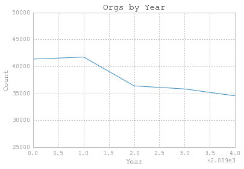
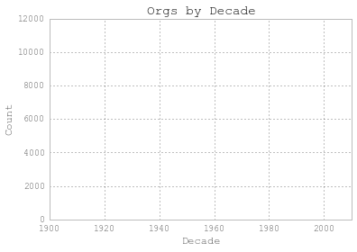
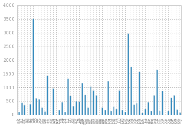
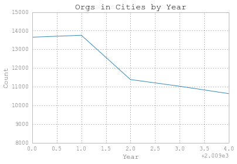
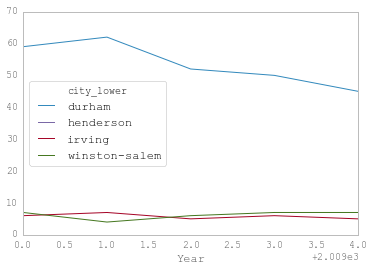
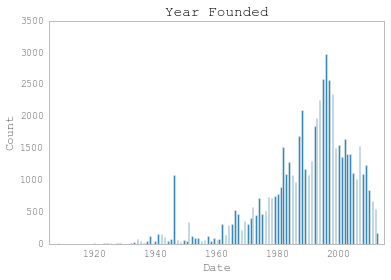
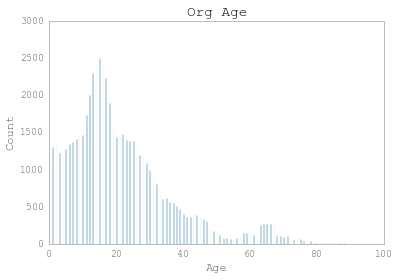

##Analyzing Nonprofit Housing Organizations with Pandas

In progress - June 24, 2015

###Table of Contents
* &nbsp;
	* [Analyzing Nonprofit Housing Organizations with Pandas](#Analyzing-Nonprofit-Housing-Organizations-with-Pandas)
		* [Introduction](#Introduction)
		* [Add extensions and import modules](#Add-extensions-and-import-modules)
		* [Ideal way to merge five NCCS files (for years 2009-2013)](#Ideal-way-to-merge-five-NCCS-files-%28for-years-2009-2013%29)
		* [Import data files, add columns, filter, and merge](#Import-data-files,-add-columns,-filter,-and-merge)
		* [Import Merged File](#Import-Merged-File)
		* [Look at Org Data](#Look-at-Org-Data)
			* [Q1: Which organization(s) have the highest (and lowest) income?](#Q1:-Which-organization%28s%29-have-the-highest-%28and-lowest%29-income?)
			* [Q2: How many organizations were founded in 2012?](#Q2:-How-many-organizations-were-founded-in-2012?)
			* [Q3: Using just data from 2013, let's plot when organizations were founded, by decade](#Q3:-Using-just-data-from-2013,-let's-plot-when-organizations-were-founded,-by-decade)
		* [Import Census Bureau data of ~115 most populous cities](#Import-Census-Bureau-data-of-~115-most-populous-cities)
		* [More Groupby operations](#More-Groupby-operations)
			* [Q4: Using the `orgs_cities` dataframe, let's compare the number of organizations, by year, in Durham and other similarly sized cities](#Q4:-Using-the-orgs_cities-dataframe,-let's-compare-the-number-of-organizations,-by-year,-in-Durham-and-other-similarly-sized-cities)
		* [The Power of `unstack`](#The-Power-of-unstack)
		* [Add Dependent Variables](#Add-Dependent-Variables)
		* [Another DV (low-income housing units)](#Another-DV-%28low-income-housing-units%29)
		* [Add GDP Data](#Add-GDP-Data)
		* [Descriptive Statistics (city-level)](#Descriptive-Statistics-%28city-level%29)
		* [Create new dataset of city characterstics (like the `collapse` command in Stata)](#Create-new-dataset-of-city-characterstics-%28like-the-collapse-command-in-Stata%29)
		* [Comparable Stata code](#Comparable-Stata-code)


###Introduction

This is a brief tutorial of how to work with the pandas library in Python to import datasets, clean and merge them together, get some descriptive statistics, and (in progress) do some statistical analysis. 

I started using pandas when I realized that I wanted to merge a lot of large datasets together for a research project I'm working on. My basic research question is to see whether the presence of nonprofit organizations that work in any capacity on affordable housing has an effect on affordable housing policies and outcomes.

For this project, the data I'm using for nonprofit organizational presence come from the IRS (and compiled by the National Center for Charitable Statistics. The data for my outcomes of interest -- housing voucher usage and the number of affordable housing units built -- come from the U.S. Department of Housing and Urban Development (HUD). I also use data from the Census Bureau and the Bureau of Economic Analysis.

The city is my unit of analysis.

A big chunk of this notebook deals with importing and merging datasets to get the data ready for analysis.

###Add extensions and import modules

If you want to load the JS extensions (spell check for markdown and table of contents creation), check out http://calicoproject.org/Icalico and https://github.com/minrk/ipython_extensions. 


```javascript
%%javascript
IPython.load_extensions('toc', 'calico-spell-check', 'calico-document-tools')
```


    <IPython.core.display.Javascript object>


```python
# Import modules and set display settings

import numpy as np
import pandas as pd
import matplotlib.pyplot as plt
plt.style.use('ggplot')

pd.set_option('display.width', 5000) 
pd.set_option('display.mpl_style', 'default') 
pd.set_option('display.max_columns', 100)
```


```python
%matplotlib inline
```


```python
#download style sheets here: https://github.com/brandon-rhodes/pycon-pandas-tutorial

from IPython.core.display import HTML
css = open('style-table.css').read() + open('style-notebook.css').read()
HTML('<style>{}</style>'.format(css))
```


<style>body {
    margin: 0;
    font-family: Helvetica;
}
table.dataframe {
    border-collapse: collapse;
    border: none;
}
table.dataframe tr {
    border: none;
}
table.dataframe td, table.dataframe th {
    margin: 0;
    border: 1px solid white;
    padding-left: 0.25em;
    padding-right: 0.25em;
}
table.dataframe th:not(:empty) {
    background-color: #fec;
    text-align: left;
    font-weight: normal;
}
table.dataframe tr:nth-child(2) th:empty {
    border-left: none;
    border-right: 1px dashed #888;
}
table.dataframe td {
    border: 2px solid #ccf;
    background-color: #f4f4ff;
}
h3 {
    color: white;
    background-color: black;
    padding: 0.5em;
}
</style>


###Ideal way to merge five NCCS files (for years 2009-2013)

Each of the NCCS yearly files I downloaded (which, unfortunately, are not freely available) contained about a million records (and approximately 60 variables). Each row contains information about a registered nonprofit organization in the U.S., including year of founding (or, more accurately, year the IRS approved nonprofit status), annual income, location, and an NTEE code (classification of an organization's main activity). For more, see http://www.irs.gov/pub/irs-soi/eo_info.pdf. 

Each file was about 500 MB, so merging five of them in the function below was too much for my computer. So, I narrowed down each file (i.e., data for each year) to the kinds of organizations I was interested in.

Don't execute first cell below...it has either taken too long or crashed my browser


```python
# Import organization text files and append to a list
# Data from 2009 from October, not December

years = range(2009, 2014)
pieces = []

for year in years:
    path = 'C:\Users\Akram Al-Turk\Box Sync\MA data\Org_data\eo_te\eo_12_%d.txt' % year
    eo = pd.read_csv(path)  
    eo['year'] = year
    #eo['month'] = month
    pieces.append(eo)

# Concatenate all orgs into one DF

eos = pd.concat(pieces, ignore_index=True)

#

eos['city_lower'] = eos.CITY.str.lower()
eos['state_lower'] = eos.STATE.str.lower()

eos['housing_in_name'] = eos.NAME.str.contains('HOUSING COALITION') | eos.NAME.str.contains('FAIR HOUSING') | eos.NAME.str.contains('AFFORDABLE HOUSING') 
eos['housing_activ'] = ((eos.ACTIV2 >= 380) & (eos.ACTIV2 <= 399)) | ((eos.ACTIV1 >= 380) & (eos.ACTIV1 <= 399)) | ((eos.ACTIV3 >= 380) & (eos.ACTIV3 <= 399))
eos['housing_ntee'] = eos.NTEE1 == 'L'
eos['housing_other'] = (eos.ACTIV1 == 402) | (eos.ACTIV1 == 429) | (eos.ACTIV2 == 402) | (eos.ACTIV2 == 429) | (eos.ACTIV3 == 402) | (eos.ACTIV3 == 429)

eos['all_housing'] = (eos.housing_in_name == True) | (eos.housing_activ == True) | (eos.housing_ntee == True) | (eos.housing_other == True)
```

###Import data files, add columns, filter, and merge

This code is more inefficient, but ultimately works better for me.

First, let's import one of the data files and read it into a pandas dataframe.


```python
orgs_13_loc = r'C:\Users\Akram Al-Turk\Box Sync\MA data\Org_data\eo_te\eo_12_2013.txt'
orgs_13 = pd.read_csv(orgs_13_loc)
```

    C:\Users\Akram Al-Turk\Anaconda\lib\site-packages\pandas\io\parsers.py:1170: DtypeWarning: Columns (14) have mixed types. Specify dtype option on import or set low_memory=False.
      data = self._reader.read(nrows)
    

There are a number of commands that you can use to inspect the data. I'll go through a few them throughout. 

This one is to look at a list of variable names in the dataset.


```python
orgs_13.columns
```


    Index([u'EIN', u'NAME', u'STATE', u'NTEE1', u'NTEECC', u'ADDRESS', u'CITY', u'ZIP', u'zip5', u'FIPS', u'MSA_NECH', u'PMSA', u'TAXPER', u'outnccs', u'OUTREAS', u'Filer', u'ZFILER', u'SUBSECCD', u'ntmaj5', u'ntmaj10', u'ntmaj12', u'NTEEconf', u'MAJGRPB', u'ACTIV1', u'ACTIV2', u'ACTIV3', u'ASCD', u'INCCD', u'INCOME', u'F990REV', u'ASSETS', u'cFiler', u'czFiler', u'cTaxPer', u'cTotRev', u'cAssets', u'cFinSrc', u'RULEDATE', u'FNDNCD', u'FRCD', u'AFCD', u'ARED', u'CONTACT', u'SEC_NAME', u'GEN', u'EOSTATUS', u'LEVEL1', u'LEVEL2', u'level3', u'level4', u'CLASSCD', u'DEDUCTCD', u'NTEEIRS', u'NAICS', u'ORGCD', u'ACCPER'], dtype='object')


And now just looking at the first five rows in the dataset.


```python
orgs_13.head()
```


<div>
<table border="1" class="dataframe">
  <thead>
    <tr style="text-align: right;">
      <th></th>
      <th>EIN</th>
      <th>NAME</th>
      <th>STATE</th>
      <th>NTEE1</th>
      <th>NTEECC</th>
      <th>ADDRESS</th>
      <th>CITY</th>
      <th>ZIP</th>
      <th>zip5</th>
      <th>FIPS</th>
      <th>MSA_NECH</th>
      <th>PMSA</th>
      <th>TAXPER</th>
      <th>outnccs</th>
      <th>OUTREAS</th>
      <th>Filer</th>
      <th>ZFILER</th>
      <th>SUBSECCD</th>
      <th>ntmaj5</th>
      <th>ntmaj10</th>
      <th>ntmaj12</th>
      <th>NTEEconf</th>
      <th>MAJGRPB</th>
      <th>ACTIV1</th>
      <th>ACTIV2</th>
      <th>ACTIV3</th>
      <th>ASCD</th>
      <th>INCCD</th>
      <th>INCOME</th>
      <th>F990REV</th>
      <th>ASSETS</th>
      <th>cFiler</th>
      <th>czFiler</th>
      <th>cTaxPer</th>
      <th>cTotRev</th>
      <th>cAssets</th>
      <th>cFinSrc</th>
      <th>RULEDATE</th>
      <th>FNDNCD</th>
      <th>FRCD</th>
      <th>AFCD</th>
      <th>ARED</th>
      <th>CONTACT</th>
      <th>SEC_NAME</th>
      <th>GEN</th>
      <th>EOSTATUS</th>
      <th>LEVEL1</th>
      <th>LEVEL2</th>
      <th>level3</th>
      <th>level4</th>
      <th>CLASSCD</th>
      <th>DEDUCTCD</th>
      <th>NTEEIRS</th>
      <th>NAICS</th>
      <th>ORGCD</th>
      <th>ACCPER</th>
    </tr>
  </thead>
  <tbody>
    <tr>
      <th>0</th>
      <td>19818</td>
      <td>PALMER SECOND BAPTIST CHURCH</td>
      <td>MA</td>
      <td>X</td>
      <td>X21</td>
      <td>1050 THORNDIKE ST</td>
      <td>PALMER</td>
      <td>01069-1507</td>
      <td>1069</td>
      <td>25013</td>
      <td>8003</td>
      <td>NaN</td>
      <td>NaN</td>
      <td>IN</td>
      <td>NaN</td>
      <td>N</td>
      <td>N</td>
      <td>3</td>
      <td>OT</td>
      <td>RE</td>
      <td>RE</td>
      <td>A</td>
      <td>X</td>
      <td>1</td>
      <td>0</td>
      <td>0</td>
      <td>0</td>
      <td>0</td>
      <td>0</td>
      <td>0</td>
      <td>0</td>
      <td>N</td>
      <td>N</td>
      <td>.</td>
      <td>.</td>
      <td>.</td>
      <td>.</td>
      <td>195504</td>
      <td>10</td>
      <td>60</td>
      <td>9</td>
      <td>0</td>
      <td>NaN</td>
      <td>3514</td>
      <td>3125</td>
      <td>1</td>
      <td>PC</td>
      <td>O</td>
      <td>RE</td>
      <td>X</td>
      <td>7</td>
      <td>1</td>
      <td>NaN</td>
      <td>813110</td>
      <td>5</td>
      <td>12</td>
    </tr>
    <tr>
      <th>1</th>
      <td>29215</td>
      <td>ST GEORGE CATHEDRAL</td>
      <td>MA</td>
      <td>X</td>
      <td>X20</td>
      <td>523 E BROADWAY</td>
      <td>SOUTH BOSTON</td>
      <td>02127-4415</td>
      <td>2127</td>
      <td>25025</td>
      <td>1123</td>
      <td>NaN</td>
      <td>NaN</td>
      <td>IN</td>
      <td>NaN</td>
      <td>N</td>
      <td>N</td>
      <td>3</td>
      <td>OT</td>
      <td>RE</td>
      <td>RE</td>
      <td>C</td>
      <td>X</td>
      <td>1</td>
      <td>0</td>
      <td>0</td>
      <td>0</td>
      <td>0</td>
      <td>0</td>
      <td>0</td>
      <td>0</td>
      <td>N</td>
      <td>N</td>
      <td>.</td>
      <td>.</td>
      <td>.</td>
      <td>.</td>
      <td>197210</td>
      <td>10</td>
      <td>60</td>
      <td>9</td>
      <td>0</td>
      <td>NaN</td>
      <td>NaN</td>
      <td>2365</td>
      <td>1</td>
      <td>PC</td>
      <td>O</td>
      <td>RE</td>
      <td>X</td>
      <td>7</td>
      <td>1</td>
      <td>NaN</td>
      <td>813110</td>
      <td>1</td>
      <td>12</td>
    </tr>
    <tr>
      <th>2</th>
      <td>260049</td>
      <td>CORINTH BAPTIST CHURCH</td>
      <td>FL</td>
      <td>X</td>
      <td>X21</td>
      <td>PO BOX 92</td>
      <td>HOSFORD</td>
      <td>32334-0092</td>
      <td>32334</td>
      <td>12077</td>
      <td>NaN</td>
      <td>NaN</td>
      <td>NaN</td>
      <td>IN</td>
      <td>NaN</td>
      <td>N</td>
      <td>N</td>
      <td>3</td>
      <td>OT</td>
      <td>RE</td>
      <td>RE</td>
      <td>A</td>
      <td>X</td>
      <td>59</td>
      <td>29</td>
      <td>0</td>
      <td>0</td>
      <td>0</td>
      <td>0</td>
      <td>0</td>
      <td>0</td>
      <td>N</td>
      <td>N</td>
      <td>.</td>
      <td>.</td>
      <td>.</td>
      <td>.</td>
      <td>196908</td>
      <td>10</td>
      <td>60</td>
      <td>9</td>
      <td>0</td>
      <td>NaN</td>
      <td>NaN</td>
      <td>2024</td>
      <td>1</td>
      <td>PC</td>
      <td>O</td>
      <td>RE</td>
      <td>X</td>
      <td>7</td>
      <td>1</td>
      <td>NaN</td>
      <td>813110</td>
      <td>5</td>
      <td>12</td>
    </tr>
    <tr>
      <th>3</th>
      <td>262650</td>
      <td>THE SOCIETY OF ST VINCENT DE PAUL OF MEMPHIS INC</td>
      <td>TN</td>
      <td>T</td>
      <td>T30</td>
      <td>3522 CARNES AVE</td>
      <td>MEMPHIS</td>
      <td>38111-5704</td>
      <td>38111</td>
      <td>47157</td>
      <td>4920</td>
      <td>NaN</td>
      <td>NaN</td>
      <td>IN</td>
      <td>NaN</td>
      <td>N</td>
      <td>N</td>
      <td>3</td>
      <td>OT</td>
      <td>PU</td>
      <td>PU</td>
      <td>B</td>
      <td>T</td>
      <td>0</td>
      <td>0</td>
      <td>0</td>
      <td>0</td>
      <td>0</td>
      <td>0</td>
      <td>0</td>
      <td>0</td>
      <td>N</td>
      <td>N</td>
      <td>.</td>
      <td>.</td>
      <td>.</td>
      <td>.</td>
      <td>201304</td>
      <td>15</td>
      <td>10</td>
      <td>3</td>
      <td>0</td>
      <td>NaN</td>
      <td>NaN</td>
      <td>0</td>
      <td>1</td>
      <td>PC</td>
      <td>S</td>
      <td>ZD</td>
      <td>T</td>
      <td>1</td>
      <td>1</td>
      <td>T30</td>
      <td>813211</td>
      <td>1</td>
      <td>12</td>
    </tr>
    <tr>
      <th>4</th>
      <td>490336</td>
      <td>EASTSIDE BAPTIST CHURCH</td>
      <td>FL</td>
      <td>X</td>
      <td>X21</td>
      <td>PO BOX 296</td>
      <td>LABELLE</td>
      <td>33975-0296</td>
      <td>33975</td>
      <td>12051</td>
      <td>NaN</td>
      <td>NaN</td>
      <td>NaN</td>
      <td>IN</td>
      <td>NaN</td>
      <td>N</td>
      <td>N</td>
      <td>3</td>
      <td>OT</td>
      <td>RE</td>
      <td>RE</td>
      <td>A</td>
      <td>X</td>
      <td>59</td>
      <td>29</td>
      <td>0</td>
      <td>0</td>
      <td>0</td>
      <td>0</td>
      <td>0</td>
      <td>0</td>
      <td>N</td>
      <td>N</td>
      <td>.</td>
      <td>.</td>
      <td>.</td>
      <td>.</td>
      <td>196908</td>
      <td>10</td>
      <td>60</td>
      <td>9</td>
      <td>0</td>
      <td>NaN</td>
      <td>NaN</td>
      <td>2024</td>
      <td>1</td>
      <td>PC</td>
      <td>O</td>
      <td>RE</td>
      <td>X</td>
      <td>7</td>
      <td>1</td>
      <td>NaN</td>
      <td>813110</td>
      <td>5</td>
      <td>12</td>
    </tr>
  </tbody>
</table>
</div>


Because there are a lot of variables I'm not going to use, I can just specify which ones I want.


```python
variables = ['EIN', 'NAME', 'NTEE1', 'NTEECC', 'CITY', 'STATE', 'zip5', 'MSA_NECH', 'ntmaj12', 'ACTIV1', 'ACTIV2', 'ACTIV3', 'INCOME', 'ASSETS', 'RULEDATE', 'NTEEIRS', 'NAICS']
```

Then, I create a new dataframe that includes just my variables.

I also create a few new variables. I want to add a 'year' variable, since I'll be working with five years worth of data. 

I then use a few string commands (see [Working with Text Data](http://pandas.pydata.org/pandas-docs/stable/text.html)). 

A couple of them are just to create new variables that use lower case for the city and state. I'll need this later when I merge in other datasets. 

Based on the IRS file I linked to above, there are a few ways we can narrow down our dataframe to include organizations that work on affordable housing. (This definitely has its limitations.) "L" groups are classified as "Housing, Shelter" and then there are some activity codes that correspond to housing-based work. 


```python
orgs_13 = orgs_13[variables]
orgs_13['year'] = 2013

orgs_13['city_lower'] = orgs_13.CITY.str.lower()
orgs_13['state_lower'] = orgs_13.STATE.str.lower()

orgs_13['housing_in_name'] = orgs_13.NAME.str.contains('HOUSING COALITION') | orgs_13.NAME.str.contains('FAIR HOUSING') | orgs_13.NAME.str.contains('AFFORDABLE HOUSING') 
orgs_13['housing_activ'] = ((orgs_13.ACTIV2 >= 380) & (orgs_13.ACTIV2 <= 399)) | ((orgs_13.ACTIV1 >= 380) & (orgs_13.ACTIV1 <= 399)) | ((orgs_13.ACTIV3 >= 380) & (orgs_13.ACTIV3 <= 399))
orgs_13['housing_ntee'] = orgs_13.NTEE1 == 'L'
orgs_13['housing_other'] = (orgs_13.ACTIV1 == 402) | (orgs_13.ACTIV1 == 429) | (orgs_13.ACTIV2 == 402) | (orgs_13.ACTIV2 == 429) | (orgs_13.ACTIV3 == 402) | (orgs_13.ACTIV3 == 429)
```

We can look at the shape of the dataset. After I included just the variables I was interested in and adding a few, it looks like we now have 25 columns. And approximately 1 million rows.


```python
orgs_13.shape
```


    ---------------------------------------------------------------------------

    NameError                                 Traceback (most recent call last)

    <ipython-input-2-9379859e966c> in <module>()
    ----> 1 orgs_13.shape
    

    NameError: name 'orgs_13' is not defined


The code above just added (or removed) columns. It didn't filter out any records. The syntax in pandas sometimes confuses me, and this took me a few tries. You often have to write `df[(df.variable...)]` to get that subset of the dataframe. The code above didn't have this df followed by df that I have below.


```python
housing_orgs_13 = orgs_13[(orgs_13.housing_in_name == True) | (orgs_13.housing_activ == True) | (orgs_13.housing_ntee == True) | (orgs_13.housing_other == True)]
```

As we can see from the `shape` command, the code just above this one gave us a new df, which now has 34522 rows.


```python
housing_orgs_13.shape
```


    (34522, 25)


Or about 3 percent of all registered nonprofit organizations in the U.S.


```python
"%.3f" % (34522/float(1047591))
```


    '0.033'


###Import Merged File

After running the code above on the five files (one each for 2009-2013), I merged the five resulting dataframes. 

Here's how to do that:
```
housing_orgs_5yrs = pd.concat([housing_orgs_13, housing_orgs_12, housing_orgs_11, housing_orgs_10, housing_orgs_09])
```

Then, export to a csv file:
```
housing_orgs_5yrs.to_csv('C:\Users\Akram Al-Turk\Box Sync\MA data\housing_orgs_5yrs.csv')
```


```python
#import merged file
housing_orgs_location = r'C:\Users\Akram Al-Turk\Box Sync\MA data\housing_orgs_5yrs.csv'
housing_orgs_5yrs = pd.read_csv(housing_orgs_location)
```

    C:\Users\Akram Al-Turk\Anaconda\lib\site-packages\pandas\io\parsers.py:1170: DtypeWarning: Columns (8) have mixed types. Specify dtype option on import or set low_memory=False.
      data = self._reader.read(nrows)
    

###Look at Org Data


```python
housing_orgs_5yrs.shape
```


    (189756, 26)


We see we have 189,756 organization-year observations.


```python
# top of dataframe

housing_orgs_5yrs.head()
```


<div>
<table border="1" class="dataframe">
  <thead>
    <tr style="text-align: right;">
      <th></th>
      <th>Unnamed: 0</th>
      <th>EIN</th>
      <th>NAME</th>
      <th>NTEE1</th>
      <th>NTEECC</th>
      <th>CITY</th>
      <th>STATE</th>
      <th>zip5</th>
      <th>MSA_NECH</th>
      <th>ntmaj12</th>
      <th>ACTIV1</th>
      <th>ACTIV2</th>
      <th>ACTIV3</th>
      <th>INCOME</th>
      <th>ASSETS</th>
      <th>RULEDATE</th>
      <th>NTEEIRS</th>
      <th>NAICS</th>
      <th>year</th>
      <th>month</th>
      <th>city_lower</th>
      <th>state_lower</th>
      <th>housing_in_name</th>
      <th>housing_activ</th>
      <th>housing_ntee</th>
      <th>housing_other</th>
    </tr>
  </thead>
  <tbody>
    <tr>
      <th>0</th>
      <td>29</td>
      <td>10024907</td>
      <td>BAR HARBOR VILLAGE IMPROVEMENT ASSOCIATION</td>
      <td>S</td>
      <td>S20</td>
      <td>BAR HARBOR</td>
      <td>ME</td>
      <td>4609</td>
      <td>NaN</td>
      <td>PU</td>
      <td>402</td>
      <td>404</td>
      <td>0</td>
      <td>42247</td>
      <td>612052</td>
      <td>199603</td>
      <td>S20Z</td>
      <td>813410</td>
      <td>2013</td>
      <td>12</td>
      <td>bar harbor</td>
      <td>me</td>
      <td>False</td>
      <td>False</td>
      <td>False</td>
      <td>True</td>
    </tr>
    <tr>
      <th>1</th>
      <td>35</td>
      <td>10131950</td>
      <td>PLANT MEMORIAL HOME</td>
      <td>A</td>
      <td>A80</td>
      <td>BATH</td>
      <td>ME</td>
      <td>4530</td>
      <td>NaN</td>
      <td>AR</td>
      <td>382</td>
      <td>0</td>
      <td>0</td>
      <td>1790944</td>
      <td>4500326</td>
      <td>197202</td>
      <td>NaN</td>
      <td>712120</td>
      <td>2013</td>
      <td>12</td>
      <td>bath</td>
      <td>me</td>
      <td>False</td>
      <td>True</td>
      <td>False</td>
      <td>False</td>
    </tr>
    <tr>
      <th>2</th>
      <td>74</td>
      <td>10211504</td>
      <td>EUNICE FRYE HOME</td>
      <td>L</td>
      <td>L99</td>
      <td>PORTLAND</td>
      <td>ME</td>
      <td>4112</td>
      <td>6403</td>
      <td>HU</td>
      <td>382</td>
      <td>399</td>
      <td>0</td>
      <td>1264856</td>
      <td>1440996</td>
      <td>194303</td>
      <td>NaN</td>
      <td>624220</td>
      <td>2013</td>
      <td>12</td>
      <td>portland</td>
      <td>me</td>
      <td>False</td>
      <td>True</td>
      <td>True</td>
      <td>False</td>
    </tr>
    <tr>
      <th>3</th>
      <td>79</td>
      <td>10211512</td>
      <td>HOME FOR THE AGED</td>
      <td>P</td>
      <td>P75</td>
      <td>PORTLAND</td>
      <td>ME</td>
      <td>4103</td>
      <td>6403</td>
      <td>HU</td>
      <td>382</td>
      <td>0</td>
      <td>0</td>
      <td>6386270</td>
      <td>15951540</td>
      <td>194207</td>
      <td>P750</td>
      <td>623311</td>
      <td>2013</td>
      <td>12</td>
      <td>portland</td>
      <td>me</td>
      <td>False</td>
      <td>True</td>
      <td>False</td>
      <td>False</td>
    </tr>
    <tr>
      <th>4</th>
      <td>94</td>
      <td>10211545</td>
      <td>PORTLAND SEAMENS FRIEND SOCIETY</td>
      <td>T</td>
      <td>T23</td>
      <td>WESTBROOK</td>
      <td>ME</td>
      <td>4092</td>
      <td>6403</td>
      <td>PU</td>
      <td>399</td>
      <td>0</td>
      <td>0</td>
      <td>102519</td>
      <td>172085</td>
      <td>195003</td>
      <td>NaN</td>
      <td>813211</td>
      <td>2013</td>
      <td>12</td>
      <td>westbrook</td>
      <td>me</td>
      <td>False</td>
      <td>True</td>
      <td>False</td>
      <td>False</td>
    </tr>
  </tbody>
</table>
</div>


```python
#To just view a few columns, use list of lists

housing_orgs_5yrs.head()[['NAME', 'NTEECC', 'RULEDATE', 'city_lower', 'state_lower']]
```


<div>
<table border="1" class="dataframe">
  <thead>
    <tr style="text-align: right;">
      <th></th>
      <th>NAME</th>
      <th>NTEECC</th>
      <th>RULEDATE</th>
      <th>city_lower</th>
      <th>state_lower</th>
    </tr>
  </thead>
  <tbody>
    <tr>
      <th>0</th>
      <td>BAR HARBOR VILLAGE IMPROVEMENT ASSOCIATION</td>
      <td>S20</td>
      <td>199603</td>
      <td>bar harbor</td>
      <td>me</td>
    </tr>
    <tr>
      <th>1</th>
      <td>PLANT MEMORIAL HOME</td>
      <td>A80</td>
      <td>197202</td>
      <td>bath</td>
      <td>me</td>
    </tr>
    <tr>
      <th>2</th>
      <td>EUNICE FRYE HOME</td>
      <td>L99</td>
      <td>194303</td>
      <td>portland</td>
      <td>me</td>
    </tr>
    <tr>
      <th>3</th>
      <td>HOME FOR THE AGED</td>
      <td>P75</td>
      <td>194207</td>
      <td>portland</td>
      <td>me</td>
    </tr>
    <tr>
      <th>4</th>
      <td>PORTLAND SEAMENS FRIEND SOCIETY</td>
      <td>T23</td>
      <td>195003</td>
      <td>westbrook</td>
      <td>me</td>
    </tr>
  </tbody>
</table>
</div>


Let's see how many orgs there are per year.

We can use `value.counts` or we can do `groupby` and plot with matplotlib.

There's probably a more efficient way than the plot example below.


```python
print "Housing Orgs by Year\n"

print housing_orgs_5yrs['year'].value_counts()
```

    Housing Orgs by Year
    
    2010    41718
    2009    41337
    2011    36371
    2012    35808
    2013    34522
    dtype: int64
    


```python
yearly_counts = housing_orgs_5yrs.groupby('year').EIN.nunique()
```


```python
yearly_counts
```


    year
    2009    41337
    2010    41718
    2011    36371
    2012    35808
    2013    34522
    Name: EIN, dtype: int64


```python
#could be a lot better

yearly_counts.plot()
plt.title("Orgs by Year")
plt.ylabel('Count')
plt.axis([2009, 2013, 25000, 50000])
plt.xlabel('Year')
```


    <matplotlib.text.Text at 0x13204898>





####Q1: Which organization(s) have the highest (and lowest) income?


```python

```


```python

```

####Q2: How many organizations were founded in 2012?

First, let's see which column has this info.


```python
housing_orgs_5yrs.columns
```


    Index([u'Unnamed: 0', u'EIN', u'NAME', u'NTEE1', u'NTEECC', u'CITY', u'STATE', u'zip5', u'MSA_NECH', u'ntmaj12', u'ACTIV1', u'ACTIV2', u'ACTIV3', u'INCOME', u'ASSETS', u'RULEDATE', u'NTEEIRS', u'NAICS', u'year', u'month', u'city_lower', u'state_lower', u'housing_in_name', u'housing_activ', u'housing_ntee', u'housing_other'], dtype='object')


```python
#Let's use RULEDATE

housing_orgs_5yrs.RULEDATE.head()

#Looks like the format is year, month.
```


    0    199603
    1    197202
    2    194303
    3    194207
    4    195003
    Name: RULEDATE, dtype: int64


```python
founded_12 = housing_orgs_5yrs[(housing_orgs_5yrs.RULEDATE >= 201201) & (housing_orgs_5yrs.RULEDATE <= 201212)]
```


```python
founded_12.shape
```


    (1662, 26)


```python
len(housing_orgs_5yrs[(housing_orgs_5yrs.RULEDATE >= 201201) & (housing_orgs_5yrs.RULEDATE <= 201212)])
```


    1662


There are a few things to consider about the three cells above. First, remember from above that the syntax to get a dataframe (rather than a bunch of true's and false's) requires putting the name of the dataframe in brackets followed by the variable of interest (I think that both `.variable` and `['variable']` work). The other tricky part is that, although it doesn't seem intuitive, you need to include parentheses when you use operands like `&` and `|`. 

The other thing about that output is that the number of rows (1662) is the organization-year observations, not the number of organizations founded in 2012. How can we find that number?


```python

```

####Q3: Using just data from 2013, let's plot when organizations were founded, by decade 


```python
#create df with just 2013 data
data_13 = housing_orgs_5yrs[housing_orgs_5yrs.year == 2013]

#double slash cuts off the fraction, so this code will give us the decade of founding
(data_13.RULEDATE // 1000 * 10).head()

#now, let's use value_counts and groupby to plot the results
```


    0    1990
    1    1970
    2    1940
    3    1940
    4    1950
    Name: RULEDATE, dtype: int64


```python
# value_counts

```


```python
# groupby

```


```python
#insert first line of code

plt.title("Orgs by Decade")
plt.ylabel('Count')
plt.axis([1900, 2010, 0, 12000])
plt.xlabel('Decade')
```


    <matplotlib.text.Text at 0x1088cfd0>





```python
data_13.state_lower.value_counts().sort_index().plot(kind='bar')
```


    <matplotlib.axes._subplots.AxesSubplot at 0x15634c88>





###Import Census Bureau data of ~115 most populous cities

This is a file I downloaded from Social Explorer.


```python
# Import city characteristics file (2009-2013)

cities_location = r'C:\Users\Akram Al-Turk\Box Sync\MA Data\census_2009_2013.csv'
cities = pd.read_csv(cities_location)
```


```python
cities.head(2)
```


<div>
<table border="1" class="dataframe">
  <thead>
    <tr style="text-align: right;">
      <th></th>
      <th>Year</th>
      <th>FIPS</th>
      <th>Name of Area</th>
      <th>Qualifying Name</th>
      <th>State/U.S.-Abbreviation (USPS)</th>
      <th>Summary Level</th>
      <th>Geographic Component</th>
      <th>File Identification</th>
      <th>Logical Record Number</th>
      <th>State (FIPS)</th>
      <th>Place (FIPS Code)</th>
      <th>Place (State FIPS + Place FIPS)</th>
      <th>Metropolitan and Micropolitan Statistical Area</th>
      <th>Principal City Indicator</th>
      <th>Geographic Identifier</th>
      <th>Area (Land)</th>
      <th>Area (Water)</th>
      <th>Total Population</th>
      <th>Area Total</th>
      <th>Area (Land).1</th>
      <th>Area (Water).1</th>
      <th>Total Population.1</th>
      <th>White Alone</th>
      <th>Black or African American Alone</th>
      <th>American Indian and Alaska Native Alone</th>
      <th>Asian Alone</th>
      <th>Native Hawaiian and Other Pacific Islander Alone</th>
      <th>Some Other Race Alone</th>
      <th>Two or More races</th>
      <th>Population 16 Years and over</th>
      <th>Population 16 Years and over: In labor force</th>
      <th>Population 16 Years and over: In labor force: In Armed Forces</th>
      <th>Population 16 Years and over: In labor force: Civilian</th>
      <th>Population 16 Years and over: In labor force: Civilian: Employed</th>
      <th>Population 16 Years and over: In labor force: Civilian: Unemployed</th>
      <th>Population 16 Years and over: Not in labor force</th>
      <th>Civilian Population In Labor Force 16 Years And Over</th>
      <th>Civilian Population In Labor Force 16 Years And Over: Employed</th>
      <th>Civilian Population In Labor Force 16 Years And Over: Unemployed</th>
      <th>Median household income (In 2013 Inflation adjusted dollars)</th>
      <th>Households: Gini Index</th>
      <th>Housing units</th>
      <th>Median year structure built</th>
      <th>Owner-occupied housing units: Median value</th>
      <th>Renter-occupied housing units</th>
      <th>Renter-occupied housing units: Gross Rent As A Percentage Of Household Income In 2011: Less than 10 percent</th>
      <th>Renter-occupied housing units: Gross Rent As A Percentage Of Household Income In 2011: 10 to 29 percent</th>
      <th>Renter-occupied housing units: Gross Rent As A Percentage Of Household Income In 2011: 30 to 49 percent</th>
      <th>Renter-occupied housing units: Gross Rent As A Percentage Of Household Income In 2011: 50 percent or More</th>
      <th>Renter-occupied housing units: Gross Rent As A Percentage Of Household Income In 2011: Not computed</th>
      <th>Renter-Occupied Paying Cash Rent: Median Gross Rent as a Percentage of Household Income In 2013</th>
      <th>Families</th>
      <th>Families: Income in 2013 below poverty level</th>
      <th>Families: Income in 2013 below poverty level: Married Couple Family: With Related Child Living Bellow Poverty Level</th>
      <th>Families: Income in 2013 below poverty level: Married Couple Family: No related children under 18 Years</th>
      <th>Families: Income in 2013 below poverty level: Male Householder, no wife present</th>
      <th>Families: Income in 2013 below poverty level: Male Householder, no wife present: With related children under 18 Years</th>
      <th>Families: Income in 2013 below poverty level: Male Householder, no wife present: No related children under 18 Years</th>
      <th>Families: Income in 2013 below poverty level: Female Householder, no husband present</th>
      <th>Families: Income in 2013 below poverty level: Female Householder, no husband present: With related children under 18 Years</th>
      <th>Families: Income in 2013 below poverty level: Female Householder, no husband present: No related children under 18 Years</th>
      <th>Families: Income in 2013 at or above poverty level</th>
      <th>Population Age 18 to 64 for whom poverty status is determined</th>
      <th>Population Age 18 to 64 for whom poverty status is determined: Living in Poverty</th>
      <th>Population Age 18 to 64 for whom poverty status is determined: At or Above Poverty Level</th>
    </tr>
  </thead>
  <tbody>
    <tr>
      <th>0</th>
      <td>2013</td>
      <td>3.640000e+11</td>
      <td>New York city; New York-Newark-Jersey City, NY...</td>
      <td>New York city; New York-Newark-Jersey City, Ne...</td>
      <td>ny</td>
      <td>321</td>
      <td>0</td>
      <td>ACSSF</td>
      <td>26405</td>
      <td>36</td>
      <td>51000</td>
      <td>3651000</td>
      <td>35620</td>
      <td>Y</td>
      <td>32100US363562051000</td>
      <td>783842402</td>
      <td>429527437</td>
      <td>8268999</td>
      <td>468.4847</td>
      <td>302.6433</td>
      <td>165.8415</td>
      <td>8268999</td>
      <td>3659155</td>
      <td>2057226</td>
      <td>32421</td>
      <td>1077554</td>
      <td>4403</td>
      <td>1189355</td>
      <td>248885</td>
      <td>6694673</td>
      <td>4244118</td>
      <td>3309</td>
      <td>4240809</td>
      <td>3789820</td>
      <td>450989</td>
      <td>2450555</td>
      <td>4240809</td>
      <td>3789820</td>
      <td>450989</td>
      <td>52259</td>
      <td>0.5402</td>
      <td>3380513</td>
      <td>1948</td>
      <td>492800</td>
      <td>2080590</td>
      <td>98360</td>
      <td>823241</td>
      <td>476588</td>
      <td>581148</td>
      <td>101253</td>
      <td>31.900000</td>
      <td>1844540</td>
      <td>318457</td>
      <td>73665</td>
      <td>41153</td>
      <td>28784</td>
      <td>19448</td>
      <td>9336</td>
      <td>174855</td>
      <td>138611</td>
      <td>36244</td>
      <td>1526083</td>
      <td>5393156</td>
      <td>957146</td>
      <td>4436010</td>
    </tr>
    <tr>
      <th>1</th>
      <td>2013</td>
      <td>6.310804e+10</td>
      <td>Los Angeles city; Los Angeles-Long Beach-Anahe...</td>
      <td>Los Angeles city; Los Angeles-Long Beach-Anahe...</td>
      <td>ca</td>
      <td>321</td>
      <td>0</td>
      <td>ACSSF</td>
      <td>37860</td>
      <td>6</td>
      <td>44000</td>
      <td>644000</td>
      <td>31080</td>
      <td>Y</td>
      <td>32100US063108044000</td>
      <td>NaN</td>
      <td>NaN</td>
      <td>3827261</td>
      <td>NaN</td>
      <td>NaN</td>
      <td>NaN</td>
      <td>3827261</td>
      <td>2006054</td>
      <td>357932</td>
      <td>20424</td>
      <td>434846</td>
      <td>6924</td>
      <td>872000</td>
      <td>129081</td>
      <td>3062309</td>
      <td>2034246</td>
      <td>1414</td>
      <td>2032832</td>
      <td>1787083</td>
      <td>245749</td>
      <td>1028063</td>
      <td>2032832</td>
      <td>1787083</td>
      <td>245749</td>
      <td>49497</td>
      <td>0.5257</td>
      <td>1422368</td>
      <td>1960</td>
      <td>446100</td>
      <td>824597</td>
      <td>18097</td>
      <td>288370</td>
      <td>212744</td>
      <td>265981</td>
      <td>39405</td>
      <td>36.299999</td>
      <td>799536</td>
      <td>142361</td>
      <td>42419</td>
      <td>15113</td>
      <td>18666</td>
      <td>14567</td>
      <td>4099</td>
      <td>66163</td>
      <td>55645</td>
      <td>10518</td>
      <td>657175</td>
      <td>2505285</td>
      <td>491940</td>
      <td>2013345</td>
    </tr>
  </tbody>
</table>
</div>


Which cities are in the dataset? 

We can use `unique`.


```python
cities['Name of Area'].unique()
```


    array([ 'New York city; New York-Newark-Jersey City, NY-NJ-PA Metro Area (part); New York',
           'Los Angeles city; Los Angeles-Long Beach-Anaheim, CA Metro Area; California',
           'Chicago city; Chicago-Naperville-Elgin, IL-IN-WI Metro Area (part); Illinois',
           'Houston city; Houston-The Woodlands-Sugar Land, TX Metro Area; Texas',
           'Philadelphia city; Philadelphia-Camden-Wilmington, PA-NJ-DE-MD Metro Area (part); Pennsylvania',
           'Phoenix city; Phoenix-Mesa-Scottsdale, AZ Metro Area; Arizona',
           'San Antonio city; San Antonio-New Braunfels, TX Metro Area; Texas',
           'San Diego city; San Diego-Carlsbad, CA Metro Area; California',
           'Dallas city; Dallas-Fort Worth-Arlington, TX Metro Area; Texas',
           'San Jose city; San Jose-Sunnyvale-Santa Clara, CA Metro Area; California',
           'Austin city; Austin-Round Rock, TX Metro Area; Texas',
           'Jacksonville city; Jacksonville, FL Metro Area; Florida',
           'Indianapolis city (balance); Indianapolis-Carmel-Anderson, IN Metro Area; Indiana',
           'San Francisco city; San Francisco-Oakland-Hayward, CA Metro Area; California',
           'Columbus city; Columbus, OH Metro Area; Ohio',
           'Fort Worth city; Dallas-Fort Worth-Arlington, TX Metro Area; Texas',
           'Charlotte city; Charlotte-Concord-Gastonia, NC-SC Metro Area (part); North Carolina',
           'Detroit city; Detroit-Warren-Dearborn, MI Metro Area; Michigan',
           'El Paso city; El Paso, TX Metro Area; Texas',
           'Memphis city; Memphis, TN-MS-AR Metro Area (part); Tennessee',
           'Boston city; Boston-Cambridge-Newton, MA-NH Metro Area (part); Massachusetts',
           'Seattle city; Seattle-Tacoma-Bellevue, WA Metro Area; Washington',
           'Baltimore city; Baltimore-Columbia-Towson, MD Metro Area; Maryland',
           'Washington city; Washington-Arlington-Alexandria, DC-VA-MD-WV Metro Area (part); District of Columbia',
           'Denver city; Denver-Aurora-Lakewood, CO Metro Area; Colorado',
           'Nashville-Davidson metropolitan government (balance); Nashville-Davidson--Murfreesboro--Franklin, TN Metro Area; Tennessee',
           'Louisville/Jefferson County metro government (balance); Louisville/Jefferson County, KY-IN Metro Area (part); Kentucky',
           'Milwaukee city; Milwaukee-Waukesha-West Allis, WI Metro Area; Wisconsin',
           'Portland city; Portland-Vancouver-Hillsboro, OR-WA Metro Area (part); Oregon',
           'Las Vegas city; Las Vegas-Henderson-Paradise, NV Metro Area; Nevada',
           'Oklahoma City city (part); Oklahoma City, OK Metro Area; Oklahoma',
           'Albuquerque city; Albuquerque, NM Metro Area; New Mexico',
           'Tucson city; Tucson, AZ Metro Area; Arizona',
           'Fresno city; Fresno, CA Metro Area; California',
           'Sacramento city; Sacramento--Roseville--Arden-Arcade, CA Metro Area; California',
           'Long Beach city; Los Angeles-Long Beach-Anaheim, CA Metro Area; California',
           'Kansas City city; Kansas City, MO-KS Metro Area (part); Missouri',
           'Mesa city; Phoenix-Mesa-Scottsdale, AZ Metro Area; Arizona',
           'Virginia Beach city; Virginia Beach-Norfolk-Newport News, VA-NC Metro Area (part); Virginia',
           'Atlanta city; Atlanta-Sandy Springs-Roswell, GA Metro Area; Georgia',
           'Colorado Springs city; Colorado Springs, CO Metro Area; Colorado',
           'Omaha city; Omaha-Council Bluffs, NE-IA Metro Area (part); Nebraska',
           'Raleigh city (part); Raleigh, NC Metro Area; North Carolina',
           'Miami city; Miami-Fort Lauderdale-West Palm Beach, FL Metro Area; Florida',
           'Oakland city; San Francisco-Oakland-Hayward, CA Metro Area; California',
           'Cleveland city; Cleveland-Elyria, OH Metro Area; Ohio',
           'Tulsa city; Tulsa, OK Metro Area; Oklahoma',
           'Minneapolis city; Minneapolis-St. Paul-Bloomington, MN-WI Metro Area (part); Minnesota',
           'Wichita city; Wichita, KS Metro Area; Kansas',
           'San Juan zona urbana; San Juan-Carolina-Caguas, PR Metro Area; Puerto Rico',
           'Arlington city; Dallas-Fort Worth-Arlington, TX Metro Area; Texas',
           'New Orleans city; New Orleans-Metairie, LA Metro Area; Louisiana',
           'Bakersfield city; Bakersfield, CA Metro Area; California',
           'Tampa city; Tampa-St. Petersburg-Clearwater, FL Metro Area; Florida',
           'Urban Honolulu CDP; Urban Honolulu, HI Metro Area; Hawaii',
           'Anaheim city; Los Angeles-Long Beach-Anaheim, CA Metro Area; California',
           'Aurora city; Denver-Aurora-Lakewood, CO Metro Area; Colorado',
           'Santa Ana city; Los Angeles-Long Beach-Anaheim, CA Metro Area; California',
           'St. Louis city; St. Louis, MO-IL Metro Area (part); Missouri',
           'Riverside city; Riverside-San Bernardino-Ontario, CA Metro Area; California',
           'Corpus Christi city (part); Corpus Christi, TX Metro Area; Texas',
           'Pittsburgh city; Pittsburgh, PA Metro Area; Pennsylvania',
           'Lexington-Fayette urban county; Lexington-Fayette, KY Metro Area; Kentucky',
           'Cincinnati city; Cincinnati, OH-KY-IN Metro Area (part); Ohio',
           'Anchorage municipality; Anchorage, AK Metro Area; Alaska',
           'Stockton city; Stockton-Lodi, CA Metro Area; California',
           'St. Paul city; Minneapolis-St. Paul-Bloomington, MN-WI Metro Area (part); Minnesota',
           'Toledo city; Toledo, OH Metro Area; Ohio',
           'Newark city; New York-Newark-Jersey City, NY-NJ-PA Metro Area (part); New Jersey',
           'Greensboro city; Greensboro-High Point, NC Metro Area; North Carolina',
           'Plano city; Dallas-Fort Worth-Arlington, TX Metro Area; Texas',
           'Lincoln city; Lincoln, NE Metro Area; Nebraska',
           'Henderson city; Las Vegas-Henderson-Paradise, NV Metro Area; Nevada',
           'Buffalo city; Buffalo-Cheektowaga-Niagara Falls, NY Metro Area; New York',
           'Fort Wayne city; Fort Wayne, IN Metro Area; Indiana',
           'Jersey City city; New York-Newark-Jersey City, NY-NJ-PA Metro Area (part); New Jersey',
           'St. Petersburg city; Tampa-St. Petersburg-Clearwater, FL Metro Area; Florida',
           'Orlando city; Orlando-Kissimmee-Sanford, FL Metro Area; Florida',
           'Norfolk city; Virginia Beach-Norfolk-Newport News, VA-NC Metro Area (part); Virginia',
           'Laredo city; Laredo, TX Metro Area; Texas',
           'Madison city; Madison, WI Metro Area; Wisconsin',
           'Durham city (part); Durham-Chapel Hill, NC Metro Area; North Carolina',
           'Lubbock city; Lubbock, TX Metro Area; Texas',
           'Winston-Salem city; Winston-Salem, NC Metro Area; North Carolina',
           'Baton Rouge city; Baton Rouge, LA Metro Area; Louisiana',
           'Reno city; Reno, NV Metro Area; Nevada',
           'Paradise CDP; Las Vegas-Henderson-Paradise, NV Metro Area; Nevada',
           'Scottsdale city; Phoenix-Mesa-Scottsdale, AZ Metro Area; Arizona',
           'Irvine city; Los Angeles-Long Beach-Anaheim, CA Metro Area; California',
           'Irving city; Dallas-Fort Worth-Arlington, TX Metro Area; Texas',
           'Arlington CDP; Washington-Arlington-Alexandria, DC-VA-MD-WV Metro Area (part); Virginia',
           'Birmingham city; Birmingham-Hoover, AL Metro Area; Alabama',
           'San Bernardino city; Riverside-San Bernardino-Ontario, CA Metro Area; California',
           'Rochester city; Rochester, NY Metro Area; New York',
           'Boise City city; Boise City, ID Metro Area; Idaho',
           'Spokane city; Spokane-Spokane Valley, WA Metro Area; Washington',
           'Richmond city; Richmond, VA Metro Area; Virginia',
           'Des Moines city; Des Moines-West Des Moines, IA Metro Area; Iowa',
           'Montgomery city; Montgomery, AL Metro Area; Alabama',
           'Modesto city; Modesto, CA Metro Area; California',
           'Fayetteville city; Fayetteville, NC Metro Area; North Carolina',
           'Tacoma city; Seattle-Tacoma-Bellevue, WA Metro Area; Washington',
           'Shreveport city; Shreveport-Bossier City, LA Metro Area; Louisiana',
           'Oxnard city; Oxnard-Thousand Oaks-Ventura, CA Metro Area; California',
           'Akron city; Akron, OH Metro Area; Ohio',
           'Augusta-Richmond County consolidated government (balance); Augusta-Richmond County, GA-SC Metro Area (part); Georgia',
           'Mobile city; Mobile, AL Metro Area; Alabama',
           'Little Rock city; Little Rock-North Little Rock-Conway, AR Metro Area; Arkansas',
           'Columbus city; Columbus, GA-AL Metro Area (part); Georgia',
           'Glendale city; Los Angeles-Long Beach-Anaheim, CA Metro Area; California',
           'New York city; New York-Northern New Jersey-Long Island, NY-NJ-PA Metro Area (part); New York',
           'Los Angeles city; Los Angeles-Long Beach-Santa Ana, CA Metro Area; California',
           'Chicago city; Chicago-Joliet-Naperville, IL-IN-WI Metro Area (part); Illinois',
           'Houston city; Houston-Sugar Land-Baytown, TX Metro Area; Texas',
           'Phoenix city; Phoenix-Mesa-Glendale, AZ Metro Area; Arizona',
           'San Diego city; San Diego-Carlsbad-San Marcos, CA Metro Area; California',
           'Indianapolis city (balance); Indianapolis-Carmel, IN Metro Area; Indiana',
           'San Francisco city; San Francisco-Oakland-Fremont, CA Metro Area; California',
           'Austin city; Austin-Round Rock-San Marcos, TX Metro Area; Texas',
           'Charlotte city; Charlotte-Gastonia-Rock Hill, NC-SC Metro Area (part); North Carolina',
           'Detroit city; Detroit-Warren-Livonia, MI Metro Area; Michigan',
           'Baltimore city; Baltimore-Towson, MD Metro Area; Maryland',
           'Boston city; Boston-Cambridge-Quincy, MA-NH Metro Area (part); Massachusetts',
           'Denver city; Denver-Aurora-Broomfield, CO Metro Area; Colorado',
           'Las Vegas city; Las Vegas-Paradise, NV Metro Area; Nevada',
           'Sacramento city; Sacramento--Arden-Arcade--Roseville, CA Metro Area; California',
           'Long Beach city; Los Angeles-Long Beach-Santa Ana, CA Metro Area; California',
           'Mesa city; Phoenix-Mesa-Glendale, AZ Metro Area; Arizona',
           'Atlanta city; Atlanta-Sandy Springs-Marietta, GA Metro Area; Georgia',
           'Raleigh city (part); Raleigh-Cary, NC Metro Area; North Carolina',
           'Miami city; Miami-Fort Lauderdale-Pompano Beach, FL Metro Area; Florida',
           'Cleveland city; Cleveland-Elyria-Mentor, OH Metro Area; Ohio',
           'Oakland city; San Francisco-Oakland-Fremont, CA Metro Area; California',
           'San Juan zona urbana; San Juan-Caguas-Guaynabo, PR Metro Area; Puerto Rico',
           'Bakersfield city; Bakersfield-Delano, CA Metro Area; California',
           'Urban Honolulu CDP; Honolulu, HI Metro Area; Hawaii',
           'New Orleans city; New Orleans-Metairie-Kenner, LA Metro Area; Louisiana',
           'Anaheim city; Los Angeles-Long Beach-Santa Ana, CA Metro Area; California',
           'Santa Ana city; Los Angeles-Long Beach-Santa Ana, CA Metro Area; California',
           'Aurora city; Denver-Aurora-Broomfield, CO Metro Area; Colorado',
           'Cincinnati city; Cincinnati-Middletown, OH-KY-IN Metro Area (part); Ohio',
           'Stockton city; Stockton, CA Metro Area; California',
           'Newark city; New York-Northern New Jersey-Long Island, NY-NJ-PA Metro Area (part); New Jersey',
           'Buffalo city; Buffalo-Niagara Falls, NY Metro Area; New York',
           'Glendale city; Phoenix-Mesa-Glendale, AZ Metro Area; Arizona',
           'Reno city; Reno-Sparks, NV Metro Area; Nevada',
           'Paradise CDP; Las Vegas-Paradise, NV Metro Area; Nevada',
           'Scottsdale city; Phoenix-Mesa-Glendale, AZ Metro Area; Arizona',
           'Fremont city; San Francisco-Oakland-Fremont, CA Metro Area; California',
           'Irvine city; Los Angeles-Long Beach-Santa Ana, CA Metro Area; California',
           'Spokane city; Spokane, WA Metro Area; Washington',
           'Boise City city; Boise City-Nampa, ID Metro Area; Idaho',
           'Glendale city; Los Angeles-Long Beach-Santa Ana, CA Metro Area; California',
           'Grand Rapids city; Grand Rapids-Wyoming, MI Metro Area; Michigan',
           'Amarillo city; Amarillo, TX Metro Area; Texas',
           'Chicago city; Chicago-Naperville-Joliet, IL-IN-WI Metro Area (part); Illinois',
           'San Antonio city; San Antonio, TX Metro Area; Texas',
           'Charlotte city; Charlotte-Gastonia-Concord, NC-SC Metro Area (part); North Carolina',
           'Louisville/Jefferson County metro government (balance); Louisville-Jefferson County, KY-IN Metro Area (part); Kentucky',
           'Portland city; Portland-Vancouver-Beaverton, OR-WA Metro Area (part); Oregon',
           'Honolulu CDP; Honolulu, HI Metro Area; Hawaii',
           'Orlando city; Orlando-Kissimmee, FL Metro Area; Florida',
           'Newport News city; Virginia Beach-Norfolk-Newport News, VA-NC Metro Area (part); Virginia'], dtype=object)


Because of how the city names are displayed in this dataset (i.e., differently from the way it is in the Housing Orgs dataframe), I had to create a function that would create a new column. I needed city names without "city" or "municipality" or punctuation. There were a few other issues. 

We need to use the `apply` command to use the function on all cells in the Name of Area column.


```python
def city(text):
    split_text = text.split(';')
    words = split_text[0].split(' ')
    if words[1] == 'municipality' or words[1] == 'city':
        new_city = words[0].lower()
    else:
        new_city = words[0].lower() + ' ' + words[1].lower()
    test_lower = new_city.replace('.', '')
    if test_lower == 'urban honolulu':
        honolulu = test_lower.replace('urban ', '')
        return honolulu
    if test_lower == 'boise city':
        boise = test_lower.replace(' city', '')
        return boise
    if test_lower == 'louisville/jefferson county':
        louisville = test_lower.replace('/jefferson county', '')
        return louisville
    if test_lower == 'lexington-fayette urban':
        lexington = test_lower.replace('-fayette urban', '')
        return lexington
    if test_lower == 'nashville-davidson metropolitan':
        nashville = test_lower.replace('-davidson metropolitan', '')
        return nashville
    if test_lower == 'arlington cdp':
        arlington = test_lower.replace(' cdp', '')
        return arlington
    if test_lower == 'paradise cdp':
        paradise = test_lower.replace(' cdp', '')
        return paradise
    if test_lower == 'honolulu cdp':
        honolulu2 = test_lower.replace(' cdp', '')
        return honolulu2
    if test_lower == 'augusta-richmond county':
        augusta = test_lower.replace('-richmond county', '')
        return augusta
    return test_lower

cities['City Name'] = cities['Name of Area'].apply(city)
```


```python
cities['City Name'].head()
```


    0        new york
    1     los angeles
    2         chicago
    3         houston
    4    philadelphia
    Name: City Name, dtype: object


There were about 35-40k orgs per year in the U.S. But because I want to restrict my analysis to cities (and I arbitrarily chose a little over 100), I'd like to just keep the orgs in those cities in my dataset. So, I can use the `merge` function in pandas.

There are different choices you need to make - mostly which columns from each df to merge on and whether to keep observations where there is no match. In this case, I just want to keep orgs in the cities in the second dataframe. So, in the `how` option, I chose `inner` (rather than `outer` or another option). 


```python
orgs_cities = pd.merge(housing_orgs_5yrs, cities, on=None, left_on=['city_lower', 'state_lower', 'year'], right_on=['City Name', 'State/U.S.-Abbreviation (USPS)', 'Year'], how='inner')
```


```python
orgs_cities.year.value_counts()
```


    2010    13758
    2009    13655
    2011    11387
    2012    11029
    2013    10634
    dtype: int64


We now have between 10-14k orgs per year.


```python
#without sort_index, the plot would order the number of orgs by size, not year

orgs_cities.year.value_counts().sort_index().plot()
plt.title("Orgs in Cities by Year")
plt.ylabel('Count')
plt.axis([2009, 2013, 8000, 15000])
plt.xlabel('Year')
```


    <matplotlib.text.Text at 0x386c28d0>





###More Groupby operations 


```python
orgs_cities_13 = orgs_cities[orgs_cities.year == 2013]

orgs_cities_13.groupby(['city_lower', 'state_lower']).size().head(10)
```


    city_lower   state_lower
    akron        oh              55
    albuquerque  nm              65
    anaheim      ca              23
    anchorage    ak              31
    arlington    tx              11
                 va              40
    atlanta      ga             263
    augusta      ga              36
    aurora       co              20
    austin       tx             107
    dtype: int64


####Q4: Using the `orgs_cities` dataframe, let's compare the number of organizations, by year, in Durham and other similarly sized cities


```python
#Let's start by looking at the populations of cities close in size to Durham (using 2013 data)

orgs_cities_13[['city_lower', 'Total Population', 'Place (State FIPS + Place FIPS)']][orgs_cities_13.city_lower == 'durham'].head(3)
```


<div>
<table border="1" class="dataframe">
  <thead>
    <tr style="text-align: right;">
      <th></th>
      <th>city_lower</th>
      <th>Total Population</th>
      <th>Place (State FIPS + Place FIPS)</th>
    </tr>
  </thead>
  <tbody>
    <tr>
      <th>7790</th>
      <td>durham</td>
      <td>234922</td>
      <td>3719000</td>
    </tr>
    <tr>
      <th>7791</th>
      <td>durham</td>
      <td>234922</td>
      <td>3719000</td>
    </tr>
    <tr>
      <th>7792</th>
      <td>durham</td>
      <td>234922</td>
      <td>3719000</td>
    </tr>
  </tbody>
</table>
</div>


```python
orgs_cities_13[['city_lower', 'state_lower', 'Total Population', 'Place (State FIPS + Place FIPS)']][(orgs_cities_13['Total Population'] > 180000) 
                                                & (orgs_cities_13['Total Population'] < 300000)]
```


<div>
<table border="1" class="dataframe">
  <thead>
    <tr style="text-align: right;">
      <th></th>
      <th>city_lower</th>
      <th>state_lower</th>
      <th>Total Population</th>
      <th>Place (State FIPS + Place FIPS)</th>
    </tr>
  </thead>
  <tbody>
    <tr>
      <th>685</th>
      <td>anchorage</td>
      <td>ak</td>
      <td>295237</td>
      <td>203000</td>
    </tr>
    <tr>
      <th>686</th>
      <td>anchorage</td>
      <td>ak</td>
      <td>295237</td>
      <td>203000</td>
    </tr>
    <tr>
      <th>687</th>
      <td>anchorage</td>
      <td>ak</td>
      <td>295237</td>
      <td>203000</td>
    </tr>
    <tr>
      <th>688</th>
      <td>anchorage</td>
      <td>ak</td>
      <td>295237</td>
      <td>203000</td>
    </tr>
    <tr>
      <th>689</th>
      <td>anchorage</td>
      <td>ak</td>
      <td>295237</td>
      <td>203000</td>
    </tr>
    <tr>
      <th>690</th>
      <td>anchorage</td>
      <td>ak</td>
      <td>295237</td>
      <td>203000</td>
    </tr>
    <tr>
      <th>691</th>
      <td>anchorage</td>
      <td>ak</td>
      <td>295237</td>
      <td>203000</td>
    </tr>
    <tr>
      <th>692</th>
      <td>anchorage</td>
      <td>ak</td>
      <td>295237</td>
      <td>203000</td>
    </tr>
    <tr>
      <th>693</th>
      <td>anchorage</td>
      <td>ak</td>
      <td>295237</td>
      <td>203000</td>
    </tr>
    <tr>
      <th>694</th>
      <td>anchorage</td>
      <td>ak</td>
      <td>295237</td>
      <td>203000</td>
    </tr>
    <tr>
      <th>695</th>
      <td>anchorage</td>
      <td>ak</td>
      <td>295237</td>
      <td>203000</td>
    </tr>
    <tr>
      <th>696</th>
      <td>anchorage</td>
      <td>ak</td>
      <td>295237</td>
      <td>203000</td>
    </tr>
    <tr>
      <th>697</th>
      <td>anchorage</td>
      <td>ak</td>
      <td>295237</td>
      <td>203000</td>
    </tr>
    <tr>
      <th>698</th>
      <td>anchorage</td>
      <td>ak</td>
      <td>295237</td>
      <td>203000</td>
    </tr>
    <tr>
      <th>699</th>
      <td>anchorage</td>
      <td>ak</td>
      <td>295237</td>
      <td>203000</td>
    </tr>
    <tr>
      <th>700</th>
      <td>anchorage</td>
      <td>ak</td>
      <td>295237</td>
      <td>203000</td>
    </tr>
    <tr>
      <th>701</th>
      <td>anchorage</td>
      <td>ak</td>
      <td>295237</td>
      <td>203000</td>
    </tr>
    <tr>
      <th>702</th>
      <td>anchorage</td>
      <td>ak</td>
      <td>295237</td>
      <td>203000</td>
    </tr>
    <tr>
      <th>703</th>
      <td>anchorage</td>
      <td>ak</td>
      <td>295237</td>
      <td>203000</td>
    </tr>
    <tr>
      <th>704</th>
      <td>anchorage</td>
      <td>ak</td>
      <td>295237</td>
      <td>203000</td>
    </tr>
    <tr>
      <th>705</th>
      <td>anchorage</td>
      <td>ak</td>
      <td>295237</td>
      <td>203000</td>
    </tr>
    <tr>
      <th>706</th>
      <td>anchorage</td>
      <td>ak</td>
      <td>295237</td>
      <td>203000</td>
    </tr>
    <tr>
      <th>707</th>
      <td>anchorage</td>
      <td>ak</td>
      <td>295237</td>
      <td>203000</td>
    </tr>
    <tr>
      <th>708</th>
      <td>anchorage</td>
      <td>ak</td>
      <td>295237</td>
      <td>203000</td>
    </tr>
    <tr>
      <th>709</th>
      <td>anchorage</td>
      <td>ak</td>
      <td>295237</td>
      <td>203000</td>
    </tr>
    <tr>
      <th>710</th>
      <td>anchorage</td>
      <td>ak</td>
      <td>295237</td>
      <td>203000</td>
    </tr>
    <tr>
      <th>711</th>
      <td>anchorage</td>
      <td>ak</td>
      <td>295237</td>
      <td>203000</td>
    </tr>
    <tr>
      <th>712</th>
      <td>anchorage</td>
      <td>ak</td>
      <td>295237</td>
      <td>203000</td>
    </tr>
    <tr>
      <th>713</th>
      <td>anchorage</td>
      <td>ak</td>
      <td>295237</td>
      <td>203000</td>
    </tr>
    <tr>
      <th>714</th>
      <td>anchorage</td>
      <td>ak</td>
      <td>295237</td>
      <td>203000</td>
    </tr>
    <tr>
      <th>...</th>
      <td>...</td>
      <td>...</td>
      <td>...</td>
      <td>...</td>
    </tr>
    <tr>
      <th>10564</th>
      <td>henderson</td>
      <td>nv</td>
      <td>261953</td>
      <td>3231900</td>
    </tr>
    <tr>
      <th>10565</th>
      <td>henderson</td>
      <td>nv</td>
      <td>261953</td>
      <td>3231900</td>
    </tr>
    <tr>
      <th>10566</th>
      <td>henderson</td>
      <td>nv</td>
      <td>261953</td>
      <td>3231900</td>
    </tr>
    <tr>
      <th>10567</th>
      <td>henderson</td>
      <td>nv</td>
      <td>261953</td>
      <td>3231900</td>
    </tr>
    <tr>
      <th>10568</th>
      <td>henderson</td>
      <td>nv</td>
      <td>261953</td>
      <td>3231900</td>
    </tr>
    <tr>
      <th>10589</th>
      <td>winston-salem</td>
      <td>nc</td>
      <td>232219</td>
      <td>3775000</td>
    </tr>
    <tr>
      <th>10590</th>
      <td>winston-salem</td>
      <td>nc</td>
      <td>232219</td>
      <td>3775000</td>
    </tr>
    <tr>
      <th>10591</th>
      <td>winston-salem</td>
      <td>nc</td>
      <td>232219</td>
      <td>3775000</td>
    </tr>
    <tr>
      <th>10592</th>
      <td>winston-salem</td>
      <td>nc</td>
      <td>232219</td>
      <td>3775000</td>
    </tr>
    <tr>
      <th>10593</th>
      <td>winston-salem</td>
      <td>nc</td>
      <td>232219</td>
      <td>3775000</td>
    </tr>
    <tr>
      <th>10594</th>
      <td>winston-salem</td>
      <td>nc</td>
      <td>232219</td>
      <td>3775000</td>
    </tr>
    <tr>
      <th>10595</th>
      <td>winston-salem</td>
      <td>nc</td>
      <td>232219</td>
      <td>3775000</td>
    </tr>
    <tr>
      <th>10614</th>
      <td>laredo</td>
      <td>tx</td>
      <td>240524</td>
      <td>4841464</td>
    </tr>
    <tr>
      <th>10615</th>
      <td>laredo</td>
      <td>tx</td>
      <td>240524</td>
      <td>4841464</td>
    </tr>
    <tr>
      <th>10616</th>
      <td>laredo</td>
      <td>tx</td>
      <td>240524</td>
      <td>4841464</td>
    </tr>
    <tr>
      <th>10617</th>
      <td>laredo</td>
      <td>tx</td>
      <td>240524</td>
      <td>4841464</td>
    </tr>
    <tr>
      <th>10618</th>
      <td>laredo</td>
      <td>tx</td>
      <td>240524</td>
      <td>4841464</td>
    </tr>
    <tr>
      <th>10619</th>
      <td>laredo</td>
      <td>tx</td>
      <td>240524</td>
      <td>4841464</td>
    </tr>
    <tr>
      <th>10620</th>
      <td>laredo</td>
      <td>tx</td>
      <td>240524</td>
      <td>4841464</td>
    </tr>
    <tr>
      <th>10621</th>
      <td>laredo</td>
      <td>tx</td>
      <td>240524</td>
      <td>4841464</td>
    </tr>
    <tr>
      <th>10622</th>
      <td>laredo</td>
      <td>tx</td>
      <td>240524</td>
      <td>4841464</td>
    </tr>
    <tr>
      <th>10623</th>
      <td>laredo</td>
      <td>tx</td>
      <td>240524</td>
      <td>4841464</td>
    </tr>
    <tr>
      <th>10624</th>
      <td>laredo</td>
      <td>tx</td>
      <td>240524</td>
      <td>4841464</td>
    </tr>
    <tr>
      <th>10625</th>
      <td>laredo</td>
      <td>tx</td>
      <td>240524</td>
      <td>4841464</td>
    </tr>
    <tr>
      <th>10626</th>
      <td>laredo</td>
      <td>tx</td>
      <td>240524</td>
      <td>4841464</td>
    </tr>
    <tr>
      <th>10629</th>
      <td>irving</td>
      <td>tx</td>
      <td>220856</td>
      <td>4837000</td>
    </tr>
    <tr>
      <th>10630</th>
      <td>irving</td>
      <td>tx</td>
      <td>220856</td>
      <td>4837000</td>
    </tr>
    <tr>
      <th>10631</th>
      <td>irving</td>
      <td>tx</td>
      <td>220856</td>
      <td>4837000</td>
    </tr>
    <tr>
      <th>10632</th>
      <td>irving</td>
      <td>tx</td>
      <td>220856</td>
      <td>4837000</td>
    </tr>
    <tr>
      <th>10633</th>
      <td>irving</td>
      <td>tx</td>
      <td>220856</td>
      <td>4837000</td>
    </tr>
  </tbody>
</table>
<p>2417 rows × 4 columns</p>
</div>


```python
#Let's go with Henderson, Irving, and Winston-Salem. We should use their Place code, in case there are other cities in the
# dataset with those names.

#Let's use the five-year dataset.

mid_size = orgs_cities[(orgs_cities['Place (State FIPS + Place FIPS)'] == 4837000) | 
                       (orgs_cities['Place (State FIPS + Place FIPS)'] == 3775000) |
                       (orgs_cities['Place (State FIPS + Place FIPS)'] == 3231900) |
                       (orgs_cities['Place (State FIPS + Place FIPS)'] == 3719000)]
```


```python
#let's make sure we got our cities.

mid_size.city_lower.unique()
```


    array(['durham', 'henderson', 'winston-salem', 'irving'], dtype=object)


```python
#Need a groupby function that shows city_lower, year, and number of orgs by city
#The output of this code is here to show what this will look like.

#grouped = 
```


    city_lower     Year
    durham         2009    59
                   2010    62
                   2011    52
                   2012    50
                   2013    45
    henderson      2013     7
    irving         2009     6
                   2010     7
                   2011     5
                   2012     6
                   2013     5
    winston-salem  2009     7
                   2010     4
                   2011     6
                   2012     7
                   2013     7
    dtype: int64


###The Power of `unstack`

The `groupby` function above is nice, but the output isn't great. We can use `unstack` to make it more useful.

We can `unstack` and put the year as the column header or `unstack` and have the cities be column headers.


```python
grouped.unstack()
```


<div>
<table border="1" class="dataframe">
  <thead>
    <tr style="text-align: right;">
      <th>Year</th>
      <th>2009</th>
      <th>2010</th>
      <th>2011</th>
      <th>2012</th>
      <th>2013</th>
    </tr>
    <tr>
      <th>city_lower</th>
      <th></th>
      <th></th>
      <th></th>
      <th></th>
      <th></th>
    </tr>
  </thead>
  <tbody>
    <tr>
      <th>durham</th>
      <td>59</td>
      <td>62</td>
      <td>52</td>
      <td>50</td>
      <td>45</td>
    </tr>
    <tr>
      <th>henderson</th>
      <td>NaN</td>
      <td>NaN</td>
      <td>NaN</td>
      <td>NaN</td>
      <td>7</td>
    </tr>
    <tr>
      <th>irving</th>
      <td>6</td>
      <td>7</td>
      <td>5</td>
      <td>6</td>
      <td>5</td>
    </tr>
    <tr>
      <th>winston-salem</th>
      <td>7</td>
      <td>4</td>
      <td>6</td>
      <td>7</td>
      <td>7</td>
    </tr>
  </tbody>
</table>
</div>


```python
grouped.unstack(0)
```


<div>
<table border="1" class="dataframe">
  <thead>
    <tr style="text-align: right;">
      <th>city_lower</th>
      <th>durham</th>
      <th>henderson</th>
      <th>irving</th>
      <th>winston-salem</th>
    </tr>
    <tr>
      <th>Year</th>
      <th></th>
      <th></th>
      <th></th>
      <th></th>
    </tr>
  </thead>
  <tbody>
    <tr>
      <th>2009</th>
      <td>59</td>
      <td>NaN</td>
      <td>6</td>
      <td>7</td>
    </tr>
    <tr>
      <th>2010</th>
      <td>62</td>
      <td>NaN</td>
      <td>7</td>
      <td>4</td>
    </tr>
    <tr>
      <th>2011</th>
      <td>52</td>
      <td>NaN</td>
      <td>5</td>
      <td>6</td>
    </tr>
    <tr>
      <th>2012</th>
      <td>50</td>
      <td>NaN</td>
      <td>6</td>
      <td>7</td>
    </tr>
    <tr>
      <th>2013</th>
      <td>45</td>
      <td>7</td>
      <td>5</td>
      <td>7</td>
    </tr>
  </tbody>
</table>
</div>


```python
grouped.unstack(0).plot()
```


    <matplotlib.axes._subplots.AxesSubplot at 0xc09c860>





###Add Dependent Variables

These data come from HUD, but were compiled by the [Center for Budget and Policy Priorities](http://www.cbpp.org).

I made some slight modifications in Excel (amateur!) before importing.


```python
vouchers_path = r'C:\Users\Akram Al-Turk\Box Sync\MA data\vouchers_cities_2004_2013_edited.csv'
vouchers = pd.read_csv(vouchers_path)
```


```python
vouchers.head()
```


<div>
<table border="1" class="dataframe">
  <thead>
    <tr style="text-align: right;">
      <th></th>
      <th>city</th>
      <th>note</th>
      <th>agency_code</th>
      <th>U2004</th>
      <th>U2005</th>
      <th>U2006</th>
      <th>U2007</th>
      <th>U2008</th>
      <th>HAP2008</th>
      <th>U2009</th>
      <th>HAP2009</th>
      <th>U2010</th>
      <th>HAP2010</th>
      <th>U2011</th>
      <th>HAP2011</th>
      <th>U2012</th>
      <th>HAP2012</th>
      <th>U2013</th>
      <th>HAP2013</th>
    </tr>
  </thead>
  <tbody>
    <tr>
      <th>0</th>
      <td>Birmingham</td>
      <td>NaN</td>
      <td>AL001</td>
      <td>102%</td>
      <td>83%</td>
      <td>84%</td>
      <td>80%</td>
      <td>79%</td>
      <td>$24,155,820</td>
      <td>92%</td>
      <td>$29,902,364</td>
      <td>86%</td>
      <td>$30,080,720</td>
      <td>87%</td>
      <td>$32,105,898</td>
      <td>90%</td>
      <td>$32,636,067</td>
      <td>90%</td>
      <td>$32,470,367</td>
    </tr>
    <tr>
      <th>1</th>
      <td>Mobile</td>
      <td>NaN</td>
      <td>AL002</td>
      <td>94%</td>
      <td>90%</td>
      <td>82%</td>
      <td>85%</td>
      <td>92%</td>
      <td>$18,294,982</td>
      <td>87%</td>
      <td>$19,055,258</td>
      <td>76%</td>
      <td>$20,685,476</td>
      <td>82%</td>
      <td>$23,199,272</td>
      <td>77%</td>
      <td>$21,716,235</td>
      <td>79%</td>
      <td>$23,441,527</td>
    </tr>
    <tr>
      <th>2</th>
      <td>Montgomery</td>
      <td>NaN</td>
      <td>AL006</td>
      <td>83%</td>
      <td>79%</td>
      <td>64%</td>
      <td>66%</td>
      <td>68%</td>
      <td>$8,744,545</td>
      <td>86%</td>
      <td>$13,193,617</td>
      <td>86%</td>
      <td>$13,746,935</td>
      <td>100%</td>
      <td>$17,016,581</td>
      <td>98%</td>
      <td>$17,284,508</td>
      <td>99%</td>
      <td>$17,758,663</td>
    </tr>
    <tr>
      <th>3</th>
      <td>Little Rock</td>
      <td>NaN</td>
      <td>AR004</td>
      <td>94%</td>
      <td>86%</td>
      <td>86%</td>
      <td>91%</td>
      <td>91%</td>
      <td>$10,730,155</td>
      <td>94%</td>
      <td>$10,898,721</td>
      <td>93%</td>
      <td>$10,828,313</td>
      <td>85%</td>
      <td>$9,745,240</td>
      <td>91%</td>
      <td>$10,587,980</td>
      <td>87%</td>
      <td>$10,494,708</td>
    </tr>
    <tr>
      <th>4</th>
      <td>Glendale</td>
      <td>NaN</td>
      <td>AZ003</td>
      <td>97%</td>
      <td>95%</td>
      <td>93%</td>
      <td>92%</td>
      <td>99%</td>
      <td>$7,551,523</td>
      <td>97%</td>
      <td>$7,905,111</td>
      <td>94%</td>
      <td>$7,771,373</td>
      <td>99%</td>
      <td>$8,045,099</td>
      <td>99%</td>
      <td>$7,913,603</td>
      <td>99%</td>
      <td>$7,799,382</td>
    </tr>
  </tbody>
</table>
</div>


The data are in wide format, and columns that start with a `U` denote housing voucher usage for that year. To import these data into our master dataframe, I need to convert the voucher dataset to long format.


```python
vouchers['id'] = vouchers.index
```


```python
vouchers.shape
```


    (104, 20)


```python
vouchers_long = pd.wide_to_long(vouchers, ["U", "HAP"], i="id", j="year")
```


```python
vouchers_long.shape
```


    (1040, 5)


We went from 104 to 1040 observations.


```python
vouchers_long.head()
```


<div>
<table border="1" class="dataframe">
  <thead>
    <tr style="text-align: right;">
      <th></th>
      <th></th>
      <th>city</th>
      <th>note</th>
      <th>agency_code</th>
      <th>U</th>
      <th>HAP</th>
    </tr>
    <tr>
      <th>id</th>
      <th>year</th>
      <th></th>
      <th></th>
      <th></th>
      <th></th>
      <th></th>
    </tr>
  </thead>
  <tbody>
    <tr>
      <th>0</th>
      <th>2004</th>
      <td>Birmingham</td>
      <td>NaN</td>
      <td>AL001</td>
      <td>102%</td>
      <td>NaN</td>
    </tr>
    <tr>
      <th>1</th>
      <th>2004</th>
      <td>Mobile</td>
      <td>NaN</td>
      <td>AL002</td>
      <td>94%</td>
      <td>NaN</td>
    </tr>
    <tr>
      <th>2</th>
      <th>2004</th>
      <td>Montgomery</td>
      <td>NaN</td>
      <td>AL006</td>
      <td>83%</td>
      <td>NaN</td>
    </tr>
    <tr>
      <th>3</th>
      <th>2004</th>
      <td>Little Rock</td>
      <td>NaN</td>
      <td>AR004</td>
      <td>94%</td>
      <td>NaN</td>
    </tr>
    <tr>
      <th>4</th>
      <th>2004</th>
      <td>Glendale</td>
      <td>NaN</td>
      <td>AZ003</td>
      <td>97%</td>
      <td>NaN</td>
    </tr>
  </tbody>
</table>
</div>


Need to add some columns to make the data merge-able.


```python
#get state abbreviation from agency code column
# strip out percent sign

vouchers_long['state'] = vouchers_long['agency_code'].str[:2].str.lower()
vouchers_long['city_lower'] = vouchers_long['city'].str.lower()
vouchers_long['voucher_use'] = vouchers_long.U.str[:-1]
vouchers_long['voucher_payments'] = vouchers_long.HAP.str[1:]
vouchers_long['voucher_payments'] = vouchers_long['voucher_payments'].str.replace(',', '')
```


```python
vouchers_long.head()
```


<div>
<table border="1" class="dataframe">
  <thead>
    <tr style="text-align: right;">
      <th></th>
      <th></th>
      <th>city</th>
      <th>note</th>
      <th>agency_code</th>
      <th>U</th>
      <th>HAP</th>
      <th>state</th>
      <th>city_lower</th>
      <th>voucher_use</th>
      <th>voucher_payments</th>
    </tr>
    <tr>
      <th>id</th>
      <th>year</th>
      <th></th>
      <th></th>
      <th></th>
      <th></th>
      <th></th>
      <th></th>
      <th></th>
      <th></th>
      <th></th>
    </tr>
  </thead>
  <tbody>
    <tr>
      <th>0</th>
      <th>2004</th>
      <td>Birmingham</td>
      <td>NaN</td>
      <td>AL001</td>
      <td>102%</td>
      <td>NaN</td>
      <td>al</td>
      <td>birmingham</td>
      <td>102</td>
      <td>NaN</td>
    </tr>
    <tr>
      <th>1</th>
      <th>2004</th>
      <td>Mobile</td>
      <td>NaN</td>
      <td>AL002</td>
      <td>94%</td>
      <td>NaN</td>
      <td>al</td>
      <td>mobile</td>
      <td>94</td>
      <td>NaN</td>
    </tr>
    <tr>
      <th>2</th>
      <th>2004</th>
      <td>Montgomery</td>
      <td>NaN</td>
      <td>AL006</td>
      <td>83%</td>
      <td>NaN</td>
      <td>al</td>
      <td>montgomery</td>
      <td>83</td>
      <td>NaN</td>
    </tr>
    <tr>
      <th>3</th>
      <th>2004</th>
      <td>Little Rock</td>
      <td>NaN</td>
      <td>AR004</td>
      <td>94%</td>
      <td>NaN</td>
      <td>ar</td>
      <td>little rock</td>
      <td>94</td>
      <td>NaN</td>
    </tr>
    <tr>
      <th>4</th>
      <th>2004</th>
      <td>Glendale</td>
      <td>NaN</td>
      <td>AZ003</td>
      <td>97%</td>
      <td>NaN</td>
      <td>az</td>
      <td>glendale</td>
      <td>97</td>
      <td>NaN</td>
    </tr>
  </tbody>
</table>
</div>


```python
vouchers_long = vouchers_long.reset_index()
```


```python
vouchers_long.head()
```


<div>
<table border="1" class="dataframe">
  <thead>
    <tr style="text-align: right;">
      <th></th>
      <th>id</th>
      <th>year</th>
      <th>city</th>
      <th>note</th>
      <th>agency_code</th>
      <th>U</th>
      <th>HAP</th>
      <th>state</th>
      <th>city_lower</th>
      <th>voucher_use</th>
      <th>voucher_payments</th>
    </tr>
  </thead>
  <tbody>
    <tr>
      <th>0</th>
      <td>0</td>
      <td>2004</td>
      <td>Birmingham</td>
      <td>NaN</td>
      <td>AL001</td>
      <td>102%</td>
      <td>NaN</td>
      <td>al</td>
      <td>birmingham</td>
      <td>102</td>
      <td>NaN</td>
    </tr>
    <tr>
      <th>1</th>
      <td>1</td>
      <td>2004</td>
      <td>Mobile</td>
      <td>NaN</td>
      <td>AL002</td>
      <td>94%</td>
      <td>NaN</td>
      <td>al</td>
      <td>mobile</td>
      <td>94</td>
      <td>NaN</td>
    </tr>
    <tr>
      <th>2</th>
      <td>2</td>
      <td>2004</td>
      <td>Montgomery</td>
      <td>NaN</td>
      <td>AL006</td>
      <td>83%</td>
      <td>NaN</td>
      <td>al</td>
      <td>montgomery</td>
      <td>83</td>
      <td>NaN</td>
    </tr>
    <tr>
      <th>3</th>
      <td>3</td>
      <td>2004</td>
      <td>Little Rock</td>
      <td>NaN</td>
      <td>AR004</td>
      <td>94%</td>
      <td>NaN</td>
      <td>ar</td>
      <td>little rock</td>
      <td>94</td>
      <td>NaN</td>
    </tr>
    <tr>
      <th>4</th>
      <td>4</td>
      <td>2004</td>
      <td>Glendale</td>
      <td>NaN</td>
      <td>AZ003</td>
      <td>97%</td>
      <td>NaN</td>
      <td>az</td>
      <td>glendale</td>
      <td>97</td>
      <td>NaN</td>
    </tr>
  </tbody>
</table>
</div>


I don't have voucher information on all the cities in my dataframe, but I don't want to delete those cities out (in case I have other useful data later on those cities). 

Because of that, I use `outer` option for `how`.


```python
orgs_vouchers = pd.merge(orgs_cities, vouchers_long, on=None, left_on=['city_lower', 'State/U.S.-Abbreviation (USPS)', 'year'], right_on=['city_lower', 'state', 'year'], how='outer')
```

###Another DV (low-income housing units)

These data also come from HUD.


```python
lihtc_path = r'C:\Users\Akram Al-Turk\Box Sync\MA data\lihtc_2009_2013.csv'
lihtc = pd.read_csv(lihtc_path)
```


```python
lihtc['code'].head()
```


    0    200065
    1    200650
    2    200760
    3    200870
    4    201090
    Name: code, dtype: int64


```python
lihtc['total_units'].isnull().sum()
```


    104688


```python
orgs_vouchers[['city_lower', 'State/U.S.-Abbreviation (USPS)', 'Place (State FIPS + Place FIPS)']].head()
```


<div>
<table border="1" class="dataframe">
  <thead>
    <tr style="text-align: right;">
      <th></th>
      <th>city_lower</th>
      <th>State/U.S.-Abbreviation (USPS)</th>
      <th>Place (State FIPS + Place FIPS)</th>
    </tr>
  </thead>
  <tbody>
    <tr>
      <th>0</th>
      <td>boston</td>
      <td>ma</td>
      <td>2507000</td>
    </tr>
    <tr>
      <th>1</th>
      <td>boston</td>
      <td>ma</td>
      <td>2507000</td>
    </tr>
    <tr>
      <th>2</th>
      <td>boston</td>
      <td>ma</td>
      <td>2507000</td>
    </tr>
    <tr>
      <th>3</th>
      <td>boston</td>
      <td>ma</td>
      <td>2507000</td>
    </tr>
    <tr>
      <th>4</th>
      <td>boston</td>
      <td>ma</td>
      <td>2507000</td>
    </tr>
  </tbody>
</table>
</div>


```python
orgs_vouchers_lihtc_5yrs = pd.merge(orgs_vouchers, lihtc, on=None, left_on=['Place (State FIPS + Place FIPS)', 'year'], right_on=['code', 'year'], how='inner')
```


```python
orgs_vouchers_lihtc_5yrs.shape
```


    (60186, 169)


###Add GDP Data


```python
gdp_path = r'C:\Users\Akram Al-Turk\Box Sync\MA data\GDPMetro\allgmp.csv'
gdp_metro = pd.read_csv(gdp_path)
```

    C:\Users\Akram Al-Turk\Anaconda\lib\site-packages\pandas\io\parsers.py:1170: DtypeWarning: Columns (0,2,3,5) have mixed types. Specify dtype option on import or set low_memory=False.
      data = self._reader.read(nrows)
    


```python
gdp_metro.shape
```


    (99714, 21)


```python
gdp_metro.head(4)
```


<div>
<table border="1" class="dataframe">
  <thead>
    <tr style="text-align: right;">
      <th></th>
      <th>GeoFIPS</th>
      <th>GeoName</th>
      <th>Region</th>
      <th>ComponentId</th>
      <th>ComponentName</th>
      <th>IndustryId</th>
      <th>IndustryClassification</th>
      <th>Description</th>
      <th>2001</th>
      <th>2002</th>
      <th>2003</th>
      <th>2004</th>
      <th>2005</th>
      <th>2006</th>
      <th>2007</th>
      <th>2008</th>
      <th>2009</th>
      <th>2010</th>
      <th>2011</th>
      <th>2012</th>
      <th>2013</th>
    </tr>
  </thead>
  <tbody>
    <tr>
      <th>0</th>
      <td>998</td>
      <td>United States (Metropolitan Portion)</td>
      <td>NaN</td>
      <td>200</td>
      <td>GDP by Metropolitan Area (millions of current ...</td>
      <td>1</td>
      <td>...</td>
      <td>All industry total</td>
      <td>9578745</td>
      <td>9906059</td>
      <td>10373523</td>
      <td>11059174</td>
      <td>11817477</td>
      <td>12508774</td>
      <td>13075688</td>
      <td>13269057</td>
      <td>12994636</td>
      <td>13461662</td>
      <td>13953082</td>
      <td>14606938</td>
      <td>15079920</td>
    </tr>
    <tr>
      <th>1</th>
      <td>998</td>
      <td>United States (Metropolitan Portion)</td>
      <td>NaN</td>
      <td>200</td>
      <td>GDP by Metropolitan Area (millions of current ...</td>
      <td>2</td>
      <td>...</td>
      <td>Private industries</td>
      <td>8409914</td>
      <td>8667345</td>
      <td>9065866</td>
      <td>9676986</td>
      <td>10367862</td>
      <td>10988934</td>
      <td>11473021</td>
      <td>11584878</td>
      <td>11259772</td>
      <td>11668693</td>
      <td>12140232</td>
      <td>12776058</td>
      <td>13245359</td>
    </tr>
    <tr>
      <th>2</th>
      <td>998</td>
      <td>United States (Metropolitan Portion)</td>
      <td>NaN</td>
      <td>200</td>
      <td>GDP by Metropolitan Area (millions of current ...</td>
      <td>3</td>
      <td>11</td>
      <td>Agriculture, forestry, fishing, and hunting</td>
      <td>53326</td>
      <td>52218</td>
      <td>60233</td>
      <td>72903</td>
      <td>66975</td>
      <td>69272</td>
      <td>74561</td>
      <td>75527</td>
      <td>70338</td>
      <td>79620</td>
      <td>93977</td>
      <td>94935</td>
      <td>124434</td>
    </tr>
    <tr>
      <th>3</th>
      <td>998</td>
      <td>United States (Metropolitan Portion)</td>
      <td>NaN</td>
      <td>200</td>
      <td>GDP by Metropolitan Area (millions of current ...</td>
      <td>4</td>
      <td>111-112</td>
      <td>Farms</td>
      <td>39710</td>
      <td>38540</td>
      <td>45753</td>
      <td>57952</td>
      <td>51874</td>
      <td>50788</td>
      <td>56231</td>
      <td>57231</td>
      <td>52069</td>
      <td>59873</td>
      <td>73198</td>
      <td>72478</td>
      <td>(NA)</td>
    </tr>
  </tbody>
</table>
</div>


```python
gdp_metro = gdp_metro[gdp_metro.IndustryId == 1]
```


```python
gdp_metro.head()
```


<div>
<table border="1" class="dataframe">
  <thead>
    <tr style="text-align: right;">
      <th></th>
      <th>GeoFIPS</th>
      <th>GeoName</th>
      <th>Region</th>
      <th>ComponentId</th>
      <th>ComponentName</th>
      <th>IndustryId</th>
      <th>IndustryClassification</th>
      <th>Description</th>
      <th>2001</th>
      <th>2002</th>
      <th>2003</th>
      <th>2004</th>
      <th>2005</th>
      <th>2006</th>
      <th>2007</th>
      <th>2008</th>
      <th>2009</th>
      <th>2010</th>
      <th>2011</th>
      <th>2012</th>
      <th>2013</th>
    </tr>
  </thead>
  <tbody>
    <tr>
      <th>0</th>
      <td>998</td>
      <td>United States (Metropolitan Portion)</td>
      <td>NaN</td>
      <td>200</td>
      <td>GDP by Metropolitan Area (millions of current ...</td>
      <td>1</td>
      <td>...</td>
      <td>All industry total</td>
      <td>9578745</td>
      <td>9906059</td>
      <td>10373523</td>
      <td>11059174</td>
      <td>11817477</td>
      <td>12508774</td>
      <td>13075688</td>
      <td>13269057</td>
      <td>12994636</td>
      <td>13461662</td>
      <td>13953082</td>
      <td>14606938</td>
      <td>15079920</td>
    </tr>
    <tr>
      <th>87</th>
      <td>10180</td>
      <td>Abilene, TX (Metropolitan Statistical Area)</td>
      <td>NaN</td>
      <td>200</td>
      <td>GDP by Metropolitan Area (millions of current ...</td>
      <td>1</td>
      <td>...</td>
      <td>All industry total</td>
      <td>3574</td>
      <td>3754</td>
      <td>4020</td>
      <td>4273</td>
      <td>4514</td>
      <td>4885</td>
      <td>5295</td>
      <td>5725</td>
      <td>5239</td>
      <td>5429</td>
      <td>5761</td>
      <td>6143</td>
      <td>6452</td>
    </tr>
    <tr>
      <th>174</th>
      <td>10420</td>
      <td>Akron, OH (Metropolitan Statistical Area)</td>
      <td>NaN</td>
      <td>200</td>
      <td>GDP by Metropolitan Area (millions of current ...</td>
      <td>1</td>
      <td>...</td>
      <td>All industry total</td>
      <td>21646</td>
      <td>22742</td>
      <td>23744</td>
      <td>25217</td>
      <td>26649</td>
      <td>27418</td>
      <td>28177</td>
      <td>28663</td>
      <td>27761</td>
      <td>28616</td>
      <td>29425</td>
      <td>31012</td>
      <td>31485</td>
    </tr>
    <tr>
      <th>261</th>
      <td>10500</td>
      <td>Albany, GA (Metropolitan Statistical Area)</td>
      <td>NaN</td>
      <td>200</td>
      <td>GDP by Metropolitan Area (millions of current ...</td>
      <td>1</td>
      <td>...</td>
      <td>All industry total</td>
      <td>4317</td>
      <td>4346</td>
      <td>4492</td>
      <td>4620</td>
      <td>4800</td>
      <td>4808</td>
      <td>4863</td>
      <td>4795</td>
      <td>4957</td>
      <td>4928</td>
      <td>4938</td>
      <td>5122</td>
      <td>5307</td>
    </tr>
    <tr>
      <th>348</th>
      <td>10540</td>
      <td>Albany, OR (Metropolitan Statistical Area)</td>
      <td>NaN</td>
      <td>200</td>
      <td>GDP by Metropolitan Area (millions of current ...</td>
      <td>1</td>
      <td>...</td>
      <td>All industry total</td>
      <td>2366</td>
      <td>2492</td>
      <td>2492</td>
      <td>2844</td>
      <td>2944</td>
      <td>3207</td>
      <td>3173</td>
      <td>3235</td>
      <td>3064</td>
      <td>3050</td>
      <td>3170</td>
      <td>3294</td>
      <td>3375</td>
    </tr>
  </tbody>
</table>
</div>


```python
gdp_metro_6yrs = pd.melt(gdp_metro, id_vars=['GeoFIPS', 'GeoName'], value_vars=['2008', '2009', '2010', '2011', '2012', '2013'], var_name='year', value_name='GDP')
```


```python
gdp_metro_6yrs['GDP'] = gdp_metro_6yrs['GDP'].convert_objects(convert_numeric=True)
```


```python
gdp_metro_6yrs['gdp_growth'] = gdp_metro_6yrs.groupby('GeoFIPS').pct_change()
```


```python
gdp_metro_6yrs['GeoFIPS'] = gdp_metro_6yrs['GeoFIPS'].convert_objects(convert_numeric=True)
```


```python
gdp_metro_6yrs['year'] = gdp_metro_6yrs['year'].convert_objects(convert_numeric=True)
```


```python
gdp_metro_6yrs[gdp_metro_6yrs.GeoName.str.contains("Durham")]
```


<div>
<table border="1" class="dataframe">
  <thead>
    <tr style="text-align: right;">
      <th></th>
      <th>GeoFIPS</th>
      <th>GeoName</th>
      <th>year</th>
      <th>GDP</th>
      <th>gdp_growth</th>
    </tr>
  </thead>
  <tbody>
    <tr>
      <th>103</th>
      <td>20500</td>
      <td>Durham-Chapel Hill, NC (Metropolitan Statistic...</td>
      <td>2008</td>
      <td>36853</td>
      <td>NaN</td>
    </tr>
    <tr>
      <th>496</th>
      <td>20500</td>
      <td>Durham-Chapel Hill, NC (Metropolitan Statistic...</td>
      <td>2009</td>
      <td>38700</td>
      <td>0.050118</td>
    </tr>
    <tr>
      <th>889</th>
      <td>20500</td>
      <td>Durham-Chapel Hill, NC (Metropolitan Statistic...</td>
      <td>2010</td>
      <td>40038</td>
      <td>0.034574</td>
    </tr>
    <tr>
      <th>1282</th>
      <td>20500</td>
      <td>Durham-Chapel Hill, NC (Metropolitan Statistic...</td>
      <td>2011</td>
      <td>39484</td>
      <td>-0.013837</td>
    </tr>
    <tr>
      <th>1675</th>
      <td>20500</td>
      <td>Durham-Chapel Hill, NC (Metropolitan Statistic...</td>
      <td>2012</td>
      <td>41366</td>
      <td>0.047665</td>
    </tr>
    <tr>
      <th>2068</th>
      <td>20500</td>
      <td>Durham-Chapel Hill, NC (Metropolitan Statistic...</td>
      <td>2013</td>
      <td>42245</td>
      <td>0.021249</td>
    </tr>
  </tbody>
</table>
</div>


```python
orgs_vouchers_lihtc_gdp_5yrs = pd.merge(orgs_vouchers_lihtc_5yrs, gdp_metro_6yrs, on=None, left_on=['Metropolitan and Micropolitan Statistical Area', 'year'], right_on=['GeoFIPS', 'year'], how='outer')
```


```python
orgs_vouchers_lihtc_gdp_5yrs.shape
```


    (62423, 173)


###Descriptive Statistics (city-level)

Orgs by city

Org income by city

Org age by city


```python
#create easier name for dataframe

df = orgs_vouchers_lihtc_gdp_5yrs
```


```python
#df[['code', 'city_lower']]
```


```python
by_city = df.groupby('city_lower')
```


```python
most_orgs = df.groupby('city_lower').size().order(ascending=False)[:25]
```


```python
print most_orgs.head()
```

    city_lower
    new york        3314
    chicago         2679
    los angeles     2175
    philadelphia    2007
    columbus        1944
    dtype: int64
    


```python
df.city_lower.value_counts().head()
```


    new york        3314
    chicago         2679
    los angeles     2175
    philadelphia    2007
    columbus        1944
    dtype: int64


```python
income_by_city = df.groupby('city_lower').agg({'INCOME': [np.size, np.median]})
```


```python
print income_by_city.sort([('INCOME', 'median')], ascending=False).head(10)
```

                     INCOME           
                       size     median
    city_lower                        
    irvine              142  1108534.5
    santa ana           116   732330.0
    fremont              31   658046.0
    irving               29   556959.0
    long beach         1035   389903.0
    glendale            159   364237.0
    colorado springs     17   322180.0
    akron               286   320395.0
    tampa               416   311886.5
    richmond            465   304282.0
    


```python
df.RULEDATE.describe()
```


    count     60497.000000
    mean     198355.733441
    std       11151.838897
    min           0.000000
    25%      198301.000000
    50%      199309.000000
    75%      200004.000000
    max      201311.000000
    Name: RULEDATE, dtype: float64


```python
df['RULEDATE'] = df['RULEDATE'].astype(str)
```


```python
df['year_found'] = df['RULEDATE'].str[0:4]
```


```python
df['year_found'] = df['year_found'].convert_objects(convert_numeric=True)
```


```python
df.year_found.describe()
```


    count    60497.000000
    mean      1983.492917
    std        111.514707
    min          0.000000
    25%       1983.000000
    50%       1993.000000
    75%       2000.000000
    max       2013.000000
    Name: year_found, dtype: float64


```python
df['year_found'] = df.year_found.replace(0, np.nan)
```


```python
df.year_found.describe()
```


    count    60310.000000
    mean      1989.643028
    std         15.406525
    min       1908.000000
    25%       1983.000000
    50%       1993.000000
    75%       2000.000000
    max       2013.000000
    Name: year_found, dtype: float64


```python
df.year_found.hist(bins=200)
plt.title("Year Founded")
plt.ylabel('Count')
plt.axis([1905, 2015, 0, 3500])
plt.xlabel('Date')
```


    <matplotlib.text.Text at 0x1ac972b0>





```python
df['org_age'] = df['year'] - df['year_found']
```


```python
df.org_age.hist(bins=500)
plt.title("Org Age")
plt.ylabel('Count')
plt.axis([0, 100, 0, 3000])
plt.xlabel('Age')
```


    <matplotlib.text.Text at 0x1bd84a20>





```python
df_condense = df[['NAME_x', 'NTEECC', 'city_lower', 'state_lower', 'INCOME', 'year_found', 'org_age']]
```


```python
df_condense[df_condense.org_age > 80].sort('org_age', ascending=False).head(10)
```


<div>
<table border="1" class="dataframe">
  <thead>
    <tr style="text-align: right;">
      <th></th>
      <th>NAME_x</th>
      <th>NTEECC</th>
      <th>city_lower</th>
      <th>state_lower</th>
      <th>INCOME</th>
      <th>year_found</th>
      <th>org_age</th>
    </tr>
  </thead>
  <tbody>
    <tr>
      <th>5762</th>
      <td>THE FORT WAYNE RESCUE MISSION MINISTRIES INC</td>
      <td>L41</td>
      <td>fort wayne</td>
      <td>in</td>
      <td>3514633</td>
      <td>1908</td>
      <td>105</td>
    </tr>
    <tr>
      <th>17374</th>
      <td>THE FORT WAYNE RESCUE MISSION MINISTRIES INC</td>
      <td>L41</td>
      <td>fort wayne</td>
      <td>in</td>
      <td>3411783</td>
      <td>1908</td>
      <td>104</td>
    </tr>
    <tr>
      <th>28386</th>
      <td>THE FORT WAYNE RESCUE MISSION MINISTRIES INC</td>
      <td>L41</td>
      <td>fort wayne</td>
      <td>in</td>
      <td>4896662</td>
      <td>1908</td>
      <td>103</td>
    </tr>
    <tr>
      <th>42942</th>
      <td>THE FORT WAYNE RESCUE MISSION MINISTRIES INC</td>
      <td>L41</td>
      <td>fort wayne</td>
      <td>in</td>
      <td>4896662</td>
      <td>1908</td>
      <td>102</td>
    </tr>
    <tr>
      <th>56445</th>
      <td>THE FORT WAYNE RESCUE MISSION MINISTRIES INC</td>
      <td>L41</td>
      <td>fort wayne</td>
      <td>in</td>
      <td>2523209</td>
      <td>1908</td>
      <td>101</td>
    </tr>
    <tr>
      <th>33965</th>
      <td>STAPELEY HALL</td>
      <td>L22</td>
      <td>philadelphia</td>
      <td>pa</td>
      <td>0</td>
      <td>1914</td>
      <td>96</td>
    </tr>
    <tr>
      <th>5</th>
      <td>CAMBRIDGE HOMES</td>
      <td>S22</td>
      <td>boston</td>
      <td>ma</td>
      <td>14679414</td>
      <td>1918</td>
      <td>95</td>
    </tr>
    <tr>
      <th>47227</th>
      <td>STAPELEY HALL</td>
      <td>L22</td>
      <td>philadelphia</td>
      <td>pa</td>
      <td>0</td>
      <td>1914</td>
      <td>95</td>
    </tr>
    <tr>
      <th>10701</th>
      <td>CAMBRIDGE HOMES</td>
      <td>S22</td>
      <td>boston</td>
      <td>ma</td>
      <td>6995609</td>
      <td>1918</td>
      <td>94</td>
    </tr>
    <tr>
      <th>21789</th>
      <td>CAMBRIDGE HOMES</td>
      <td>S22</td>
      <td>boston</td>
      <td>ma</td>
      <td>9440657</td>
      <td>1918</td>
      <td>93</td>
    </tr>
  </tbody>
</table>
</div>


```python
age_by_city = df.groupby('city_lower').agg({'org_age': [np.size, np.median]})
```


```python
print age_by_city.sort([('org_age', 'median')], ascending=False).head(10)
```

                org_age       
                   size median
    city_lower                
    fremont          31   31.0
    columbus       1944   27.0
    cleveland       800   26.0
    rochester       793   26.0
    greensboro     1443   23.0
    tampa           416   22.0
    laredo           77   22.0
    cincinnati      785   22.0
    jersey city      32   21.5
    amarillo         23   21.0
    

###Create new dataset of city characterstics (like the `collapse` command in Stata)


```python
df['pct_minority'] = 1 - (df['White Alone'] / df['Total Population'])
df['poverty_rate'] = df['Families: Income in 2013 below poverty level'] / df['Families']
df['log_inc'] = df['INCOME'].apply(np.log)
```


```python
df['voucher_use'] = df['voucher_use'].convert_objects(convert_numeric=True)
```


```python
df['logvouchuse'] = df['voucher_use'].apply(np.log)
```


```python
df.shape
```


    (62423, 178)


```python
advocacy_dummy = pd.get_dummies(df['NTEECC'], prefix='NTEECC')
```


```python
df = df.join(advocacy_dummy.ix[:, 'NTEECC_L01'])
```


```python
df['NTEECC_L01'].value_counts()
```


    0    61955
    1      468
    dtype: int64


```python
df['cdc_in_name'] = df.NAME_x.str.contains('COMMUNITY DEVELOPMENT') | df.NAME_x.str.contains('COMMUNITY DEVELOPMENT CORPORATION') | df.NAME_x.str.contains('CDC')
```


```python
df['cdc'] = df['cdc_in_name'].astype(int)
```


```python
city_df = df.groupby(['Place (State FIPS + Place FIPS)', 'city_lower', 'state_lower', 'year'], as_index=False)
```


```python
city_df = city_df.agg({'EIN' : {'Number of Orgs': 'count'},
               'org_age' : {'Median Org Age (all orgs)':  'median'},
               'log_inc' : {'Median Log Income (all orgs)': 'median'},
               'NTEECC_L01' : {'Number of Advocacy Orgs': 'sum'},
               'cdc': {'Number of CDCs': 'sum'},
               'Total Population' : {'City Population': 'mean'},
               'pct_minority' : {'Percent Minority': 'mean'},
               'poverty_rate' : {'Poverty Rate': 'mean'},
               'Households: Gini Index' : {'Gini Index': 'mean'},
               'gdp_growth' : {'GDP Growth (metro area)': 'mean'},
               'total_units': {'Units Built' : 'mean'},
               'logvouchuse': {'Log Voucher Use': 'mean'}
              } )
```


```python
city_df
```


<div>
<table border="1" class="dataframe">
  <thead>
    <tr>
      <th></th>
      <th>Place (State FIPS + Place FIPS)</th>
      <th>city_lower</th>
      <th>state_lower</th>
      <th>year</th>
      <th>Total Population</th>
      <th>cdc</th>
      <th>log_inc</th>
      <th>org_age</th>
      <th>NTEECC_L01</th>
      <th>total_units</th>
      <th>gdp_growth</th>
      <th>EIN</th>
      <th>logvouchuse</th>
      <th>pct_minority</th>
      <th>poverty_rate</th>
      <th>Households: Gini Index</th>
    </tr>
    <tr>
      <th></th>
      <th></th>
      <th></th>
      <th></th>
      <th></th>
      <th>City Population</th>
      <th>Number of CDCs</th>
      <th>Median Log Income (all orgs)</th>
      <th>Median Org Age (all orgs)</th>
      <th>Number of Advocacy Orgs</th>
      <th>Units Built</th>
      <th>GDP Growth (metro area)</th>
      <th>Number of Orgs</th>
      <th>Log Voucher Use</th>
      <th>Percent Minority</th>
      <th>Poverty Rate</th>
      <th>Gini Index</th>
    </tr>
  </thead>
  <tbody>
    <tr>
      <th>0</th>
      <td>107000</td>
      <td>birmingham</td>
      <td>al</td>
      <td>2009</td>
      <td>231486</td>
      <td>3</td>
      <td>10.835022</td>
      <td>15.0</td>
      <td>1</td>
      <td>2971</td>
      <td>-0.066228</td>
      <td>125</td>
      <td>4.521789</td>
      <td>0.747453</td>
      <td>0.211099</td>
      <td>0.4870</td>
    </tr>
    <tr>
      <th>1</th>
      <td>107000</td>
      <td>birmingham</td>
      <td>al</td>
      <td>2010</td>
      <td>216392</td>
      <td>3</td>
      <td>11.279584</td>
      <td>16.0</td>
      <td>1</td>
      <td>2971</td>
      <td>0.032606</td>
      <td>122</td>
      <td>4.454347</td>
      <td>0.770888</td>
      <td>0.212195</td>
      <td>0.4890</td>
    </tr>
    <tr>
      <th>2</th>
      <td>107000</td>
      <td>birmingham</td>
      <td>al</td>
      <td>2011</td>
      <td>214348</td>
      <td>3</td>
      <td>11.563400</td>
      <td>17.0</td>
      <td>1</td>
      <td>2971</td>
      <td>0.060244</td>
      <td>99</td>
      <td>4.465908</td>
      <td>0.768311</td>
      <td>0.224508</td>
      <td>0.4893</td>
    </tr>
    <tr>
      <th>3</th>
      <td>107000</td>
      <td>birmingham</td>
      <td>al</td>
      <td>2012</td>
      <td>213180</td>
      <td>3</td>
      <td>11.844292</td>
      <td>18.0</td>
      <td>1</td>
      <td>2971</td>
      <td>0.063536</td>
      <td>93</td>
      <td>4.499810</td>
      <td>0.772319</td>
      <td>0.243358</td>
      <td>0.4919</td>
    </tr>
    <tr>
      <th>4</th>
      <td>107000</td>
      <td>birmingham</td>
      <td>al</td>
      <td>2013</td>
      <td>212295</td>
      <td>2</td>
      <td>11.871592</td>
      <td>19.0</td>
      <td>1</td>
      <td>2971</td>
      <td>0.000234</td>
      <td>83</td>
      <td>4.499810</td>
      <td>0.773217</td>
      <td>0.248970</td>
      <td>0.4970</td>
    </tr>
    <tr>
      <th>5</th>
      <td>150000</td>
      <td>mobile</td>
      <td>al</td>
      <td>2009</td>
      <td>191936</td>
      <td>1</td>
      <td>12.061117</td>
      <td>15.5</td>
      <td>0</td>
      <td>2026</td>
      <td>0.007594</td>
      <td>70</td>
      <td>4.465908</td>
      <td>0.526530</td>
      <td>0.183844</td>
      <td>0.5100</td>
    </tr>
    <tr>
      <th>6</th>
      <td>150000</td>
      <td>mobile</td>
      <td>al</td>
      <td>2010</td>
      <td>195619</td>
      <td>1</td>
      <td>11.832578</td>
      <td>15.0</td>
      <td>0</td>
      <td>2026</td>
      <td>0.032351</td>
      <td>71</td>
      <td>4.330733</td>
      <td>0.539707</td>
      <td>0.179356</td>
      <td>0.5110</td>
    </tr>
    <tr>
      <th>7</th>
      <td>150000</td>
      <td>mobile</td>
      <td>al</td>
      <td>2011</td>
      <td>195457</td>
      <td>1</td>
      <td>12.066029</td>
      <td>15.0</td>
      <td>0</td>
      <td>2026</td>
      <td>0.030506</td>
      <td>71</td>
      <td>4.406719</td>
      <td>0.539003</td>
      <td>0.181097</td>
      <td>0.5087</td>
    </tr>
    <tr>
      <th>8</th>
      <td>150000</td>
      <td>mobile</td>
      <td>al</td>
      <td>2012</td>
      <td>195239</td>
      <td>1</td>
      <td>11.888285</td>
      <td>18.5</td>
      <td>0</td>
      <td>2026</td>
      <td>0.014974</td>
      <td>76</td>
      <td>4.343805</td>
      <td>0.543877</td>
      <td>0.185307</td>
      <td>0.5052</td>
    </tr>
    <tr>
      <th>9</th>
      <td>150000</td>
      <td>mobile</td>
      <td>al</td>
      <td>2013</td>
      <td>195116</td>
      <td>1</td>
      <td>12.150392</td>
      <td>21.5</td>
      <td>0</td>
      <td>2026</td>
      <td>0.042558</td>
      <td>74</td>
      <td>4.369448</td>
      <td>0.546014</td>
      <td>0.196583</td>
      <td>0.5115</td>
    </tr>
    <tr>
      <th>10</th>
      <td>151000</td>
      <td>montgomery</td>
      <td>al</td>
      <td>2009</td>
      <td>202487</td>
      <td>0</td>
      <td>9.542661</td>
      <td>15.0</td>
      <td>0</td>
      <td>2603</td>
      <td>-0.007684</td>
      <td>43</td>
      <td>4.454347</td>
      <td>0.577089</td>
      <td>0.158505</td>
      <td>0.4890</td>
    </tr>
    <tr>
      <th>11</th>
      <td>151000</td>
      <td>montgomery</td>
      <td>al</td>
      <td>2010</td>
      <td>204788</td>
      <td>0</td>
      <td>11.491211</td>
      <td>14.0</td>
      <td>0</td>
      <td>2603</td>
      <td>0.022900</td>
      <td>41</td>
      <td>4.454347</td>
      <td>0.600353</td>
      <td>0.163636</td>
      <td>0.4750</td>
    </tr>
    <tr>
      <th>12</th>
      <td>151000</td>
      <td>montgomery</td>
      <td>al</td>
      <td>2011</td>
      <td>205548</td>
      <td>0</td>
      <td>12.092969</td>
      <td>14.0</td>
      <td>0</td>
      <td>2603</td>
      <td>0.020899</td>
      <td>36</td>
      <td>4.605170</td>
      <td>0.606973</td>
      <td>0.169775</td>
      <td>0.4773</td>
    </tr>
    <tr>
      <th>13</th>
      <td>151000</td>
      <td>montgomery</td>
      <td>al</td>
      <td>2012</td>
      <td>205516</td>
      <td>0</td>
      <td>12.281619</td>
      <td>15.0</td>
      <td>0</td>
      <td>2603</td>
      <td>0.024591</td>
      <td>36</td>
      <td>4.584967</td>
      <td>0.614546</td>
      <td>0.175385</td>
      <td>0.4746</td>
    </tr>
    <tr>
      <th>14</th>
      <td>151000</td>
      <td>montgomery</td>
      <td>al</td>
      <td>2013</td>
      <td>204760</td>
      <td>0</td>
      <td>12.268031</td>
      <td>14.5</td>
      <td>0</td>
      <td>2603</td>
      <td>0.021156</td>
      <td>36</td>
      <td>4.595120</td>
      <td>0.624057</td>
      <td>0.186060</td>
      <td>0.4772</td>
    </tr>
    <tr>
      <th>15</th>
      <td>203000</td>
      <td>anchorage</td>
      <td>ak</td>
      <td>2009</td>
      <td>280389</td>
      <td>0</td>
      <td>10.235049</td>
      <td>15.0</td>
      <td>1</td>
      <td>1065</td>
      <td>-0.072448</td>
      <td>32</td>
      <td>NaN</td>
      <td>0.302622</td>
      <td>0.058163</td>
      <td>0.4160</td>
    </tr>
    <tr>
      <th>16</th>
      <td>203000</td>
      <td>anchorage</td>
      <td>ak</td>
      <td>2010</td>
      <td>284267</td>
      <td>0</td>
      <td>-inf</td>
      <td>15.5</td>
      <td>1</td>
      <td>1116</td>
      <td>0.066004</td>
      <td>36</td>
      <td>NaN</td>
      <td>0.321490</td>
      <td>0.058111</td>
      <td>0.4160</td>
    </tr>
    <tr>
      <th>17</th>
      <td>203000</td>
      <td>anchorage</td>
      <td>ak</td>
      <td>2011</td>
      <td>287390</td>
      <td>0</td>
      <td>11.177745</td>
      <td>14.5</td>
      <td>1</td>
      <td>1116</td>
      <td>0.070643</td>
      <td>34</td>
      <td>NaN</td>
      <td>0.327033</td>
      <td>0.054289</td>
      <td>0.4132</td>
    </tr>
    <tr>
      <th>18</th>
      <td>203000</td>
      <td>anchorage</td>
      <td>ak</td>
      <td>2012</td>
      <td>291470</td>
      <td>0</td>
      <td>11.471541</td>
      <td>15.0</td>
      <td>1</td>
      <td>1116</td>
      <td>0.038555</td>
      <td>32</td>
      <td>NaN</td>
      <td>0.332041</td>
      <td>0.055081</td>
      <td>0.4145</td>
    </tr>
    <tr>
      <th>19</th>
      <td>203000</td>
      <td>anchorage</td>
      <td>ak</td>
      <td>2013</td>
      <td>295237</td>
      <td>0</td>
      <td>11.990277</td>
      <td>16.0</td>
      <td>1</td>
      <td>1116</td>
      <td>-0.005326</td>
      <td>31</td>
      <td>NaN</td>
      <td>0.337749</td>
      <td>0.054277</td>
      <td>0.4132</td>
    </tr>
    <tr>
      <th>20</th>
      <td>427820</td>
      <td>glendale</td>
      <td>az</td>
      <td>2010</td>
      <td>229687</td>
      <td>0</td>
      <td>8.722337</td>
      <td>10.0</td>
      <td>0</td>
      <td>1413</td>
      <td>0.018056</td>
      <td>10</td>
      <td>4.543295</td>
      <td>0.240906</td>
      <td>0.130971</td>
      <td>0.4330</td>
    </tr>
    <tr>
      <th>21</th>
      <td>427820</td>
      <td>glendale</td>
      <td>az</td>
      <td>2011</td>
      <td>229611</td>
      <td>0</td>
      <td>10.556073</td>
      <td>12.0</td>
      <td>0</td>
      <td>1413</td>
      <td>0.049081</td>
      <td>11</td>
      <td>4.595120</td>
      <td>0.241095</td>
      <td>0.135128</td>
      <td>0.4286</td>
    </tr>
    <tr>
      <th>22</th>
      <td>427820</td>
      <td>glendale</td>
      <td>az</td>
      <td>2012</td>
      <td>229331</td>
      <td>0</td>
      <td>11.935322</td>
      <td>13.5</td>
      <td>0</td>
      <td>1413</td>
      <td>0.058723</td>
      <td>8</td>
      <td>4.595120</td>
      <td>0.237748</td>
      <td>0.139857</td>
      <td>0.4324</td>
    </tr>
    <tr>
      <th>23</th>
      <td>446000</td>
      <td>mesa</td>
      <td>az</td>
      <td>2009</td>
      <td>459742</td>
      <td>0</td>
      <td>-inf</td>
      <td>11.0</td>
      <td>0</td>
      <td>1732</td>
      <td>-0.068492</td>
      <td>24</td>
      <td>4.615121</td>
      <td>0.162321</td>
      <td>0.083274</td>
      <td>0.4160</td>
    </tr>
    <tr>
      <th>24</th>
      <td>446000</td>
      <td>mesa</td>
      <td>az</td>
      <td>2010</td>
      <td>439639</td>
      <td>0</td>
      <td>-inf</td>
      <td>13.0</td>
      <td>0</td>
      <td>1732</td>
      <td>0.018056</td>
      <td>66</td>
      <td>4.521789</td>
      <td>0.160122</td>
      <td>0.085671</td>
      <td>0.4180</td>
    </tr>
    <tr>
      <th>25</th>
      <td>446000</td>
      <td>mesa</td>
      <td>az</td>
      <td>2011</td>
      <td>441711</td>
      <td>0</td>
      <td>-inf</td>
      <td>13.0</td>
      <td>0</td>
      <td>1732</td>
      <td>0.049081</td>
      <td>20</td>
      <td>4.595120</td>
      <td>0.164139</td>
      <td>0.098129</td>
      <td>0.4226</td>
    </tr>
    <tr>
      <th>26</th>
      <td>446000</td>
      <td>mesa</td>
      <td>az</td>
      <td>2012</td>
      <td>443875</td>
      <td>0</td>
      <td>12.086147</td>
      <td>14.0</td>
      <td>0</td>
      <td>1732</td>
      <td>0.058723</td>
      <td>14</td>
      <td>4.574711</td>
      <td>0.167475</td>
      <td>0.108867</td>
      <td>0.4252</td>
    </tr>
    <tr>
      <th>27</th>
      <td>446000</td>
      <td>mesa</td>
      <td>az</td>
      <td>2013</td>
      <td>447002</td>
      <td>0</td>
      <td>12.865485</td>
      <td>15.0</td>
      <td>0</td>
      <td>1732</td>
      <td>0.029440</td>
      <td>15</td>
      <td>4.605170</td>
      <td>0.163914</td>
      <td>0.116703</td>
      <td>0.4273</td>
    </tr>
    <tr>
      <th>28</th>
      <td>455000</td>
      <td>phoenix</td>
      <td>az</td>
      <td>2009</td>
      <td>1536632</td>
      <td>2</td>
      <td>11.472128</td>
      <td>16.0</td>
      <td>0</td>
      <td>6451</td>
      <td>-0.068492</td>
      <td>188</td>
      <td>4.532599</td>
      <td>0.232686</td>
      <td>0.137272</td>
      <td>0.4590</td>
    </tr>
    <tr>
      <th>29</th>
      <td>455000</td>
      <td>phoenix</td>
      <td>az</td>
      <td>2010</td>
      <td>1450206</td>
      <td>2</td>
      <td>11.580685</td>
      <td>17.0</td>
      <td>1</td>
      <td>6584</td>
      <td>0.018056</td>
      <td>176</td>
      <td>4.465908</td>
      <td>0.225302</td>
      <td>0.146661</td>
      <td>0.4650</td>
    </tr>
    <tr>
      <th>...</th>
      <td>...</td>
      <td>...</td>
      <td>...</td>
      <td>...</td>
      <td>...</td>
      <td>...</td>
      <td>...</td>
      <td>...</td>
      <td>...</td>
      <td>...</td>
      <td>...</td>
      <td>...</td>
      <td>...</td>
      <td>...</td>
      <td>...</td>
      <td>...</td>
    </tr>
    <tr>
      <th>513</th>
      <td>5363000</td>
      <td>seattle</td>
      <td>wa</td>
      <td>2009</td>
      <td>594005</td>
      <td>5</td>
      <td>11.288793</td>
      <td>21.5</td>
      <td>1</td>
      <td>13011</td>
      <td>-0.007442</td>
      <td>226</td>
      <td>4.605170</td>
      <td>0.283671</td>
      <td>0.064619</td>
      <td>0.4870</td>
    </tr>
    <tr>
      <th>514</th>
      <td>5363000</td>
      <td>seattle</td>
      <td>wa</td>
      <td>2010</td>
      <td>595240</td>
      <td>5</td>
      <td>11.962618</td>
      <td>17.0</td>
      <td>1</td>
      <td>13011</td>
      <td>0.032607</td>
      <td>181</td>
      <td>4.615121</td>
      <td>0.294674</td>
      <td>0.067856</td>
      <td>0.4850</td>
    </tr>
    <tr>
      <th>515</th>
      <td>5363000</td>
      <td>seattle</td>
      <td>wa</td>
      <td>2011</td>
      <td>603174</td>
      <td>4</td>
      <td>12.400730</td>
      <td>18.0</td>
      <td>1</td>
      <td>13011</td>
      <td>0.033098</td>
      <td>151</td>
      <td>4.615121</td>
      <td>0.294209</td>
      <td>0.068039</td>
      <td>0.4872</td>
    </tr>
    <tr>
      <th>516</th>
      <td>5363000</td>
      <td>seattle</td>
      <td>wa</td>
      <td>2012</td>
      <td>612916</td>
      <td>2</td>
      <td>12.553589</td>
      <td>19.0</td>
      <td>1</td>
      <td>13011</td>
      <td>0.068428</td>
      <td>148</td>
      <td>4.553877</td>
      <td>0.294008</td>
      <td>0.065350</td>
      <td>0.4869</td>
    </tr>
    <tr>
      <th>517</th>
      <td>5363000</td>
      <td>seattle</td>
      <td>wa</td>
      <td>2013</td>
      <td>624681</td>
      <td>2</td>
      <td>12.840541</td>
      <td>20.0</td>
      <td>1</td>
      <td>13011</td>
      <td>0.041424</td>
      <td>146</td>
      <td>4.510860</td>
      <td>0.294254</td>
      <td>0.071749</td>
      <td>0.4866</td>
    </tr>
    <tr>
      <th>518</th>
      <td>5367000</td>
      <td>spokane</td>
      <td>wa</td>
      <td>2009</td>
      <td>200700</td>
      <td>1</td>
      <td>12.450148</td>
      <td>16.0</td>
      <td>1</td>
      <td>1562</td>
      <td>-0.004406</td>
      <td>61</td>
      <td>4.595120</td>
      <td>0.114160</td>
      <td>0.123531</td>
      <td>0.4580</td>
    </tr>
    <tr>
      <th>519</th>
      <td>5367000</td>
      <td>spokane</td>
      <td>wa</td>
      <td>2010</td>
      <td>206541</td>
      <td>1</td>
      <td>12.646709</td>
      <td>21.0</td>
      <td>1</td>
      <td>1562</td>
      <td>0.014423</td>
      <td>59</td>
      <td>4.574711</td>
      <td>0.123559</td>
      <td>0.125574</td>
      <td>0.4580</td>
    </tr>
    <tr>
      <th>520</th>
      <td>5367000</td>
      <td>spokane</td>
      <td>wa</td>
      <td>2011</td>
      <td>208040</td>
      <td>1</td>
      <td>12.738860</td>
      <td>22.0</td>
      <td>1</td>
      <td>1562</td>
      <td>0.023918</td>
      <td>59</td>
      <td>4.605170</td>
      <td>0.127692</td>
      <td>0.126916</td>
      <td>0.4573</td>
    </tr>
    <tr>
      <th>521</th>
      <td>5367000</td>
      <td>spokane</td>
      <td>wa</td>
      <td>2012</td>
      <td>208701</td>
      <td>1</td>
      <td>12.482700</td>
      <td>18.0</td>
      <td>1</td>
      <td>1562</td>
      <td>0.034287</td>
      <td>61</td>
      <td>4.584967</td>
      <td>0.129012</td>
      <td>0.132788</td>
      <td>0.4537</td>
    </tr>
    <tr>
      <th>522</th>
      <td>5367000</td>
      <td>spokane</td>
      <td>wa</td>
      <td>2013</td>
      <td>209478</td>
      <td>1</td>
      <td>12.759135</td>
      <td>19.5</td>
      <td>1</td>
      <td>1562</td>
      <td>0.034896</td>
      <td>60</td>
      <td>4.595120</td>
      <td>0.132735</td>
      <td>0.133819</td>
      <td>0.4556</td>
    </tr>
    <tr>
      <th>523</th>
      <td>5370000</td>
      <td>tacoma</td>
      <td>wa</td>
      <td>2009</td>
      <td>196118</td>
      <td>2</td>
      <td>12.056767</td>
      <td>14.5</td>
      <td>0</td>
      <td>2325</td>
      <td>-0.007442</td>
      <td>38</td>
      <td>4.574711</td>
      <td>0.320409</td>
      <td>0.127612</td>
      <td>0.4510</td>
    </tr>
    <tr>
      <th>524</th>
      <td>5370000</td>
      <td>tacoma</td>
      <td>wa</td>
      <td>2010</td>
      <td>198819</td>
      <td>2</td>
      <td>12.112877</td>
      <td>15.0</td>
      <td>0</td>
      <td>2325</td>
      <td>0.032607</td>
      <td>41</td>
      <td>4.584967</td>
      <td>0.316806</td>
      <td>0.126453</td>
      <td>0.4420</td>
    </tr>
    <tr>
      <th>525</th>
      <td>5370000</td>
      <td>tacoma</td>
      <td>wa</td>
      <td>2011</td>
      <td>199449</td>
      <td>1</td>
      <td>12.151807</td>
      <td>17.0</td>
      <td>0</td>
      <td>2325</td>
      <td>0.033098</td>
      <td>36</td>
      <td>4.595120</td>
      <td>0.323742</td>
      <td>0.128508</td>
      <td>0.4422</td>
    </tr>
    <tr>
      <th>526</th>
      <td>5370000</td>
      <td>tacoma</td>
      <td>wa</td>
      <td>2012</td>
      <td>200013</td>
      <td>1</td>
      <td>12.095984</td>
      <td>18.0</td>
      <td>0</td>
      <td>2325</td>
      <td>0.068428</td>
      <td>37</td>
      <td>4.543295</td>
      <td>0.333423</td>
      <td>0.130415</td>
      <td>0.4372</td>
    </tr>
    <tr>
      <th>527</th>
      <td>5370000</td>
      <td>tacoma</td>
      <td>wa</td>
      <td>2013</td>
      <td>200890</td>
      <td>1</td>
      <td>12.123895</td>
      <td>19.0</td>
      <td>0</td>
      <td>2325</td>
      <td>0.041424</td>
      <td>36</td>
      <td>4.553877</td>
      <td>0.335845</td>
      <td>0.132610</td>
      <td>0.4404</td>
    </tr>
    <tr>
      <th>528</th>
      <td>5548000</td>
      <td>madison</td>
      <td>wi</td>
      <td>2009</td>
      <td>229051</td>
      <td>1</td>
      <td>12.242371</td>
      <td>17.0</td>
      <td>1</td>
      <td>2048</td>
      <td>0.031689</td>
      <td>83</td>
      <td>4.521789</td>
      <td>0.176996</td>
      <td>0.081184</td>
      <td>0.4570</td>
    </tr>
    <tr>
      <th>529</th>
      <td>5548000</td>
      <td>madison</td>
      <td>wi</td>
      <td>2010</td>
      <td>229236</td>
      <td>1</td>
      <td>12.320807</td>
      <td>16.0</td>
      <td>1</td>
      <td>2053</td>
      <td>0.045224</td>
      <td>83</td>
      <td>4.488636</td>
      <td>0.193238</td>
      <td>0.080996</td>
      <td>0.4530</td>
    </tr>
    <tr>
      <th>530</th>
      <td>5548000</td>
      <td>madison</td>
      <td>wi</td>
      <td>2011</td>
      <td>231783</td>
      <td>1</td>
      <td>12.638971</td>
      <td>19.0</td>
      <td>0</td>
      <td>2053</td>
      <td>0.044040</td>
      <td>71</td>
      <td>4.499810</td>
      <td>0.191502</td>
      <td>0.086236</td>
      <td>0.4545</td>
    </tr>
    <tr>
      <th>531</th>
      <td>5548000</td>
      <td>madison</td>
      <td>wi</td>
      <td>2012</td>
      <td>234586</td>
      <td>1</td>
      <td>12.654233</td>
      <td>20.0</td>
      <td>0</td>
      <td>2053</td>
      <td>0.040039</td>
      <td>69</td>
      <td>4.499810</td>
      <td>0.193328</td>
      <td>0.089283</td>
      <td>0.4609</td>
    </tr>
    <tr>
      <th>532</th>
      <td>5548000</td>
      <td>madison</td>
      <td>wi</td>
      <td>2013</td>
      <td>237395</td>
      <td>1</td>
      <td>12.634798</td>
      <td>20.0</td>
      <td>0</td>
      <td>2053</td>
      <td>0.052508</td>
      <td>71</td>
      <td>4.488636</td>
      <td>0.197397</td>
      <td>0.093128</td>
      <td>0.4650</td>
    </tr>
    <tr>
      <th>533</th>
      <td>5553000</td>
      <td>milwaukee</td>
      <td>wi</td>
      <td>2009</td>
      <td>603338</td>
      <td>1</td>
      <td>11.793621</td>
      <td>16.0</td>
      <td>1</td>
      <td>3843</td>
      <td>0.001618</td>
      <td>175</td>
      <td>4.595120</td>
      <td>0.511524</td>
      <td>0.198886</td>
      <td>0.4370</td>
    </tr>
    <tr>
      <th>534</th>
      <td>5553000</td>
      <td>milwaukee</td>
      <td>wi</td>
      <td>2010</td>
      <td>589697</td>
      <td>1</td>
      <td>11.510984</td>
      <td>16.0</td>
      <td>1</td>
      <td>3882</td>
      <td>0.021615</td>
      <td>177</td>
      <td>4.553877</td>
      <td>0.534495</td>
      <td>0.217092</td>
      <td>0.4440</td>
    </tr>
    <tr>
      <th>535</th>
      <td>5553000</td>
      <td>milwaukee</td>
      <td>wi</td>
      <td>2011</td>
      <td>591957</td>
      <td>1</td>
      <td>11.972633</td>
      <td>17.0</td>
      <td>1</td>
      <td>3882</td>
      <td>0.031461</td>
      <td>158</td>
      <td>4.574711</td>
      <td>0.525841</td>
      <td>0.226300</td>
      <td>0.4471</td>
    </tr>
    <tr>
      <th>536</th>
      <td>5553000</td>
      <td>milwaukee</td>
      <td>wi</td>
      <td>2012</td>
      <td>594328</td>
      <td>1</td>
      <td>11.929291</td>
      <td>18.0</td>
      <td>1</td>
      <td>3882</td>
      <td>0.024257</td>
      <td>157</td>
      <td>4.553877</td>
      <td>0.520982</td>
      <td>0.238435</td>
      <td>0.4541</td>
    </tr>
    <tr>
      <th>537</th>
      <td>5553000</td>
      <td>milwaukee</td>
      <td>wi</td>
      <td>2013</td>
      <td>596459</td>
      <td>1</td>
      <td>11.947749</td>
      <td>19.0</td>
      <td>1</td>
      <td>3882</td>
      <td>0.023812</td>
      <td>143</td>
      <td>4.543295</td>
      <td>0.525791</td>
      <td>0.249228</td>
      <td>0.4582</td>
    </tr>
    <tr>
      <th>538</th>
      <td>7276770</td>
      <td>san juan</td>
      <td>pr</td>
      <td>2009</td>
      <td>410854</td>
      <td>0</td>
      <td>-inf</td>
      <td>6.0</td>
      <td>0</td>
      <td>3040</td>
      <td>NaN</td>
      <td>26</td>
      <td>4.158883</td>
      <td>0.326617</td>
      <td>0.344548</td>
      <td>0.5780</td>
    </tr>
    <tr>
      <th>539</th>
      <td>7276770</td>
      <td>san juan</td>
      <td>pr</td>
      <td>2010</td>
      <td>392157</td>
      <td>0</td>
      <td>-inf</td>
      <td>7.0</td>
      <td>0</td>
      <td>3040</td>
      <td>NaN</td>
      <td>26</td>
      <td>4.204693</td>
      <td>0.344092</td>
      <td>0.348485</td>
      <td>0.5810</td>
    </tr>
    <tr>
      <th>540</th>
      <td>7276770</td>
      <td>san juan</td>
      <td>pr</td>
      <td>2011</td>
      <td>386070</td>
      <td>0</td>
      <td>-inf</td>
      <td>9.5</td>
      <td>0</td>
      <td>3040</td>
      <td>NaN</td>
      <td>18</td>
      <td>4.143135</td>
      <td>0.355619</td>
      <td>0.356274</td>
      <td>0.5862</td>
    </tr>
    <tr>
      <th>541</th>
      <td>7276770</td>
      <td>san juan</td>
      <td>pr</td>
      <td>2012</td>
      <td>380167</td>
      <td>0</td>
      <td>-inf</td>
      <td>10.5</td>
      <td>0</td>
      <td>3040</td>
      <td>NaN</td>
      <td>18</td>
      <td>4.174387</td>
      <td>0.362501</td>
      <td>0.358783</td>
      <td>0.5887</td>
    </tr>
    <tr>
      <th>542</th>
      <td>7276770</td>
      <td>san juan</td>
      <td>pr</td>
      <td>2013</td>
      <td>374129</td>
      <td>0</td>
      <td>12.660839</td>
      <td>15.0</td>
      <td>0</td>
      <td>3040</td>
      <td>NaN</td>
      <td>13</td>
      <td>4.204693</td>
      <td>0.355276</td>
      <td>0.363976</td>
      <td>0.5930</td>
    </tr>
  </tbody>
</table>
<p>543 rows × 16 columns</p>
</div>


###Comparable Stata code 

Here's the Stata code that would produce a similar output as the `city_df` dataframe above. It's a little less verbose, but not by much. 

    gen minority = 1 - (whitealone/totalpopulation)
    gen poverty = familiesincomein2013belowpoverty /families
    gen loginc = ln(income)
    gen logvouchuse = ln(voucher_use)
    gen cdc_1 = regexm(name_x, "COMMUNITY DEVELOPMENT")
    gen cdc_2 = regexm(name_x, "COMMUNITY DEVELOPMENT CORPORATION")
    gen cdc_3 = regexm(name_x, "CDC")
    gen cdc = 0
    replace cdc = 1 if cdc_1 == 1 | cdc_2 == 1 | cdc_3 == 1
    gen advocacy = nteecc == "L01"
    collapse (median)loginc (median)org_age (mean)logvouchuse (mean)logvouchpay (mean)total_units (count)ein (sum)coalition (sum)advocacy (sum)cdc (sum)low_income (sum)low_income_priority (mean)totalpopulation (mean)blackorafricanamericanalone (mean)medianhouseholdincomein2013infla (mean)householdsginiindex (mean)renteroccupiedpayingcashrentmedi (mean)gdp_growth (mean)minority (mean)poverty (mean)manager, by(city_main city_lower state_lower year)


```python

```
