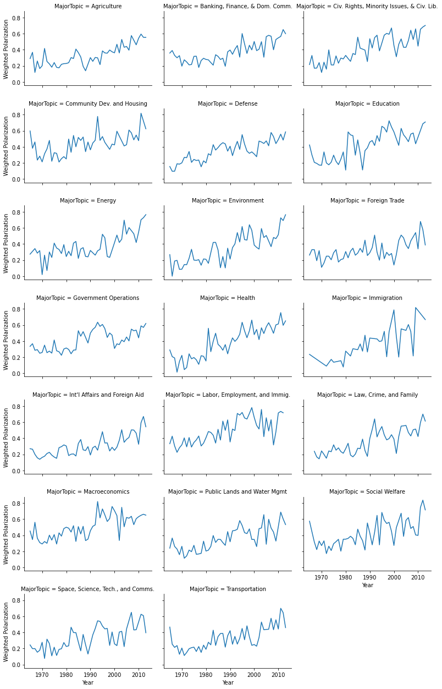

In one paper from my dissertation, I assess the effects of political polarization on the growth of interest groups in the U.S. since the 1970s. The most common measure of polarization is [DW-NOMINATE](https://voteview.com/about) which, based on roll call votes, is a measure of the ideological positions of Senators and Representatives in the House. 

Because I am interested in the growth of interest groups that focus on a particular policy area (say, healthcare or the environment), I wanted to measure polarization at that level. To do so, I merged roll call data from [Voteview](https://voteview.com/data) with roll call votes broken down by policy area from the [Comparative Agendas Project](https://www.comparativeagendas.net/us). I then measure how far apart the two major parties' voting behavior is based on roll call votes by policy area (see formula below). 


```python
# import libraries
import pandas as pd
import numpy as np
import seaborn as sns
import matplotlib.pyplot as plt
```


```python
### import data
# import Comparative Agendas Project Roll Call Data
pap_roll = pd.read_csv('../../../../Research/Dissertation/Data/Policy Agendas Project/US-Legislative-roll_call_votes_18.2.csv', low_memory=False)

# import Voteview Roll Call Data
vv_house_roll_call = pd.read_excel('../../../../Research/Dissertation/Data/hdemrep35_113.xlsx')
vv_senate_roll_call = pd.read_excel('../../../../Research/Dissertation/Data/sdemrep35_113.xlsx')
```

### Polarization Measure

The formula for calculating how partisan each roll call vote is:

$$\left|\frac{R_{y}}{R_{y}+R_{n}}-\frac{D_{y}}{D_{y}+D_{n}}\right|$$

where ${R_{y}}$ and ${D_{y}}$ are the number of Republicans and Democrats, respectively, that vote **yes** on a bill and ${R_{n}}$ and ${D_{n}}$ are the number of Republicans and Democrats, respectively, that vote **no** on a bill.


```python
# create polarization measure for each bill
vv_house_roll_call['house_partisan'] = np.abs((vv_house_roll_call['r_yeas'] / (vv_house_roll_call['r_yeas'] + vv_house_roll_call['r_nays'])) - (vv_house_roll_call['d_yeas'] / (vv_house_roll_call['d_yeas'] + vv_house_roll_call['d_nays'])))

vv_senate_roll_call['senate_partisan'] = np.abs((vv_senate_roll_call['r_yeas'] / (vv_senate_roll_call['r_yeas'] + vv_senate_roll_call['r_nays'])) - (vv_senate_roll_call['d_yeas'] / (vv_senate_roll_call['d_yeas'] + vv_senate_roll_call['d_nays'])))
```


```python
# filter to only House votes from 1965-2015 in CAP
pap_roll_house = pap_roll[pap_roll['filter_House'] == 1]
pap_roll_house_1965_2015 = pap_roll_house[(pap_roll_house['year'] > 1964) & (pap_roll_house['year'] < 2016)]

# filter to only Senate votes from 1965-2015 in CAP
pap_roll_senate = pap_roll[pap_roll['filter_Senate'] == 1]
pap_roll_senate_1965_2015 = pap_roll_senate[(pap_roll_senate['year'] > 1964) & (pap_roll_senate['year'] < 2016)]

# filter Voteview data to same years as CAP years above
vv_house_roll_call_1965_2015 = vv_house_roll_call[(vv_house_roll_call['year'] > 1964) & (vv_house_roll_call['year'] < 2016)]
vv_senate_roll_call_1965_2015 = vv_senate_roll_call[(vv_senate_roll_call['year'] > 1964) & (vv_senate_roll_call['year'] < 2016)]

# print (vv_house_roll_call_1965_2015.shape)
# print (pap_roll_house_1965_2015.shape)

merged_house_roll = pd.merge(vv_house_roll_call_1965_2015, pap_roll_house_1965_2015, on=['year', 'cong', 'rc_count']).rename(columns={'year': 'Year', 'pap_majortopic' : 'MajorTopic', 'rc_count' : 'num_house_bills'})

merged_senate_roll = pd.merge(vv_senate_roll_call_1965_2015, pap_roll_senate_1965_2015, on=['year', 'cong', 'rc_count']).rename(columns={'year': 'Year', 'pap_majortopic' : 'MajorTopic', 'rc_count' : 'num_senate_bills'})

# print (merged_house_roll.shape)

print ('Data merge kept', str(round(merged_house_roll.shape[0] / vv_house_roll_call_1965_2015.shape[0] * 100, 2)), 'percent of total roll call House votes in Voteview data.')
print ('Data merge kept', str(round(merged_senate_roll.shape[0] / vv_senate_roll_call_1965_2015.shape[0] * 100, 2)), 'percent of total roll call Senate votes in Voteview data.')
```

    Data merge kept 99.77 percent of total roll call House votes in Voteview data.
    Data merge kept 98.05 percent of total roll call Senate votes in Voteview data.
    


```python
# keep just Major Policy Domains from CAP
merged_house_roll = merged_house_roll[(merged_house_roll['MajorTopic'] > 0) & (merged_house_roll['MajorTopic'] < 22)]
merged_senate_roll = merged_senate_roll[(merged_senate_roll['MajorTopic'] > 0) & (merged_senate_roll['MajorTopic'] < 22)]
```


```python
# rename Policy Domains codes
di = {1 : 'Macroeconomics', 
      2 : 'Civ. Rights, Minority Issues, & Civ. Lib.',
      3 : 'Health',
      4 : 'Agriculture',
      5 : 'Labor, Employment, and Immig.',
      6 : 'Education',
      7 : 'Environment',
      8 : 'Energy',
      9 : 'Immigration',
      10 : 'Transportation',
      12 : 'Law, Crime, and Family',
      13 : 'Social Welfare',
      14 : 'Community Dev. and Housing',
      15 : 'Banking, Finance, & Dom. Comm.',
      16 : 'Defense',
      17 : 'Space, Science, Tech., and Comms.',
      18 : 'Foreign Trade',
      19 : 'Int\'l Affairs and Foreign Aid',
      20 : 'Government Operations',
      21 : 'Public Lands and Water Mgmt'}

merged_house_roll = merged_house_roll.replace({'MajorTopic' : di})
merged_senate_roll = merged_senate_roll.replace({'MajorTopic' : di})
```

### Ten Most Polarized Policy Areas (1965-2015)


```python
# Get average polarization by policy area and sort
merged_house_roll.groupby('MajorTopic')['house_partisan'].mean().reset_index().sort_values(by='house_partisan', ascending=False).head(10)
```


<div>
<style scoped>
    .dataframe tbody tr th:only-of-type {
        vertical-align: middle;
    }

    .dataframe tbody tr th {
        vertical-align: top;
    }

    .dataframe thead th {
        text-align: right;
    }
</style>
<table border="1" class="dataframe">
  <thead>
    <tr style="text-align: right;">
      <th></th>
      <th>MajorTopic</th>
      <th>house_partisan</th>
    </tr>
  </thead>
  <tbody>
    <tr>
      <th>15</th>
      <td>Macroeconomics</td>
      <td>0.531904</td>
    </tr>
    <tr>
      <th>13</th>
      <td>Labor, Employment, and Immig.</td>
      <td>0.496616</td>
    </tr>
    <tr>
      <th>6</th>
      <td>Energy</td>
      <td>0.475584</td>
    </tr>
    <tr>
      <th>3</th>
      <td>Community Dev. and Housing</td>
      <td>0.475444</td>
    </tr>
    <tr>
      <th>9</th>
      <td>Government Operations</td>
      <td>0.465232</td>
    </tr>
    <tr>
      <th>2</th>
      <td>Civ. Rights, Minority Issues, &amp; Civ. Lib.</td>
      <td>0.447487</td>
    </tr>
    <tr>
      <th>5</th>
      <td>Education</td>
      <td>0.434153</td>
    </tr>
    <tr>
      <th>1</th>
      <td>Banking, Finance, &amp; Dom. Comm.</td>
      <td>0.423594</td>
    </tr>
    <tr>
      <th>7</th>
      <td>Environment</td>
      <td>0.418144</td>
    </tr>
    <tr>
      <th>10</th>
      <td>Health</td>
      <td>0.411548</td>
    </tr>
  </tbody>
</table>
</div>


#### Reshape Data to Policy Area-Year


```python
house_roll_by_year = merged_house_roll.groupby(['Year', 'MajorTopic']).agg({'house_partisan' : 'mean', 'num_house_bills' : 'size'}).reset_index()
senate_roll_by_year = merged_senate_roll.groupby(['Year', 'MajorTopic']).agg({'senate_partisan' : 'mean', 'num_senate_bills' : 'size'}).reset_index()
```


```python
# merge House and Senate votes
# merge 'outer' to keep all
congress_roll_by_year = pd.merge(house_roll_by_year, senate_roll_by_year, on=['Year', 'MajorTopic'], how='outer')
```


```python
# Get total number of bills by policy area-year
congress_roll_by_year['total_bills'] = congress_roll_by_year['num_house_bills'] + congress_roll_by_year['num_senate_bills']
```

#### Calculate Weighted Polarization Measure


```python
# Get weighted average of House and Senate polarization by policy area-year
congress_roll_by_year['Weighted Polarization'] = ((congress_roll_by_year['house_partisan'] * congress_roll_by_year['num_house_bills']) \
                                                  + (congress_roll_by_year['senate_partisan'] * congress_roll_by_year['num_senate_bills'])) \
/ congress_roll_by_year['total_bills']
```


```python
# summary stats for total bills column
congress_roll_by_year['total_bills'].describe()
```


    count    940.000000
    mean      47.595745
    std       49.548122
    min        2.000000
    25%       18.000000
    50%       32.000000
    75%       57.000000
    max      376.000000
    Name: total_bills, dtype: float64


### Ten Most Polarized Policy Area-Years


```python
# sort by weighted polarization measure for policy area-years with at least 20 total bills
congress_roll_by_year[congress_roll_by_year['total_bills'] > 20].sort_values(by='Weighted Polarization', ascending=False).head(10)
```


<div>
<style scoped>
    .dataframe tbody tr th:only-of-type {
        vertical-align: middle;
    }

    .dataframe tbody tr th {
        vertical-align: top;
    }

    .dataframe thead th {
        text-align: right;
    }
</style>
<table border="1" class="dataframe">
  <thead>
    <tr style="text-align: right;">
      <th></th>
      <th>Year</th>
      <th>MajorTopic</th>
      <th>house_partisan</th>
      <th>num_house_bills</th>
      <th>senate_partisan</th>
      <th>num_senate_bills</th>
      <th>total_bills</th>
      <th>Weighted Polarization</th>
    </tr>
  </thead>
  <tbody>
    <tr>
      <th>570</th>
      <td>1993</td>
      <td>Macroeconomics</td>
      <td>0.791960</td>
      <td>28.0</td>
      <td>0.841347</td>
      <td>35.0</td>
      <td>63.0</td>
      <td>0.819397</td>
    </tr>
    <tr>
      <th>959</th>
      <td>2013</td>
      <td>Energy</td>
      <td>0.767350</td>
      <td>83.0</td>
      <td>0.644231</td>
      <td>2.0</td>
      <td>85.0</td>
      <td>0.764453</td>
    </tr>
    <tr>
      <th>960</th>
      <td>2013</td>
      <td>Environment</td>
      <td>0.781385</td>
      <td>29.0</td>
      <td>0.689239</td>
      <td>7.0</td>
      <td>36.0</td>
      <td>0.763468</td>
    </tr>
    <tr>
      <th>689</th>
      <td>1999</td>
      <td>Macroeconomics</td>
      <td>0.695255</td>
      <td>21.0</td>
      <td>0.806076</td>
      <td>27.0</td>
      <td>48.0</td>
      <td>0.757592</td>
    </tr>
    <tr>
      <th>767</th>
      <td>2003</td>
      <td>Labor, Employment, and Immig.</td>
      <td>0.700248</td>
      <td>20.0</td>
      <td>0.859363</td>
      <td>11.0</td>
      <td>31.0</td>
      <td>0.756708</td>
    </tr>
    <tr>
      <th>923</th>
      <td>2011</td>
      <td>Health</td>
      <td>0.760382</td>
      <td>56.0</td>
      <td>0.661634</td>
      <td>4.0</td>
      <td>60.0</td>
      <td>0.753799</td>
    </tr>
    <tr>
      <th>769</th>
      <td>2003</td>
      <td>Macroeconomics</td>
      <td>0.692755</td>
      <td>47.0</td>
      <td>0.811563</td>
      <td>40.0</td>
      <td>87.0</td>
      <td>0.747379</td>
    </tr>
    <tr>
      <th>926</th>
      <td>2011</td>
      <td>Labor, Employment, and Immig.</td>
      <td>0.722055</td>
      <td>25.0</td>
      <td>0.754693</td>
      <td>12.0</td>
      <td>37.0</td>
      <td>0.732640</td>
    </tr>
    <tr>
      <th>610</th>
      <td>1995</td>
      <td>Macroeconomics</td>
      <td>0.754720</td>
      <td>74.0</td>
      <td>0.697245</td>
      <td>67.0</td>
      <td>141.0</td>
      <td>0.727409</td>
    </tr>
    <tr>
      <th>939</th>
      <td>2012</td>
      <td>Energy</td>
      <td>0.727309</td>
      <td>79.0</td>
      <td>0.718141</td>
      <td>10.0</td>
      <td>89.0</td>
      <td>0.726279</td>
    </tr>
  </tbody>
</table>
</div>


### Polarization by Policy Area by Year


```python
topic_plot = sns.FacetGrid(congress_roll_by_year, col="MajorTopic", col_wrap=3, height=2.5, aspect=1.5, margin_titles=False)
topic_plot = topic_plot.map(plt.plot, "Year", "Weighted Polarization")
```





```python

```
